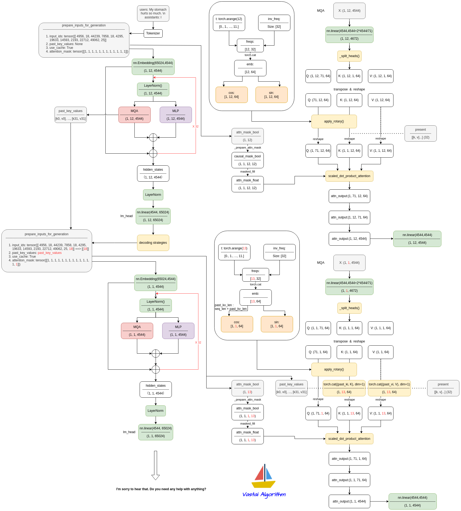
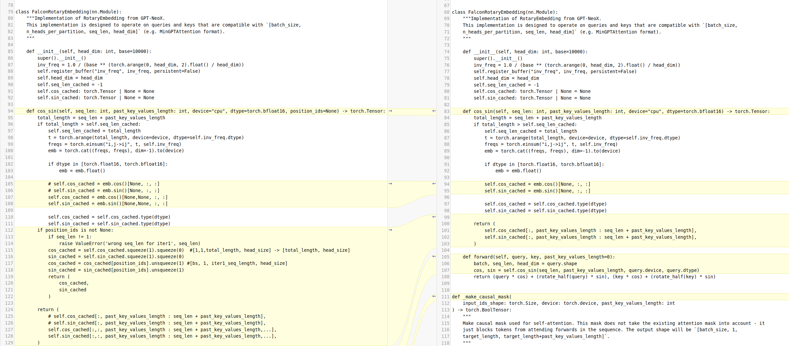
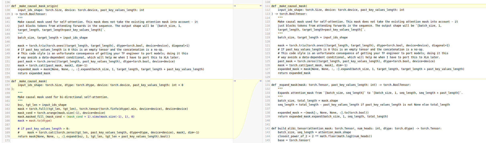
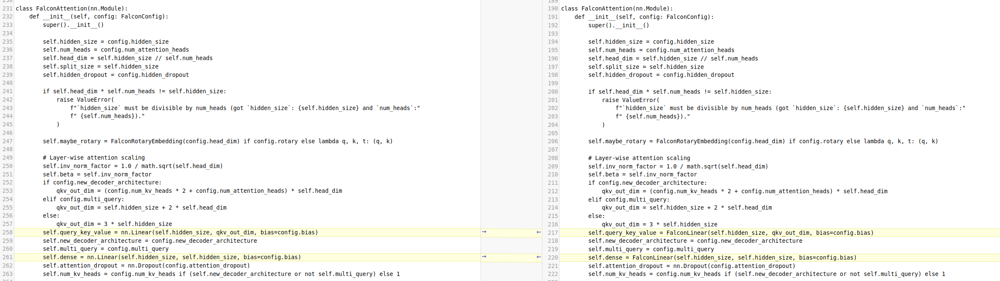
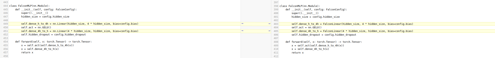
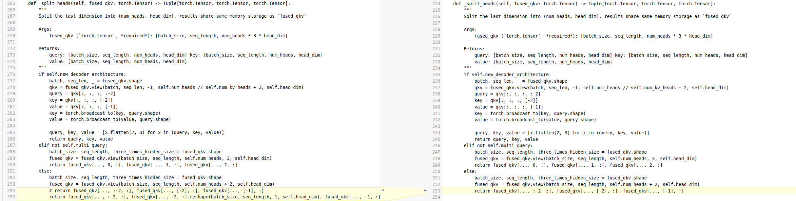
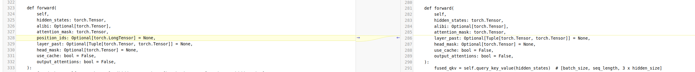
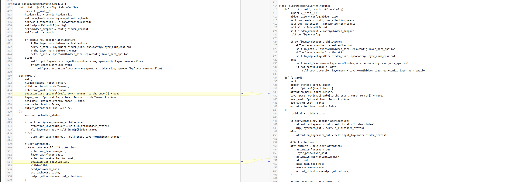
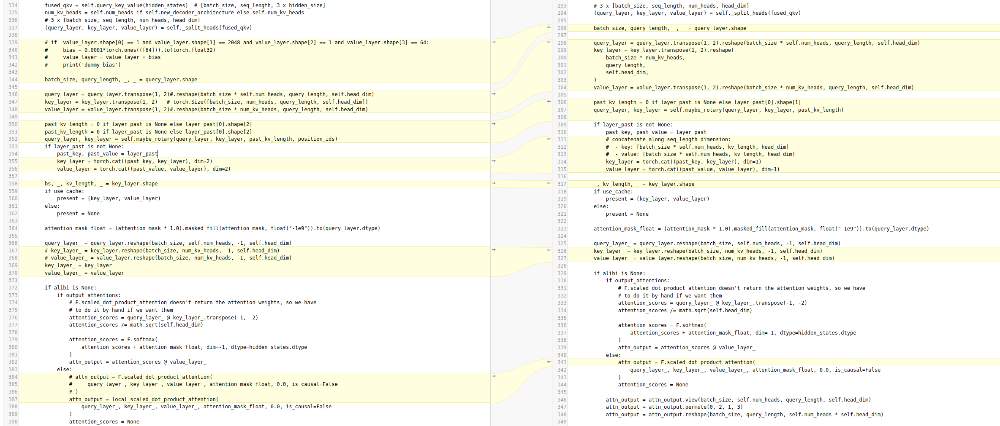

# Falcon

## Model Arch



## Model Info
### Support Models

| models  | tips |
| :---: | :--: |
| [tiiuae/falcon-7b-instruct](https://huggingface.co/tiiuae/falcon-7b-instruct) |[modeling_falcon_vacc.py](./source_code/modeling_falcon_vacc.py) |

### Precision


## Build_In Deploy

### step.1 模型准备
#### internlm
1. 参考`Support Models`列表下载模型权重
2. 为了方便部署`Falcon`系列模型， 在官方源码的基础上， 对`modeling_falcon.py`做一些修改，其中左图为修改的代码
- [modeling_falcon_vacc.py](./source_code/modeling_falcon_vacc.py)
    - 参考4.31.0版本llama2, 修改RotaryEmbedding

    

    - 修改_make_causual_mask， 避免导出onnx时出现算子不支持错误

    

    - 为了方便对模型进行int8量化，将self_atttention, mlp中的FalconLinear替换成nn.Linear

    
    

    - 修改split_head, 方便导出onnx

    

    - 对应RotaryEmbedding的修改， 增加position_ids

    
    

    - 参考4.31.0llama2, 修改kv_cache输入输出

    


    > 其他修改可忽略


### step.2 数据集

1. 量化校准数据集：
    - [allenai/c4](https://hf-mirror.com/datasets/allenai/c4/tree/main/en)
        - c4-train.00000-of-01024.json.gz
        - c4-validation.00000-of-00008.json.gz
    - [ceval/ceval-exam](https://hf-mirror.com/datasets/ceval/ceval-exam/tree/main)
        - ceval-exam.zip
    - [yahma/alpaca-cleaned](https://hf-mirror.com/datasets/yahma/alpaca-cleaned/tree/main)
        - alpaca_data_cleaned.json

### step.3 模型转换
1. 根据具体模型修改模型转换配置文件
    - [hf_falcon_fp16.yaml](./build_in/build/hf_falcon_fp16.yaml)
    - [hf_falcon_int8.yaml](./build_in/build/hf_falcon_int8.yaml)

    ```bash
    cd falcon
    mkdir workspace
    cd workspace
    vamc compile ./build_in/build/hf_falcon_fp16.yaml
    vamc compile ./build_in/build/hf_falcon_int8.yaml
    ```

### step.4 模型推理
1. 参考大模型部署推理工具：[vastgenx](../../docs/doc_vastgenx.md)

### Tips
- **LLM模型请先查看概要指引**，[Tips🔔](../README.md)
- 依赖配置
    ```bash
    protobuf==3.20.3
    torch==2.1.0
    onnx==1.14.0
    onnxsim==0.4.35
    onnxruntime==1.13.1
    accelerate==0.25.0
    transformers>=4.31.0
    ```
