# Gemma

- [Gemini: A Family of Highly Capable Multimodal Models](https://arxiv.org/abs/2312.11805)


## Model Arch
- 2b-MQA，7b-MHA
- `it`-instruction-tuned variants，指令微调版本
- `1.1`-在上一版本基础上，使用一种新颖的RLHF方法进行训练，在质量、编码能力、真实性、指令遵循和多轮会话质量方面取得了显著进步

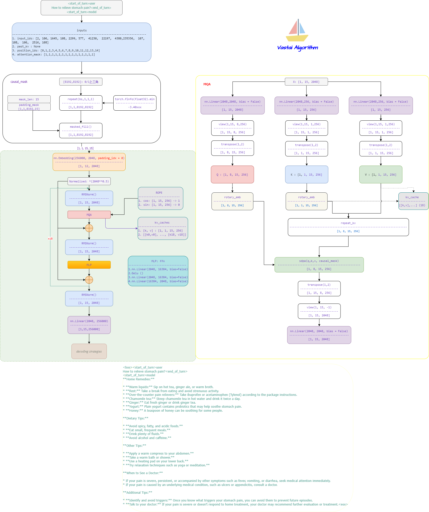

## Model Info
### Support Models

| models  | tips |
| :---: | :--: |
| [gemma-2b](https://huggingface.co/collections/google/gemma-release-65d5efbccdbb8c4202ec078b) |[modeling_gemma_vacc.py](./source_code/modeling_gemma_vacc.py) |
| [gemma-2b-it](https://huggingface.co/collections/google/gemma-release-65d5efbccdbb8c4202ec078b) |[modeling_gemma_vacc.py](./source_code/modeling_gemma_vacc.py) |
| [gemma-7b](https://huggingface.co/collections/google/gemma-release-65d5efbccdbb8c4202ec078b) |[modeling_gemma_vacc.py](./source_code/modeling_gemma_vacc.py) |
| [gemma-7b-it](https://huggingface.co/collections/google/gemma-release-65d5efbccdbb8c4202ec078b) |[modeling_gemma_vacc.py](./source_code/modeling_gemma_vacc.py) |
| [gemma-1.1-2b-it](https://huggingface.co/collections/google/gemma-release-65d5efbccdbb8c4202ec078b) |[modeling_gemma_vacc.py](./source_code/modeling_gemma_vacc.py) |
| [gemma-1.1-7b-it](https://huggingface.co/collections/google/gemma-release-65d5efbccdbb8c4202ec078b) |[modeling_gemma_vacc.py](./source_code/modeling_gemma_vacc.py) |


## Build_In Deploy

### step.1 模型准备

1. 参考`Support Models`列表下载模型权重
2. 网络修改
    - 为部署`gemma`系列模型，在官方源码基础上，需要做部分修改，其中左图为修改后代码
    - [modeling_gemma_vacc.py](./source_code/modeling_gemma_vacc.py)
        - 修改库引用方式
        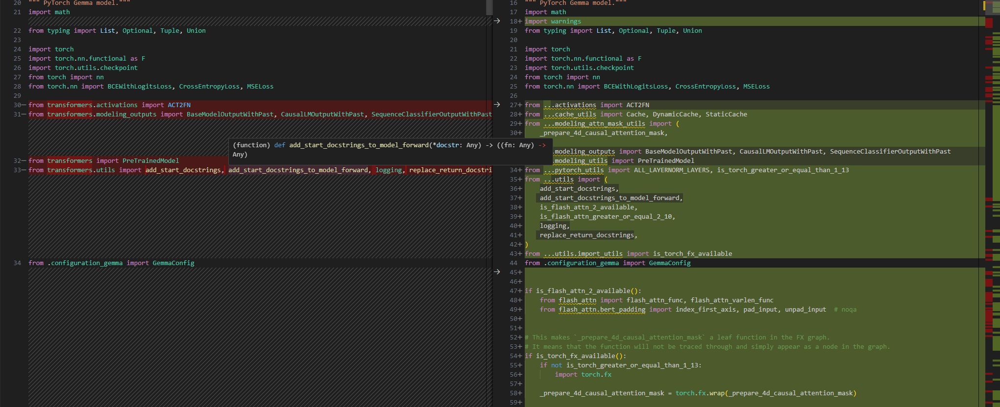
        - 添加生成attention mask时需要的函数
        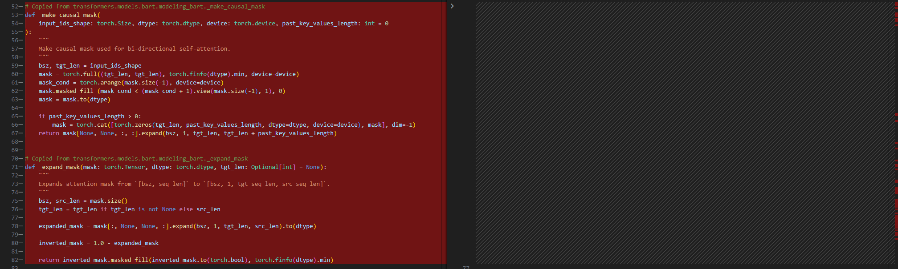        
        - rotary_embedding使用4.31.0的transformers/models/llama/modeling_llama.py中使用的方式
        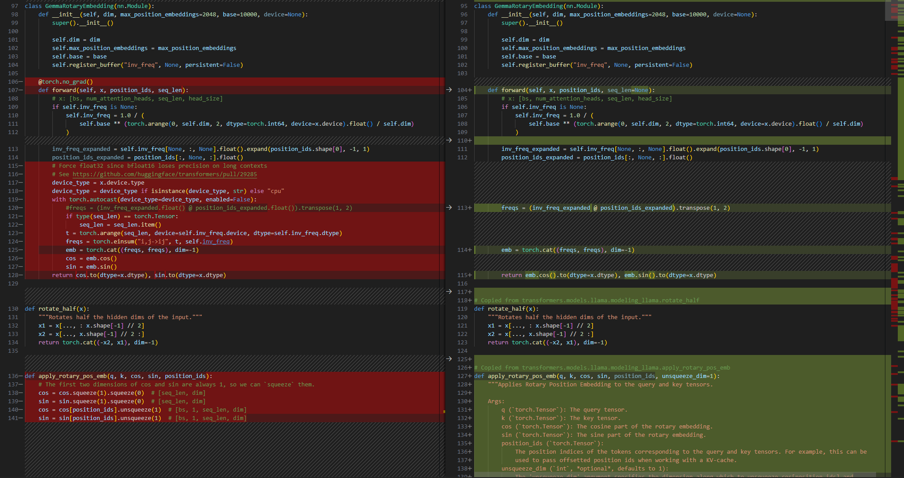
        - self attention和attention mask使用4.31.0的transformers/models/llama/modeling_llama.py中使用的方式
        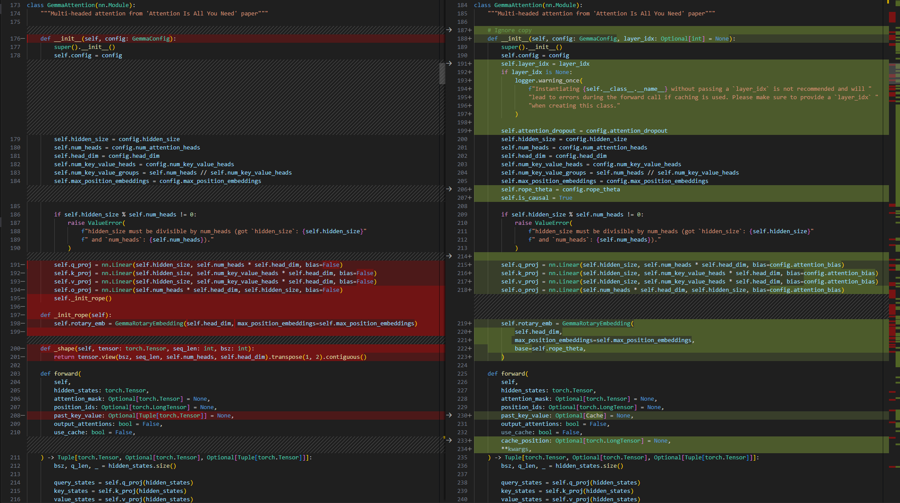
        - class GemmaDecoderLayer中修改forward函数和self.self_attn的调用，修改forward函数的参数说明
        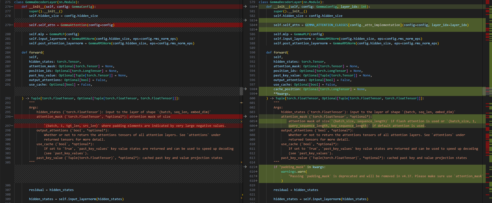
        - class GemmaPreTrainedModel 按照4.31.0的transformers/models/llama/modeling_llama.py中使用进行修改
        
        - 借助config.iter_num和 config.insert_slice来判断是否插入strided_slice
        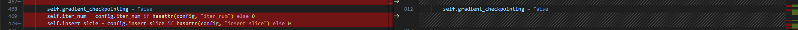
        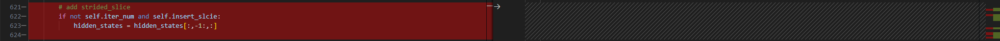
        - 修改attention mask的生成方式
        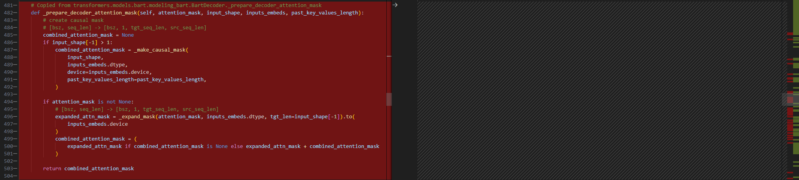
        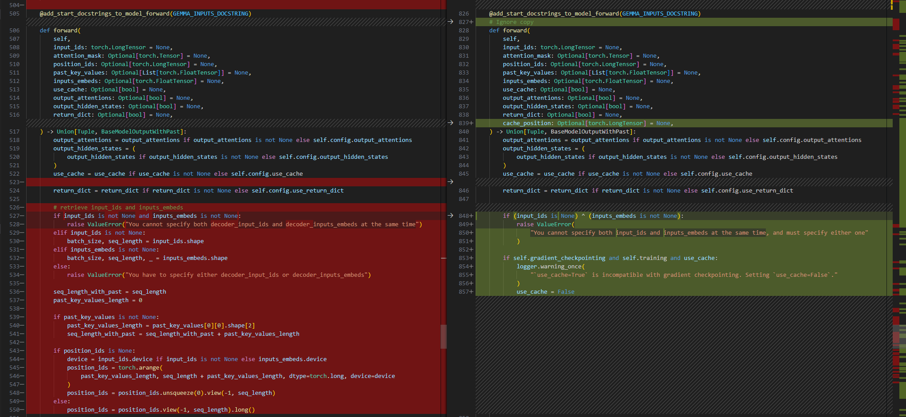
        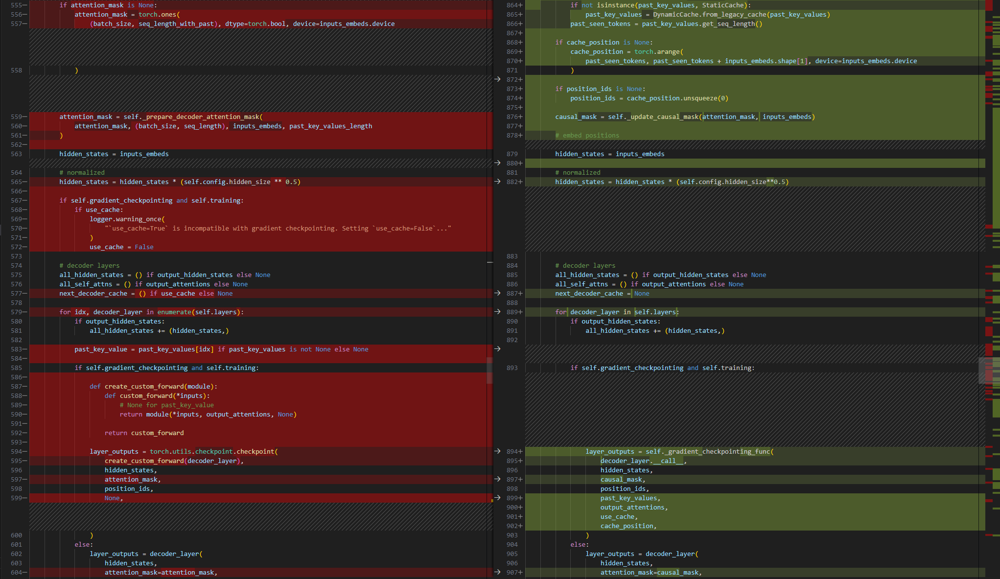
        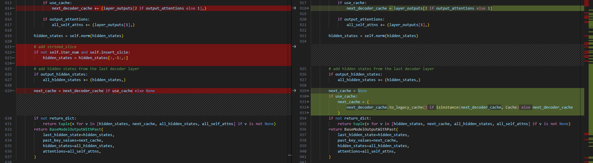
        - prepare_inputs_for_generation按照4.31.0的transformers/models/llama/modeling_llama.py中使用进行修改
        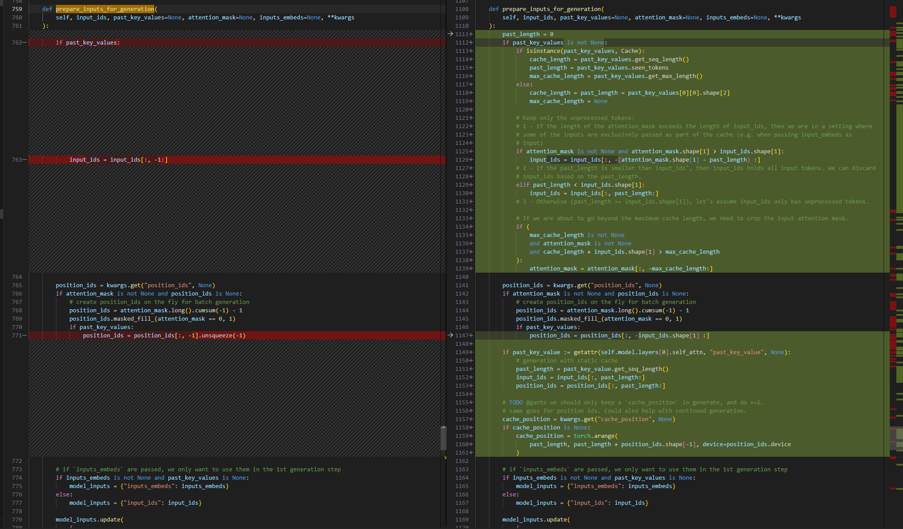
        - GemmaForCausalLM添加quantize方法，支持per_channel int8量化，[quantization_vacc.py](./source_code/quantization_vacc.py)
        
        - 修改sequence_lengths的计算
        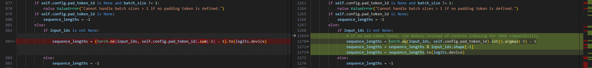
    - [configuration_gemma_vacc.py](./source_code/configuration_gemma_vacc.py)
        - 修改对于相关依赖的导入方式
        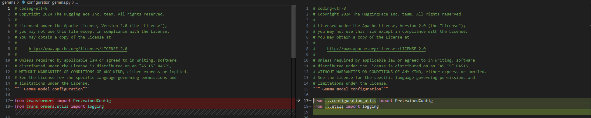
    - [config.json](./source_code/config.json)
        - 添加auto_map选项，使得transformers不会从原始库目录加载网络结构
        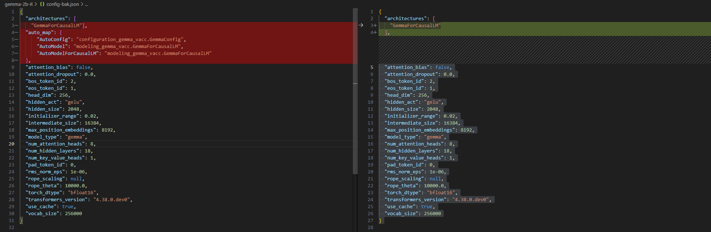
    - 将以上文件移动至原始权重路径内，覆盖同名文件


### step.2 数据集

1. 量化校准数据集：
    - [allenai/c4](https://hf-mirror.com/datasets/allenai/c4/tree/main/en)
        - c4-train.00000-of-01024.json.gz
        - c4-validation.00000-of-00008.json.gz
    - [ceval/ceval-exam](https://hf-mirror.com/datasets/ceval/ceval-exam/tree/main)
        - ceval-exam.zip
    - [yahma/alpaca-cleaned](https://hf-mirror.com/datasets/yahma/alpaca-cleaned/tree/main)
        - alpaca_data_cleaned.json

### step.3 模型转换

1. 根据具体模型修改模型转换配置文件
    - [hf_gemma_fp16.yaml](./build_in/build/hf_gemma_fp16.yaml)
    - [hf_gemma_int8.yaml](./build_in/build/hf_gemma_int8.yaml)

    > - runstream推理，编译参数`backend.type: tvm_vacc`
    > - fp16精度: 编译参数`backend.dtype: fp16`
    > - int8精度: 编译参数`backend.dtype: int8`

    ```bash
    cd gemma
    mkdir workspace
    cd workspace
    vamc compile ../build_in/build/hf_gemma_fp16.yaml
    vamc compile ../build_in/build/hf_gemma_int8.yaml
    ```

### step.4 模型推理
1. 参考大模型部署推理工具：[vastgenx](../../docs/vastgenx/README.md)

### Tips
- **LLM模型请先查看概要指引**，[Tips🔔](../README.md)
- 依赖配置
    ```bash
    protobuf==3.20.3
    torch==2.1.0
    onnx==1.14.0
    onnxsim==0.4.35
    onnxruntime==1.13.1
    accelerate==0.25.0
    transformers>=4.38.0，推荐4.40
    ```
