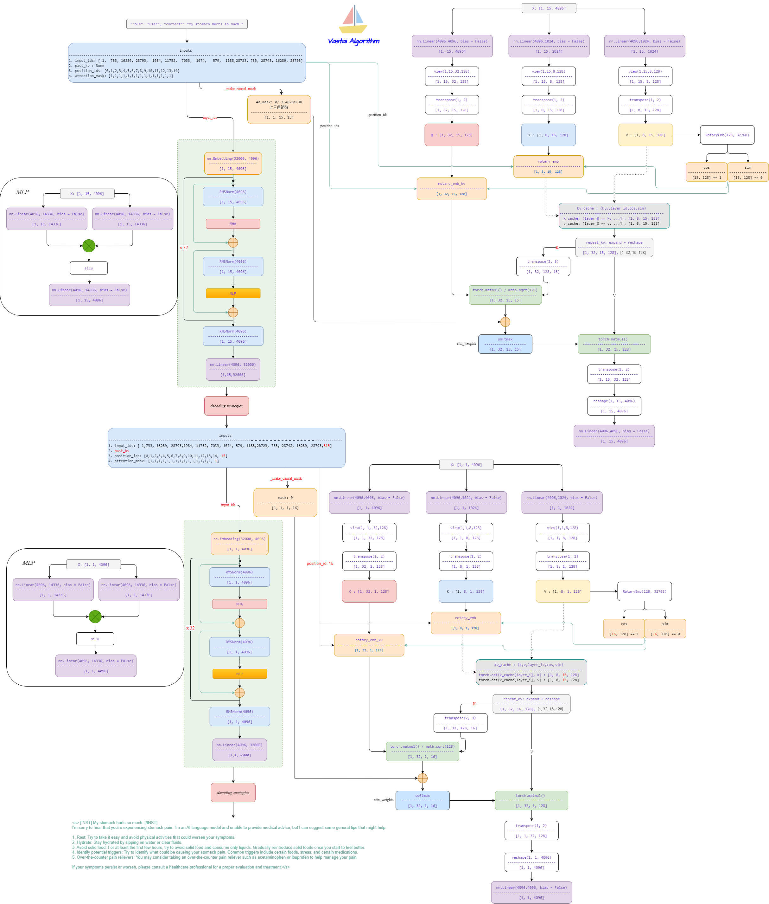
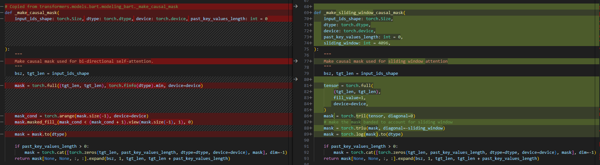
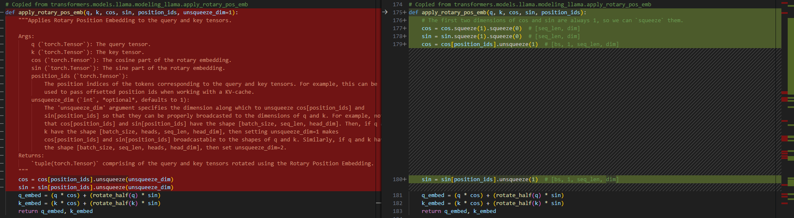
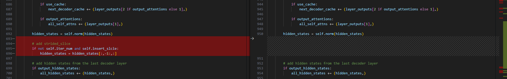
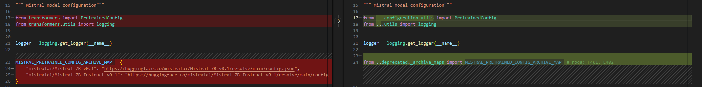
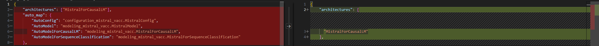

# Mistral

- [Mistral 7B](https://arxiv.org/abs/2310.06825)


## Model Arch
- 基于llama2修改，该模型利用了分组查询注意力(GQA)和滑动窗口注意力(SWA)的机制，提高了推理速度和效率。GQA加速了推理速度，减少了解码过程中的内存需求，从而实现更高的批处理大小和吞吐量；SWA通过降低计算成本，更有效地处理任意长度的序列。



## Model Info
### Support Models

| models  | tips |
| :---: | :--: |
| [Mistral-7B-Instruct-v0.2](https://huggingface.co/mistralai/Mistral-7B-Instruct-v0.2) |GQA，[modeling_mistral_vacc.py](./source_code/modeling_mistral_vacc.py) |
| [Ministral-8B-Instruct-2410](https://huggingface.co/mistralai/Ministral-8B-Instruct-2410) |GQA，[modeling_mistral_vacc.py](./source_code/modeling_mistral_vacc.py) |


## Build_In Deploy

### step.1 模型准备

1. 参考`Support Models`列表下载模型权重
2. 网络修改
    - 修改后模型文件[modeling_mistral_vacc.py](./source_code/modeling_mistral_vacc.py)，主要有以下修改（左-修改<>右-原始）：
        - 不使用sliding_window
        
        - 修改apply_rotary_pos_emb
        
        - 增加strided_slice
        

    - 修改后模型配置脚本[configuration_mistral.py](./source_code/configuration_mistral.py)
        - 去除相对引用方式，改为直接从transformers引用相关包
        
    - 修改后模型quant脚本[quantization_vacc.py](./source_code/quantization_vacc.py)
        - MistralForCausalLM添加quantize方法，支持per_channel int8量化
        
    - 修改后模型配置文件[config.json](./source_code/config.json)
        - 添加auto_map选项
        
        
    - 将以上文件移动至原始权重路径内，覆盖同名文件


### step.2 数据集
1. 量化校准数据集：
    - [allenai/c4](https://hf-mirror.com/datasets/allenai/c4/tree/main/en)
        - c4-train.00000-of-01024.json.gz
        - c4-validation.00000-of-00008.json.gz
    - [ceval/ceval-exam](https://hf-mirror.com/datasets/ceval/ceval-exam/tree/main)
        - ceval-exam.zip
    - [yahma/alpaca-cleaned](https://hf-mirror.com/datasets/yahma/alpaca-cleaned/tree/main)
        - alpaca_data_cleaned.json

### step.3 模型转换

1. 根据具体模型修改模型转换配置文件
    - [hf_mistral_fp16.yaml](./build_in/build/hf_mistral_fp16.yaml)
    - [hf_mistral_int8.yaml](./build_in/build/hf_mistral_int8.yaml)

    > - runstream推理，编译参数`backend.type: tvm_vacc`
    > - fp16精度: 编译参数`backend.dtype: fp16`
    > - int8精度: 编译参数`backend.dtype: int8`

    ```bash
    cd mistral
    mkdir workspace
    cd workspace
    vamc compile ../build_in/build/hf_mistral_fp16.yaml
    vamc compile ../build_in/build/hf_mistral_int8.yaml
    ```

### step.4 模型推理
1. 参考大模型部署推理工具：[vastgenx](../../tools/vastgenx/README.md)

### Tips
- **LLM模型请先查看概要指引**，[Tips🔔](../README.md)
