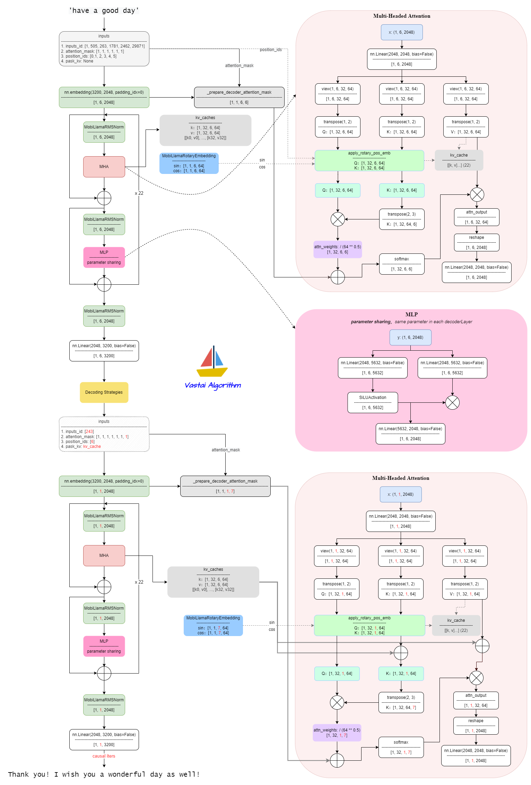

# MobiLlama

- [MobiLlama: Towards Accurate and Lightweight Fully Transparent GPT](https://arxiv.org/abs/2402.16840)


## Model Arch
- 基于llama2修改，在每一个LlamaDecoderLayer内共享同一份MLP参数



## Model Info
### Support Models

| models  | tips |
| :---: | :--: |
| [MobiLlama-05B](https://huggingface.co/collections/MBZUAI/mobillama-65dd4182d588c91e8230332e) |[modelling_mobillama_vacc.py](./source_code/modelling_mobillama_vacc.py) |
| [MobiLlama-05B-Chat](https://huggingface.co/collections/MBZUAI/mobillama-65dd4182d588c91e8230332e) |[modelling_mobillama_vacc.py](./source_code/modelling_mobillama_vacc.py) |
| [MobiLlama-1B](https://huggingface.co/collections/MBZUAI/mobillama-65dd4182d588c91e8230332e) |[modelling_mobillama_vacc.py](./source_code/modelling_mobillama_vacc.py) |
| [MobiLlama-1B-Chat](https://huggingface.co/collections/MBZUAI/mobillama-65dd4182d588c91e8230332e) |[modelling_mobillama_vacc.py](./source_code/modelling_mobillama_vacc.py) |


## Build_In Deploy

### step.1 模型准备

1. 参考`Support Models`列表下载模型权重
2. 网络修改
    - 原始的模型文件[modeling_mobillama.py#L244](https://github.com/mbzuai-oryx/MobiLlama/blob/main/model_utils/modeling_mobillama.py#L244)，使用了`flash_attn_func`实现注意力机制，需要在有cuda环境的机器下运行
    - 注释掉`flash_attn_func`实现，[modeling_mobillama.py#L214](https://github.com/mbzuai-oryx/MobiLlama/blob/main/model_utils/modeling_mobillama.py#L214)，开启其代码前面的已注释部分，使用torch的简单实现替代`flash_attn_func`
    - 原始模型配置中[config.json#L21](https://huggingface.co/MBZUAI/MobiLlama-1B/blob/main/config.json#L21)，`"num_key_value_heads": 4`需要改为`"num_key_value_heads": 32`，否则vamc编译会报错
    - 修改后的模型文件[source_code/modelling_mobillama_vacc.py](./source_code/modelling_mobillama_vacc.py)
    - 修改后的模型配置文件[source_code/config.json](./source_code/config.json)
    - 将以上文件移动至原始权重路径内，覆盖同名文件

### step.2 数据集

1. 量化校准数据集：
    - [allenai/c4](https://hf-mirror.com/datasets/allenai/c4/tree/main/en)
        - c4-train.00000-of-01024.json.gz
        - c4-validation.00000-of-00008.json.gz
    - [ceval/ceval-exam](https://hf-mirror.com/datasets/ceval/ceval-exam/tree/main)
        - ceval-exam.zip
    - [yahma/alpaca-cleaned](https://hf-mirror.com/datasets/yahma/alpaca-cleaned/tree/main)
        - alpaca_data_cleaned.json

### step.3 模型转换

1. 根据具体模型修改模型转换配置文件
    - [hf_mobillama_fp16.yaml](./build_in/build/hf_mobillama_fp16.yaml)
    - [hf_mobillama_int8.yaml](./build_in/build/hf_mobillama_int8.yaml)

    > - runstream推理，编译参数`backend.type: tvm_vacc`
    > - fp16精度: 编译参数`backend.dtype: fp16`
    > - int8精度: 编译参数`backend.dtype: int8`

    ```bash
    cd mobillama
    mkdir workspace
    cd workspace
    vamc compile ../build_in/build/hf_mobillama_fp16.yaml
    vamc compile ../build_in/build/hf_mobillama_int8.yaml
    ```

### step.4 模型推理
1. 参考大模型部署推理工具：[vastgenx](../../tools/vastgenx/README.md)

### Tips
- **LLM模型请先查看概要指引**，[Tips🔔](../README.md)
- 依赖配置
    ```bash
    protobuf==3.20.3
    torch==2.1.0
    onnx==1.14.0
    onnxsim==0.4.35
    onnxruntime==1.13.1
    accelerate==0.25.0
    transformers>=4.31.0
    ```
