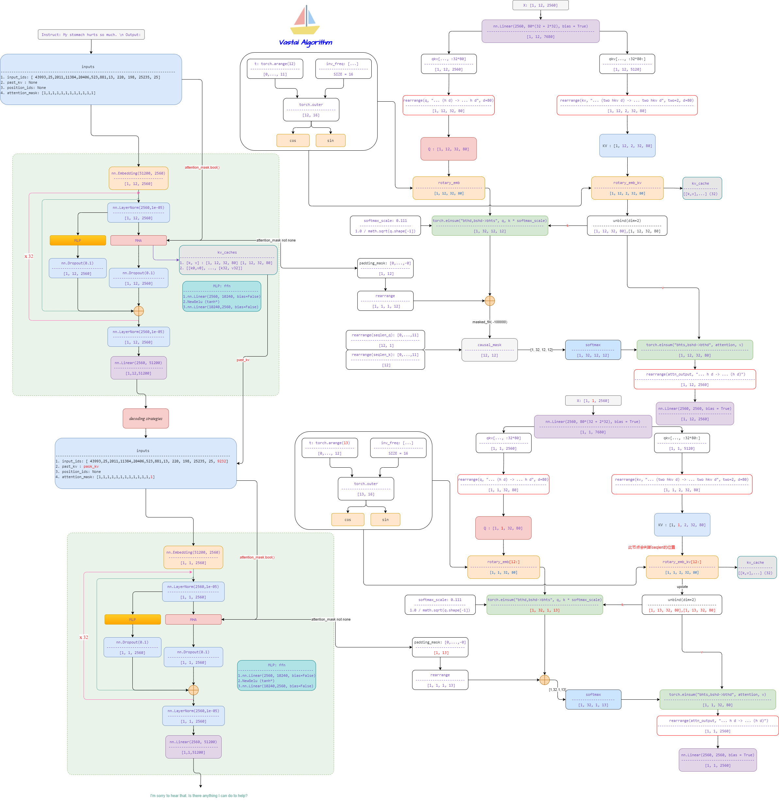
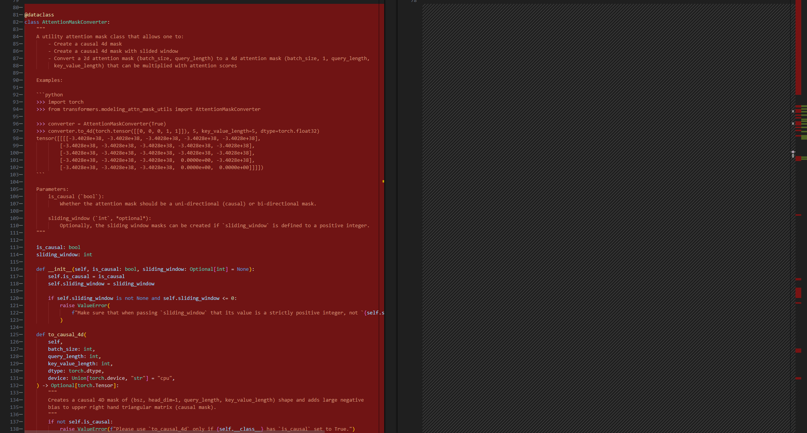
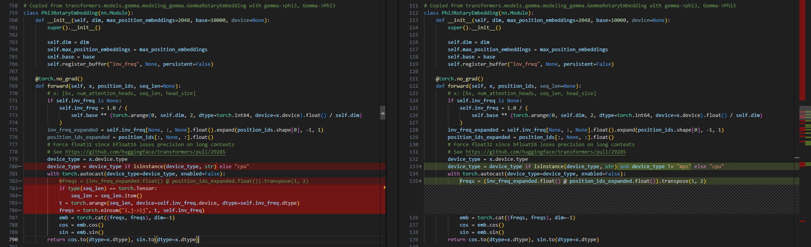
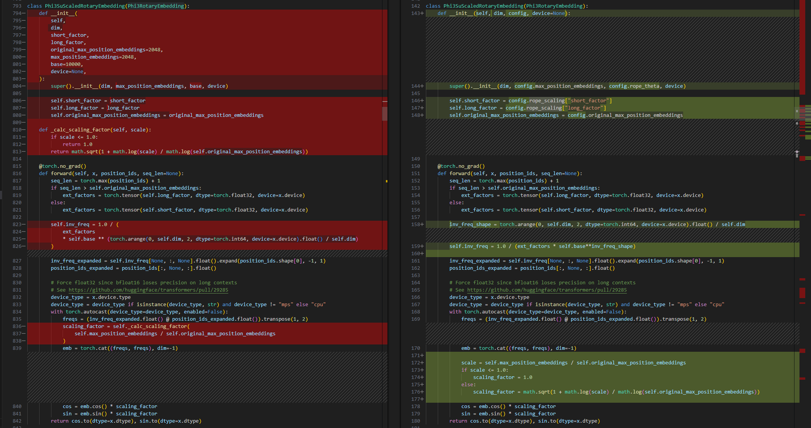
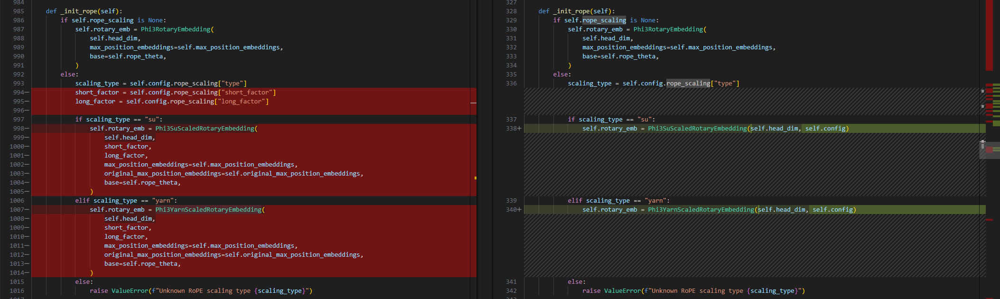
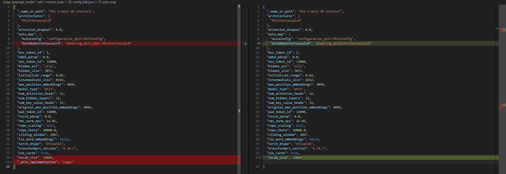

# Phi

- [Phi-3 Technical Report: A Highly Capable Language Model Locally on Your Phone](https://arxiv.org/abs/2404.14219)


## Model Arch
- 基于transformer decoder结构，MHA注意力
- 为了更好地服务开源社区，phi-3-mini模型基于与Llama-2相似的模块结构构建，并采用了相同的tokenizer，词汇量达到320641。这意味着为Llama-2系列模型开发的所有软件包均可以直接适用于phi-3-mini。该模型拥有3072的隐藏层维度，32个head和32个layer，使用BFLOAT16格式训练了总共3.3T tokens。此外，该模型还经过了聊天场景的微调优化



## Model Info
### Support Models

| models  | tips |
| :---: | :--: |
| [Phi-3-mini-4k-instruct](https://huggingface.co/microsoft/Phi-3-mini-4k-instruct) | MHA，[modeling_phi3_vacc.py](./source_code/modeling_phi3_vacc.py) |


## Build_In Deploy

### step.1 模型准备

1. 参考`Support Models`列表下载模型权重
2. 网络修改
    - 为部署`phi`系列模型，在官方源码基础上，需要做部分修改，其中左图为修改后代码
    - [modeling_phi3_vacc.py](./source_code/modeling_phi3_vacc.py)
        - 从transformers==4.31版本内复制attention_mask相关准备函数
        
        - 修改Phi3RotaryEmbedding实现
        
        - 修改Phi3SuScaledRotaryEmbedding实现
        
        - 修改Phi3YarnScaledRotaryEmbedding实现
        
        - 修改上述实现的调用方式
        
        
    - [config.json](./source_code/config.json)
        - 添加auto_map选项，使得transformers不会从原始库目录加载网络结构；同时使用eager方式的Attention实现
        
    - 将以上文件移动至原始权重路径内，覆盖同名文件


### step.2 数据集

1. 量化校准数据集：
    - [allenai/c4](https://hf-mirror.com/datasets/allenai/c4/tree/main/en)
        - c4-train.00000-of-01024.json.gz
        - c4-validation.00000-of-00008.json.gz
    - [ceval/ceval-exam](https://hf-mirror.com/datasets/ceval/ceval-exam/tree/main)
        - ceval-exam.zip
    - [yahma/alpaca-cleaned](https://hf-mirror.com/datasets/yahma/alpaca-cleaned/tree/main)
        - alpaca_data_cleaned.json

### step.3 模型转换

1. 根据具体模型修改模型转换配置文件
    - [hf_phi_fp16.yaml](./build_in/build/hf_phi_fp16.yaml)
    - [hf_phi_int8.yaml](./build_in/build/hf_phi_int8.yaml)

    > - runstream推理，编译参数`backend.type: tvm_vacc`
    > - fp16精度: 编译参数`backend.dtype: fp16`
    > - int8精度: 编译参数`backend.dtype: int8`

    ```bash
    cd phi
    mkdir workspace
    cd workspace
    vamc compile ./build_in/build/hf_phi_fp16.yaml
    vamc compile ./build_in/build/hf_phi_int8.yaml
    ```

### step.4 模型推理
1. 参考大模型部署推理工具：[vastgenx](../../tools/vastgenx/README.md)

### Tips
- **LLM模型请先查看概要指引**，[Tips🔔](../README.md)
- 依赖配置
    ```bash
    protobuf==3.20.3
    torch==2.1.0
    onnx==1.14.0
    onnxsim==0.4.35
    onnxruntime==1.13.1
    accelerate==0.25.0
    transformers>=4.31.0，推荐4.40
    ```
