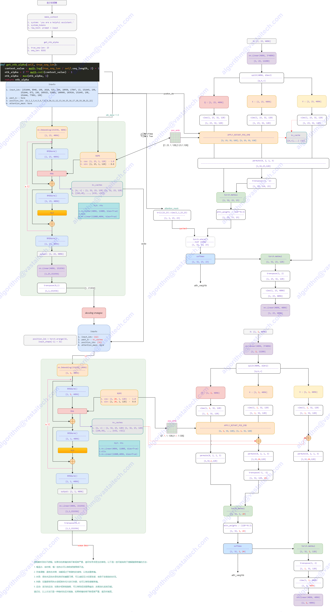
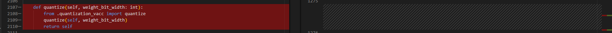

# Qwen2

- Technical Report
    - [Qwen Technical Report](https://arxiv.org/abs/2309.16609)
    - [Qwen2 Technical Report](https://arxiv.org/abs/2407.10671)
    - [Qwen2.5 Technical Report](https://arxiv.org/abs/2412.15115)
- Huggingface
    - https://huggingface.co/Qwen


## Model Arch



### Qwen v2
- 采用了Grouped Query Attention(GQA)来优化推理过程中的Key-Value (KV)缓存使用。传统的多头注意力机制在处理长序列时，KV 缓存的使用效率较低，而 GQA 通过将查询进行分组，可以更有效地利用缓存资源，从而显著提高推理的吞吐量
- 训练数据从之前的3T扩充到7T，为了增强模型长上下文的理解能力，上下文长度从4096扩展到32768(32k)个token。改进RoPE，以优化长上下文场景的性能
- DCA(Dual Chunk Attention)机制，将长序列分割成更短的管理块(Chunk)，以便模型能够更好地处理长上下文。如果输入序列长度小于单个块，DCA将产生与原始注意力机制相同的结果。如果输入序列太长，DCA将有效地捕捉块内和块间的相对位置信息，提升长文本处理能力
- YaRN(Yet another RoPE extensioN method)，一种高效扩展使用旋转位置嵌入(RoPE)的大型语言模型上下文窗口的方法，设计了插值公式来调整注意力权重，以更好地扩展到更长的上下文
- 模型训练
    - 预训练阶段：Qwen2使用超过7万亿token的高质量多语言数据集，这些数据覆盖了广泛的领域和语言。这种数据集的规模和质量提升，有助于增强模型的语言理解和生成能力，使其能够更好地处理各种语言和任务
    - 后训练阶段，Qwen2通过监督微调(SFT)和人类反馈强化学习(RLHF)来提升模型的能力。监督微调使用高质量指令数据集来调整模型，使其生成的内容更符合人类偏好。RLHF 则通过学习人类的反馈来优化模型，确保其生成的内容是安全、有益和无害的。强化学习训练分为两个阶段：离线训练和在线训练，在离线训练阶段，使用预先设计的偏好数据集，通过直接偏好优化(DPO)最大化y+和y-之间的可能性差异；在线训练阶段，模型实时迭代改进性能，利用奖励模型进行即时反馈

### Qwen v2.5
- 模型训练
    - 预训练阶段，训练数据规模从7万亿token扩大到18万亿token，这一巨大的数据量级的提升为模型的知识获取和理解能力奠定了坚实基础
    - 后训练阶段，采用了包含100万样本的监督微调（SFT）和分阶段强化学习（包括离线学习DPO和在线学习GRPO）的复杂技术，这些方法显著提高了模型对人类偏好的对齐程度，并增强了长文本生成、结构化数据分析等能力
        - Offline RL
        - Online RL
- 数据处理的突破
    - 智能数据过滤，利用了Qwen2模型来对预训练数据进行智能过滤。这种方法不仅提高了数据质量，还增强了模型对多语言数据的处理能力。通过这种自我迭代的方式，Qwen2.5能够更好地识别和保留高质量的训练样本，同时有效过滤掉低质量的数据
    - 专业领域数据的融入，融入了来自Qwen2.5 Math和Qwen2.5 Coder的专业数据。这些数据涵盖了数学和编程领域的高质量样本，极大地增强了模型在这两个关键领域的能力。这种专业数据的引入，使得Qwen2.5在处理数学问题和编程任务时表现出色
    - 高质量合成数据，利用Qwen2-72B和Qwen2-Math模型生成高质量的合成数据。更值得注意的是，他们使用Qwen2-Math-RM模型对这些合成数据进行进一步筛选，确保了合成数据的质量和相关性。这种方法不仅扩大了训练数据的规模，还保证了数据的高质量和多样性
    - 智能数据混合，为了平衡不同类型的数据，研究者使用Qwen2模型对数据进行分类，然后对不同类别的数据进行均衡处理。这种方法确保了模型能够从各种类型的数据中学习，避免了某些领域数据过多而导致的偏差
    - 突破性的扩展法则，研究团队深入研究了在不同模型大小（N）和数据量（D）下的最优学习率和批量大小（Batch Size）。这种方法允许研究者为不同规模的模型找到最佳的训练参数，从而在训练效率和模型性能之间取得平衡
- 长上下文处理的创新
    - 多阶段训练：模型训练分为两个阶段，首先在4K上下文长度上训练，然后扩展到32K。这种渐进式的方法使模型能够逐步适应更长的上下文
    - RoPE基础值调整：通过ABF技术调整RoPE的基础值，进一步增强了模型处理长序列的能力
    - 推理阶段的优化：引入YARN和Dual Chunk Attention技术，进一步提升了模型在实际应用中处理长序列的能力


## Build_In Deploy

### step.1 模型准备

1. 下载模型权重

    | models | tips |
    | :---   | :--: |
    | [Qwen/Qwen2-0.5B](https://hf-mirror.com/Qwen/Qwen2-0.5B) |  GQA |
    | [Qwen/Qwen2-0.5B-Instruct](https://hf-mirror.com/Qwen/Qwen2-0.5B-Instruct) |  GQA |
    | [Qwen/Qwen2-1.5B](https://hf-mirror.com/Qwen/Qwen2-1.5B) |  GQA |
    | [Qwen/Qwen2-1.5B-Instruct](https://hf-mirror.com/Qwen/Qwen2-1.5B-Instruct) |  GQA |
    | [Qwen/Qwen2-7B](https://hf-mirror.com/Qwen/Qwen2-7B) |  GQA |
    | [Qwen/Qwen2-7B-Instruct](https://hf-mirror.com/Qwen/Qwen2-7B-Instruct) |  GQA |
    | [Qwen/Qwen2-72B](https://hf-mirror.com/Qwen/Qwen2-72B) |  GQA |
    | [Qwen/Qwen2-72B-Instruct](https://hf-mirror.com/Qwen/Qwen2-72B-Instruct) |  GQA |
    | [Qwen/Qwen2.5-0.5B](https://hf-mirror.com/Qwen/Qwen2.5-0.5B) |  GQA |
    | [Qwen/Qwen2.5-0.5B-Instruct](https://hf-mirror.com/Qwen/Qwen2.5-0.5B-Instruct) |  GQA |
    | [Qwen/Qwen2.5-1.5B](https://hf-mirror.com/Qwen/Qwen2.5-1.5B) |  GQA |
    | [Qwen/Qwen2.5-1.5B-Instruct](https://hf-mirror.com/Qwen/Qwen1.5-1.5B-Instruct) |  GQA |
    | [Qwen/Qwen2.5-3B](https://hf-mirror.com/Qwen/Qwen2.5-3B) |  GQA |
    | [Qwen/Qwen2.5-3B-Instruct](https://hf-mirror.com/Qwen/Qwen2.5-3B-Instruct) |  GQA |
    | [Qwen/Qwen2.5-7B](https://hf-mirror.com/Qwen/Qwen2.5-7B) |  GQA |
    | [Qwen/Qwen2.5-7B-Instruct](https://hf-mirror.com/Qwen/Qwen2.5-7B-Instruct) |  GQA |
    | [Qwen/Qwen2.5-14B](https://hf-mirror.com/Qwen/Qwen2.5-14B) |  GQA |
    | [Qwen/Qwen2.5-14B-Instruct](https://hf-mirror.com/Qwen/Qwen2.5-14B-Instruct) |  GQA |
    | [Qwen/Qwen2.5-32B](https://hf-mirror.com/Qwen/Qwen2.5-32B) |  GQA |
    | [Qwen/Qwen2.5-32B-Instruct](https://hf-mirror.com/Qwen/Qwen2.5-32B-Instruct) |  GQA |
    | [Qwen/Qwen2.5-72B](https://hf-mirror.com/Qwen/Qwen2.5-72B) |  GQA |
    | [Qwen/Qwen2.5-72B-Instruct](https://hf-mirror.com/Qwen/Qwen2.5-72B-Instruct) |  GQA |

    > - 其它基于Qwen1.5/Qwen2/2.5微调(均为`model_type:qwen2`)，其模型转换及推理测试参考Qwen2系列即可


2. 模型修改
    - 为在瀚博软件栈部署`Qwen2`系列模型，在官方源码的基础上，需要对`modeling_qwen2.py`做一些修改，其中左图为修改的代码
    - [modeling_qwen2_vacc.py](./build_in/source_code/modeling_qwen2_vacc.py)
        - 修改相关依赖的导入方式
        
        - 基于config.insert_slice来判断是否插入strided_slice
        
        - class Qwen2ForCausalLM添加quantize方法，支持per_channel int8量化，[quantization_vacc.py](./build_in/source_code/quantization_vacc.py)
        
        - 迁移transformers==4.37.0版本内cache_utils,modeling_attn_mask_utils,modeling_outputs和utils中移动至modeling_qwen2_vacc.py

    - [configuration_qwen2_vacc.py](./build_in/source_code/configuration_qwen2_vacc.py)
        - 修改对于相关依赖的导入方式
        
    - [quantization_vacc.py](./build_in/source_code/quantization_vacc.py)
        - Qwen2ForCausalLM添加quantize方法，支持per_channel int8量化
        
    - [config_vacc.json](./build_in/source_code/config_vacc.json)
        - 添加_attn_implementation选项，并将其只配置为eager；并添加auto_map选项
        
    - 将以上修改后文件，放置与原始权重目录下（注意不同子模型，对应修改config_vacc.json文件）

### step.2 数据集

1. 量化校准数据集：
    - [allenai/c4](https://hf-mirror.com/datasets/allenai/c4/tree/main/en)
        - c4-train.00000-of-01024.json.gz
        - c4-validation.00000-of-00008.json.gz
    - [ceval/ceval-exam](https://hf-mirror.com/datasets/ceval/ceval-exam/tree/main)
        - ceval-exam.zip
    - [yahma/alpaca-cleaned](https://hf-mirror.com/datasets/yahma/alpaca-cleaned/tree/main)
        - alpaca_data_cleaned.json

2. 性能测试不定长数据集：[ShareGPT_V3_unfiltered_cleaned_split.json](https://huggingface.co/datasets/anon8231489123/ShareGPT_Vicuna_unfiltered/resolve/main/ShareGPT_V3_unfiltered_cleaned_split.json)
3. 精度评估数据集：[OpenCompassData-core-20240207.zip](https://github.com/open-compass/opencompass/releases/download/0.2.2.rc1/OpenCompassData-core-20240207.zip)


### step.3 模型转换
1. 参考瀚博训推软件生态链文档，获取模型转换工具: [vamc v3.0+](../../docs/vastai_software.md)
2. 根据具体模型修改模型转换配置文件
    - v1.5/v2/v2.5模型，编译配置一致
    - [hf_qwen2_fp16.yaml](./build_in/build/hf_qwen2_fp16.yaml)
    - [hf_qwen2_int8.yaml](./build_in/build/hf_qwen2_int8.yaml)

    ```bash
    vamc compile ./build_in/build/hf_qwen2_fp16.yaml
    vamc compile ./build_in/build/hf_qwen2_int8.yaml
    ```


### step.4 模型推理
1. 参考瀚博训推软件生态链文档，获取模型推理工具：[llmdeploy v1.6+](../../docs/vastai_software.md)
2. 参考llmdeploy工具文档，进行模型推理、性能和精度测试

### Tips
- **LLM模型请先查看概要指引**，[Tips🔔](../README.md)
- 建议环境配置
    ```bash
    protobuf==3.20.3
    torch==2.1.0
    onnx==1.14.0
    onnxsim==0.4.28
    onnxruntime==1.13.1
    accelerate==0.25.0
    transformers==4.40
    ```

## Pytorch Deploy

### step.1 模型准备
|  models |    demo_code    | tips |
| :------ | :------: | :------: | 
|[Qwen/Qwen2.5-0.5B-Instruct](https://hf-mirror.com/Qwen/Qwen2.5-0.5B-Instruct) | [demo](./pytorch/demo/qwen2.5.py) | - |
|[Qwen/Qwen2.5-1.5B-Instruct](https://hf-mirror.com/Qwen/Qwen2.5-1.5B-Instruct) | [demo](./pytorch/demo/qwen2.5.py) | - |
|[Qwen/Qwen2.5-3B-Instruct](https://hf-mirror.com/Qwen/Qwen2.5-3B-Instruct) | [demo](./pytorch/demo/qwen2.5.py) | - |
|[Qwen/Qwen2.5-7B-Instruct](https://hf-mirror.com/Qwen/Qwen2.5-7B-Instruct) | [demo](./pytorch/demo/qwen2.5.py) | - |
|[Qwen/Qwen2.5-14B-Instruct](https://hf-mirror.com/Qwen/Qwen2.5-14B-Instruct) | [demo](./pytorch/demo/qwen2.5.py) | - |

### step.2 模型推理
- 基于`torch_vacc`在`VA16`硬件下推理，一般基于官方demo进行适当修改，参见上表`demo_code`部分
