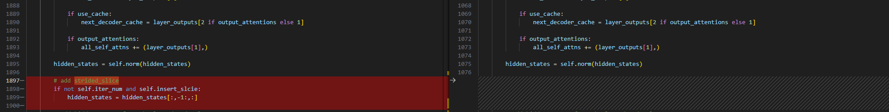

## Build_In Deploy

### step.1 模型准备

1. 下载模型权重

    | models | tips |
    | :---   | :--: |
    | [Qwen/Qwen3-0.6B](https://hf-mirror.com/collections/Qwen/qwen3-67dd247413f0e2e4f653967f)  | GQA |
    | [Qwen/Qwen3-1.7B](https://hf-mirror.com/collections/Qwen/qwen3-67dd247413f0e2e4f653967f)  | GQA |
    | [Qwen/Qwen3-4B](https://hf-mirror.com/collections/Qwen/qwen3-67dd247413f0e2e4f653967f)  | GQA |
    | [Qwen/Qwen3-8B](https://hf-mirror.com/collections/Qwen/qwen3-67dd247413f0e2e4f653967f) | GQA |
    | [Qwen/Qwen3-4B-Instruct-2507](https://hf-mirror.com/collections/Qwen/qwen3-67dd247413f0e2e4f653967f) | GQA |
    | [Qwen/Qwen3-4B-Thinking-2507](https://hf-mirror.com/collections/Qwen/qwen3-67dd247413f0e2e4f653967f) |GQA，Thinking |


2. 模型修改
    - 为在瀚博软件栈部署`Qwen3`系列模型，在官方源码的基础上，需要对`modeling_qwen2.py`做一些修改，其中左图为修改的代码
    - [modeling_qwen2_vacc.py](./source_code/modeling_qwen2_vacc.py)
        - 修改相关依赖的导入方式
        
        - 基于config.insert_slice来判断是否插入strided_slice
        
        - class Qwen2ForCausalLM添加quantize方法，支持per_channel int8量化，[quantization_vacc.py](./source_code/quantization_vacc.py)
        
        - 迁移transformers==4.37.0版本内cache_utils,modeling_attn_mask_utils,modeling_outputs和utils中移动至modeling_qwen2_vacc.py

    - [configuration_qwen2_vacc.py](./source_code/configuration_qwen2_vacc.py)
        - 修改对于相关依赖的导入方式
        
    - [quantization_vacc.py](./source_code/quantization_vacc.py)
        - Qwen2ForCausalLM添加quantize方法，支持per_channel int8量化
        
    - [config_vacc.json](./source_code/config_vacc.json)
        - 添加_attn_implementation选项，并将其只配置为eager；并添加auto_map选项
        
    - 将以上修改后文件，放置与原始权重目录下（注意不同子模型，对应修改config_vacc.json文件）

### step.2 数据集

1. 量化校准数据集：
    - [allenai/c4](https://hf-mirror.com/datasets/allenai/c4/tree/main/en)
        - c4-train.00000-of-01024.json.gz
        - c4-validation.00000-of-00008.json.gz
    - [ceval/ceval-exam](https://hf-mirror.com/datasets/ceval/ceval-exam/tree/main)
        - ceval-exam.zip
    - [yahma/alpaca-cleaned](https://hf-mirror.com/datasets/yahma/alpaca-cleaned/tree/main)
        - alpaca_data_cleaned.json

### step.3 模型转换
1. 根据具体模型修改模型转换配置文件
    - [hf_qwen3_fp16.yaml](./build/hf_qwen3_fp16.yaml)
    - [hf_qwen3_int8.yaml](./build/hf_qwen3_int8.yaml)

    ```bash
    vamc compile ./build/hf_qwen3_fp16.yaml
    vamc compile ./build/hf_qwen3_int8.yaml
    ```

### step.4 模型推理
1. 参考大模型部署推理工具：[vastgenx: v1.1.0+](../../../tools/vastgenx/README.md)

### Tips
- **LLM模型请先查看概要指引**，[Tips🔔](../../README.md)
- 建议环境配置
    ```bash
    protobuf==3.20.3
    torch==2.1.0
    onnx==1.14.0
    onnxsim==0.4.28
    onnxruntime==1.13.1
    accelerate==0.25.0
    transformers==4.45
    ```
