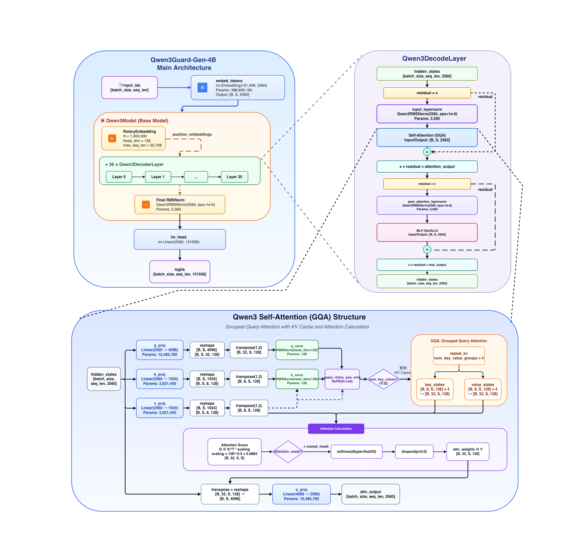

# Qwen3Guard-Gen

- Technical Report
    - [Qwen3Guard-Gen Technical Report](https://github.com/QwenLM/Qwen3/blob/main/Qwen3_Technical_Report.pdf)
- Huggingface
    - https://huggingface.co/collections/Qwen/qwen3guard
- ModelScopre
    - https://modelscope.cn/collections/Qwen3Guard-308c39ef5ffb4b

---

## Model Arch

---

## 核心说明

Qwen3Guard-Gen 是基于 [Qwen3](../qwen3/README.md) 构建的一系列安全审核模型，训练数据集包含 119 万个带有安全标签的提示和响应。该系列包括三种大小的模型（0.6B、4B 和 8B）。

它提供了以下主要优势：
- **架构精简高效**：Qwen3Guard-Gen 采用 Decoder-only Transformer，配合 GQA（2x 压缩）、SwiGLU FFN 和 RMSNorm，在保持高性能的同时实现极致轻量化。
- **生成式分类创新**：将安全分类任务框架化为文本生成任务，相比传统分类模型具有更高的可解释性和灵活性。
- **多语言支持**： Qwen3Guard-Gen 支持 119 种语言和方言，确保在全球和跨语言应用中的强大性能。
- **Qwen3 架构全特性继承**：完整继承 Qwen3 的 Flash Attention 2 支持、32K 上下文、rope_theta=1M 长文本外推等先进特性

## 特殊架构

### Qwen3Guard-Gen 核心创新

Qwen3Guard-Gen 作为安全护栏模型，在标准 Qwen3 架构基础上进行了以下特殊设计：

| 创新类型             | 描述                          | 分析                                                         |
| :------------------- | :---------------------------- | :----------------------------------------------------------- |
| **生成式安全分类**   | 将安全分类建模为文本生成任务  | 输出自然语言判断（Safe/Unsafe/Controversial + 类别），而非简单二分类标签 |
| **三级严重程度体系** | Safe / Controversial / Unsafe | Controversial 级别适应不同部署场景的安全容忍度               |
| **指令遵循架构**     | 使用指令模板格式化输入输出    | 灵活适应不同的安全策略和分类标准                             |
| **双重模式**         | Strict Mode 和 Loose Mode     | Strict: Controversial 视为 Unsafe；Loose: Controversial 视为 Safe |

### 安全类别体系

Qwen3Guard-Gen 定义了 9 大安全类别，覆盖全面的内容安全风险：

| 类别 ID | 类别名称                          | 描述                                 |
| :-----: | :-------------------------------- | :----------------------------------- |
|    1    | **Violent**                       | 暴力内容，包括武器制造、暴力行为指导 |
|    2    | **Non-violent Illegal Acts**      | 非暴力违法行为，如黑客攻击、盗窃     |
|    3    | **Sexual Content or Sexual Acts** | 性内容或性行为描述                   |
|    4    | **PII**                           | 个人身份信息泄露                     |
|    5    | **Suicide & Self-Harm**           | 自杀和自残内容                       |
|    6    | **Unethical Acts**                | 不道德行为，包括歧视、仇恨言论       |
|    7    | **Politically Sensitive Topics**  | 政治敏感话题                         |
|    8    | **Copyright Violation**           | 版权侵权行为                         |
|    9    | **Jailbreak**                     | 越狱攻击（仅用于输入检测）           |

## 训练策略

### 数据体系

| 维度                     | 分析内容      | 详情                                                         |
| :----------------------- | :------------ | :----------------------------------------------------------- |
| **数据规模**             | 总样本数      | 1.19M（119 万）prompt 和 response 标注样本                   |
| **数据来源**             | 合成数据      | 基于 Self-Instruct 框架生成，包括关键词引导合成和配对正负样本 |
|                          | 人工标注      | 人工标注的种子样本用于自动标注的质量验证                     |
|                          | 模型生成      | 利用 Qwen2.5-72B-Base 等基础模型合成不安全响应               |
| **语言分布**             | 主要语言      | 中文 26.64%，英语 21.9%，韩语 9.91%，印尼语 5.38%，俄语 5.36%，日语 4.82% 等 |
|                          | 总覆盖        | 119 种语言和方言                                             |
| **Prompt:Response 比例** | Prompt 占比   | 41.2%                                                        |
|                          | Response 占比 | 58.8%                                                        |
| **自动标注**             | 标注模型      | Qwen2.5-72B-Instruct、Qwen3-235B-A22B                        |
|                          | 质量验证      | 在人类验证集上 F1 > 0.9                                      |

### 核心训练方法
Qwen3Guard-Gen 采用**基于指令微调 Qwen3 模型的标准 SFT（监督微调）**。训练的关键创新在于**多阶段训练和数据优化管线**：

**挑战识别**：

1. **Controversial 类别模糊性**："Controversial" 安全级别本身具有内在歧义性，人工和合成数据中该类样本数量有限
2. **标注噪声**：训练数据中存在标注噪声，可能引入模型学习混淆

**解决策略**：

| 步骤 | 名称                               | 描述                               |
| :--: | :--------------------------------- | :--------------------------------- |
|  1   | **构建 Controversial 标签**        | 专门构建和增强争议性标签的数据     |
|  2   | **标签蒸馏（Label Distillation）** | 通过蒸馏减少标注噪声，提升标签质量 |

#### 生成式分类范式创新

传统的安全围栏模型（如 LlamaGuard、WildGuard）通常将安全分类建模为**序列分类任务**（输出二分类或多分类标签）。Qwen3Guard-Gen 的创新在于将安全分类重新框架化为**文本生成任务**：

| 特性           | 传统分类模型   | Qwen3Guard-Gen       |
| :------------- | :------------- | :------------------- |
| **输出格式**   | 分类标签 token | 自然语言描述         |
| **可解释性**   | 低（仅标签）   | 高（完整判断理由）   |
| **灵活性**     | 低（固定类别） | 高（可动态调整指令） |
| **多任务能力** | 需单独头       | 统一生成框架         |

#### 多语言训练策略

由于多语言安全数据天然稀缺，Qwen3Guard-Gen 采用**翻译增强策略**：

1. 利用 Qwen-MT 模型将原始内容翻译为 15 种额外语言
2. 质量验证方法：
- 语言混合检测
- LLM 评判
- 随机抽样人工审查

## vLLM Deploy
- 参考：[vllm/README.md](./vllm/README.md)