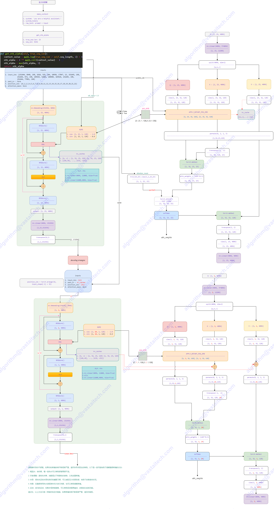

# QWQ

- Technical Report
    - [Qwen Technical Report](https://arxiv.org/abs/2309.16609)
    - [Qwen2 Technical Report](https://arxiv.org/abs/2407.10671)
    - [Qwen2.5 Technical Report](https://arxiv.org/abs/2412.15115)
    - [QwQ-32B: Embracing the Power of Reinforcement Learning](https://qwenlm.github.io/blog/qwq-32b)
- Huggingface
    - https://huggingface.co/Qwen


## Model Arch



### QWQ
大规模强化学习（RL）有潜力超越传统的预训练和后训练方法来提升模型性能。近期的研究表明，强化学习可以显著提高模型的推理能力。例如，DeepSeek R1通过整合冷启动数据和多阶段训练，实现了最先进的性能，使其能够进行深度思考和复杂推理。

推理模型QwQ-32B，这是一款拥有320亿参数的模型，其性能可与具备6710亿参数（其中370亿被激活）的DeepSeek-R1媲美。

QwQ-32B在初始阶段，特别针对数学和编程任务进行了RL训练。与依赖传统的奖励模型（reward model）不同，通过校验生成答案的正确性来为数学问题提供反馈，并通过代码执行服务器评估生成的代码是否成功通过测试用例来提供代码的反馈。随着训练轮次的推进，这两个领域中的性能均表现出持续的提升。在第一阶段的RL过后，我们增加了另一个针对通用能力的RL。此阶段使用通用奖励模型和一些基于规则的验证器进行训练。通过少量步骤的通用RL，可以提升其他通用能力，同时在数学和编程任务上的性能没有显著下降。


## Model Info
### Support Models

| models | tips |
| :---   | :--: |
| [QwQ-32B-Preview](https://hf-mirror.com/Qwen/QwQ-32B-Preview)  | GQA，强推理思考模型 |
| [QwQ-32B](https://hf-mirror.com/Qwen/QwQ-32B) |  GQA，强推理思考模型 |

> - 其它基于QwQ微调(均为`model_type:qwen2`)，其模型转换及推理测试参考Qwen2系列即可


## Build_In Deploy

### step.1 模型准备

1. 参考`Support Models`列表下载模型权重
2. 模型修改
    - 为在瀚博软件栈部署`QWQ`系列模型，在官方源码的基础上，需要对`modeling_qwen2.py`做一些修改，其中左图为修改的代码
    - [modeling_qwen2_vacc.py](./build_in/source_code/modeling_qwen2_vacc.py)
        - 修改相关依赖的导入方式
        
        - 基于config.insert_slice来判断是否插入strided_slice
        
        - class Qwen2ForCausalLM添加quantize方法，支持per_channel int8量化，[quantization_vacc.py](./build_in/source_code/quantization_vacc.py)
        
        - 迁移transformers==4.37.0版本内cache_utils,modeling_attn_mask_utils,modeling_outputs和utils中移动至modeling_qwen2_vacc.py

    - [configuration_qwen2_vacc.py](./build_in/source_code/configuration_qwen2_vacc.py)
        - 修改对于相关依赖的导入方式
        
    - [quantization_vacc.py](./build_in/source_code/quantization_vacc.py)
        - Qwen2ForCausalLM添加quantize方法，支持per_channel int8量化
        
    - [config_vacc.json](./build_in/source_code/config_vacc.json)
        - 添加_attn_implementation选项，并将其只配置为eager；并添加auto_map选项
        
    - 将以上修改后文件，放置与原始权重目录下（注意不同子模型，对应修改config_vacc.json文件）

### step.2 数据集

1. 量化校准数据集：
    - [allenai/c4](https://hf-mirror.com/datasets/allenai/c4/tree/main/en)
        - c4-train.00000-of-01024.json.gz
        - c4-validation.00000-of-00008.json.gz
    - [ceval/ceval-exam](https://hf-mirror.com/datasets/ceval/ceval-exam/tree/main)
        - ceval-exam.zip
    - [yahma/alpaca-cleaned](https://hf-mirror.com/datasets/yahma/alpaca-cleaned/tree/main)
        - alpaca_data_cleaned.json

2. 性能测试不定长数据集：[ShareGPT_V3_unfiltered_cleaned_split.json](https://huggingface.co/datasets/anon8231489123/ShareGPT_Vicuna_unfiltered/resolve/main/ShareGPT_V3_unfiltered_cleaned_split.json)
3. 精度评估数据集：[OpenCompassData-core-20240207.zip](https://github.com/open-compass/opencompass/releases/download/0.2.2.rc1/OpenCompassData-core-20240207.zip)


### step.3 模型转换
1. 参考瀚博训推软件生态链文档，获取模型转换工具: [vamc v3.0+](../../docs/vastai_software.md)
2. 根据具体模型修改模型转换配置文件
    - [hf_qwq_fp16.yaml](./build_in/build/hf_qwq_fp16.yaml)
    - [hf_qwq_int8.yaml](./build_in/build/hf_qwq_int8.yaml)

    ```bash
    vamc compile ./build_in/build/hf_qwq_fp16.yaml
    vamc compile ./build_in/build/hf_qwq_int8.yaml
    ```


### step.4 模型推理
1. 参考瀚博训推软件生态链文档，获取模型推理工具：[llmdeploy v1.6+](../../docs/vastai_software.md)
2. 参考llmdeploy工具文档，进行模型推理、性能和精度测试

### Tips
- **LLM模型请先查看概要指引**，[Tips🔔](../README.md)
- 建议环境配置
    ```bash
    protobuf==3.20.3
    torch==2.1.0
    onnx==1.14.0
    onnxsim==0.4.28
    onnxruntime==1.13.1
    accelerate==0.25.0
    transformers==4.40
    ```
