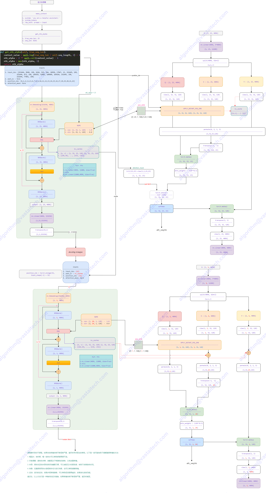
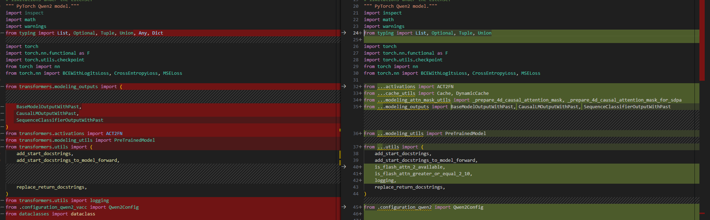
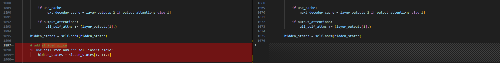
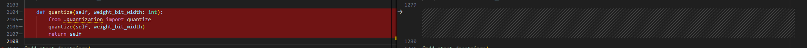
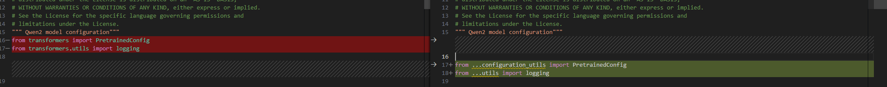
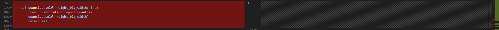
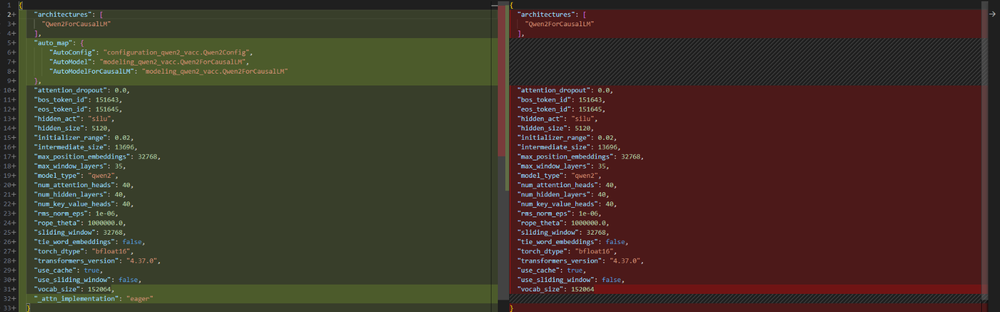

# Skywork-OR1

- [Skywork Open Reasoner Series](https://capricious-hydrogen-41c.notion.site/Skywork-Open-Reasoner-Series-1d0bc9ae823a80459b46c149e4f51680)
- [Qwen2.5 Technical Report](https://arxiv.org/abs/2412.15115)
- https://huggingface.co/collections/Skywork/skywork-or1-67fa1bcb41b436ef2def76b9
- https://github.com/SkyworkAI/Skywork-OR1

## Model Arch

> 训练优化路径：Qwen2.5 ---> DeepSeek-R1-Distill-Qwen ---> **Skywork-OR1**




OR1通过优化训练数据精炼和多阶段GRPO训练策略，更加聚焦于逻辑理解与复杂推理能力的提升。


| 模块类别           | 方法 / 策略名称             | 具体内容说明                                                 |
| :----------------- | :-------------------------- | :----------------------------------------------------------- |
| **数据构建与筛选** | **通过率筛选机制**          | 使用未微调模型进行多轮采样，仅保留 **通过率 > 0 且 < 1** 的问题（模型“有希望学会”） |
|                    | **数据混合策略**            | 训练 32B 模型时引入更难问题（如 NuminaMath 高难子集），整体优于 DeepScaleR 训练数据 |
|                    | **题目可验证性过滤**        | 去除无参考答案、无测试用例的问题；确保奖励函数评估稳定       |
| **强化学习算法**   | **多阶段 GRPO 训练**        | 多阶段按上下文窗口划分：**8K → 16K → 32K**，逐步推进推理长度 |
|                    | **截断响应策略**            | 实验过 Advantage Mask，但最终 **决定不使用任何 Advantage Mask**，以保持 token 效率和可扩展性 |
|                    | **KL 正则项设置**           | 明确设置 KL 系数 ，完全去除 KL Loss，避免限制策略演化        |
|                    | **采样温度策略**            | 强化学习中使用较高温度（**T = 1.0**），提升组内样本多样性与梯度信号 |
|                    | **自适应熵控制机制（AEC）** | 设置目标熵tgt-ent=0.2，每步更新系数$c_{k+1}=c_{k}\pm0.005$                               |
| **奖励函数机制**   | **数学任务验证器**          | 采用 Math-Verify，放弃 PRIME 和 Qwen2.5 verifier             |
|                    | **代码任务沙箱**            | 自建 code sandbox，确保代码能正确运行并 **全部通过测试用例** 才判定为 reward = 1 |

### 数据精制
1. 规则数据筛选，

为了构建高质量的强化学习训练数据，Skywork团队针对数学与代码两个任务域，制定了统一的选择标准，具体如下：
- 可验证性（Verifiable），排除了所有无法验证正确性的题目，例如：
    - 纯证明题（没有标准答案）
    - 缺乏测试用例的编程题
- 答案正确性（Correct），过滤掉：
    - 数学题中存在错误或不合法答案的问题
    - 编程题中没有完备测试用例的样本
- 挑战性（Challenging），提前用基础模型（如未强化学习前的模型）对每个问题生成多轮答案（N 次），然后排除：
    - 全部答案都对（N/N correct）的问题
    - 全部答案都错（0/N correct）的问题

基于以上三条标准，Skywork 精选出了一批具有代表性和难度的训练题目，主要包括：
- 数学数据来源
    - NuminaMath-1.5子集：
        - amc_aime、olympiads、olympiads_ref
        - aops_forum、cn_contest、inequalities、number_theory
    - DeepScaleR
    - STILL-3 Preview RL 数据集
    - Omni-MATH
    - AIME2024
- 编程数据来源
    - LeetCode
    - TACO

2. 基于模型感知的难度评估

这一步是为了确保用于强化学习（RL）训练的题目既具有挑战性，又能产生有意义的训练信号。关键思想是：先用模型自己试做一遍题，再根据结果来评估题目的难度。
- 数学题：每道题进行16次生成（N=16）
- 编程题：每道题进行8次生成（N=8）
- 生成参数
    - temperature=1.0
    - 最大上下文长度=32K tokens
- 难度判断方式
    - 对于每个题目，记录模型答对的比例（比如 16 次中答对 5 次，即 5/16）。
    - 按照这个比例，将题目分为：0/N（全错），N/N（全对），中间区域（部分答对）
- 只保留第三类——模型答对/答错情况有差异的题目
    - 这类题最能提供有用的训练信号
    - 全错/全对题目不利于优势估计（Advantage Estimation）

3. 人类+大模型双重评审的数据质量评估

即使通过了前两步（筛选+难度评估），仍有不少题目存在质量问题，比如题干不完整、格式混乱、无关信息等。

Skywork 团队发现：
- 许多数学题目 格式混乱、不完整，甚至无实际意义
- 有些问题在模型评估中被标为“答对”，其实是模型凭经验猜对的
- 高质量训练必须确保数据的清晰性、准确性和完整性


因此，Skywork 团队引入了人类评审+大模型辅助评审的机制，进一步剔除低质量题目。

- 人类评估标准（手动抽样检查），从保留数据中抽取样本，由人工基于以下标准做检查：

    | 检查维度         | 说明                                 |
    | :--------------- | :----------------------------------- |
    | **语言清晰**   | 题干表达是否通顺、易懂               |
    | **信息完整**   | 是否包含了所有必需的条件和背景       |
    | **排版规范**   | 数学符号是否正确、格式是否混乱       |
    | **无干扰内容** | 是否包含无意义的注释、乱码、翻译残留 |

- LLM 评审机制

为了更高效筛查大量题目，Skywork 团队使用两个强力大模型：Llama-3.3-70B-Instruct，Qwen2.5-72B-Instruct

- 提出统一的评审 prompt，请模型判断题目的质量（是否清晰、完整、规范等）
- 每个问题由两个模型分别生成 16 个回答，总共 32 个“投票”
- 统计判断结果：保留获得 9 票及以上肯定评价的题目
- 清理掉剩下的低质量问题，大约去掉 1000–2000 道数学题


### 训练策略
1. 多阶段GRPO与自适应熵控制

Skywork 团队在常规的 RLHF（强化学习微调）基础上做了三项主要增强：

- GRPO（Grouped Rollout with Policy Optimization）
- Multi-stage Training（多阶段训练）
    | Model               | Stage 1 | Stage 2 | Stage 3 |
    | ------------------- | ------- | ------- | ------- |
    | Skywork-OR1-Math-7B | 8K      | 16K     | 32K     |
    | Skywork-OR1-7B-Preview      | 16K     | 32K     | TBD     |
    | Skywork-OR1-32B-Preview     | 16k     | 32k     | TBD     |

    - 初期使用较短上下文，加快训练速度、减少资源消耗
    - 后期再扩展上下文，提升复杂问题的建模能力
    - 有效缓解了 RL 训练中“长序列学习慢”的问题


- Adaptive Entropy Control（自适应熵控制）
    - 为避免模型在训练中变得过于保守（熵坍缩），Skywork 引入了一个自适应熵机制：
        - 动态调整熵损失系数（αₖ），保持输出多样性
        - 如果模型生成的回答熵太低，会自动增强探索（提高 αₖ）
        - 若熵太高则减少惩罚，保持稳定
    - 目标是保证模型始终保持“敢猜但不乱猜”的状态——探索性与确定性之间的平衡。

2. 采样温度对模型熵的影响

由于Skywork使用的GRPO是group-wise策略优化机制，模型的每一步训练都会采样一组（group）响应用于优化。如果组内响应高度相似或质量较差，则会极大降低训练效率。而采样温度（temperature τ）的设置会直接影响：
- 生成样本的多样性（diversity）
- group的正确/错误比例
- 进而影响RL的优化信号与梯度方向

设计实验，证明使用更高温度效果更佳：
- 有助于保持策略熵在合理区间
- 避免模型陷入“回答一模一样”的局部最优

### 完全开源
- 训练数据
- 训练代码
- 训练权重


| Model                        | AIME24 (Avg@32) | AIME25 (Avg@32) | LiveCodeBench (8/1/24-2/1/25) (Avg@4) |
| ---------------------------- | --------------- | --------------- | ------------------------------------- |
| DeepSeek-R1-Distill-Qwen-7B  | 55.5            | 39.2            | 37.6                                  |
| Light-R1-7B-DS               | 59.1            | 44.3            | 39.5                                  |
| DeepSeek-R1-Distill-Qwen-32B | 72.9            | 59.0            | 57.2                                  |
| TinyR1-32B-Preview           | 78.1            | 65.3            | 61.6                                  |
| QwQ-32B                      | 79.5            | 65.3            | 61.6                                  |
| DeepSeek-R1                  | 79.8            | 70.0            | 65.9                                  |
| **Skywork-OR1-Math-7B**      | 69.8            | 52.3            | 43.6                                  |
| **Skywork-OR1-7B-Preview**   | 63.6            | 45.8            | 43.9                                  |
| **Skywork-OR1-32B-Preview**  | 79.7            | 69.0            | 63.9                                  |


## Model Info
### Support Models

| models  | tips |
| :---: | :--: |
| [Skywork-OR1-7B-Preview](https://huggingface.co/collections/Skywork/skywork-or1-67fa1bcb41b436ef2def76b9) |GQA，Reasoning，通用推理模型，轻量高效|
| [Skywork-OR1-Math-7B](https://huggingface.co/collections/Skywork/skywork-or1-67fa1bcb41b436ef2def76b9) |GQA，Reasoning，数学专用模型，精通AIME题目 |
| [Skywork-OR1-32B-Preview](https://huggingface.co/collections/Skywork/skywork-or1-67fa1bcb41b436ef2def76b9) |GQA，Reasoning，高性能推理模型，追求极致效果 |

> - 在DeepSeek-R1-Distill-Qwen-7B和DeepSeek-R1-Distill-Qwen-32B基础上进行微调
> - 另外，DeepSeek-R1-Distill-Qwen是基于Qwen2.5微调的


## Build_In Deploy

### step.1 模型准备

1. 参考`Support Models`列表下载模型权重
2. 网络修改
    - 为了方便部署`Skywork-OR1`系列模型，在官方源码的基础上，对`modeling_qwen2.py`做了一些修改，其中左图为修改的代码
    - [modeling_qwen2_vacc.py](./source_code/modeling_qwen2_vacc.py)
        - 修改相关依赖的导入方式
        
        - 借助config.iter_num和 config.insert_slice来判断是否插入strided_slice
        
        - class Qwen2ForCausalLM添加quantize方法，支持per_channel int8量化，[quantization_vacc.py](./source_code/quantization_vacc.py)
        
        - 如需使用transformers==4.31.0版本，部分utils函数未实现；可从transformers==4.37.0版本内cache_utils,modeling_attn_mask_utils,modeling_outputs和utils中移动至modeling_qwen2_vacc.py(当前已复制这些函数)

    - [configuration_qwen2_vacc.py](./source_code/configuration_qwen2_vacc.py)
        - 修改对于相关依赖的导入方式
        
    - [quantization_vacc.py](./source_code/quantization_vacc.py)
        - Qwen2ForCausalLM添加quantize方法，支持per_channel int8量化
        
    - [config.json](./source_code/config.json)
        - 添加_attn_implementation选项，并将其只配置为eager；并添加auto_map选项
        
        
    - 将以上文件移动至原始权重路径内，覆盖同名文件

> 修改同Qwen2.5

### step.2 数据集

1. 量化校准数据集：
    - [allenai/c4](https://hf-mirror.com/datasets/allenai/c4/tree/main/en)
        - c4-train.00000-of-01024.json.gz
        - c4-validation.00000-of-00008.json.gz
    - [ceval/ceval-exam](https://hf-mirror.com/datasets/ceval/ceval-exam/tree/main)
        - ceval-exam.zip
    - [yahma/alpaca-cleaned](https://hf-mirror.com/datasets/yahma/alpaca-cleaned/tree/main)
        - alpaca_data_cleaned.json

### step.3 模型转换
1. 根据具体模型修改模型转换配置文件
    - v1/v2/v2.5模型，编译配置一致
    - [hf_skywork_or1_fp16.yaml](./build_in/build/hf_skywork_or1_fp16.yaml)
    - [hf_skywork_or1_in8.yaml](./build_in/build/hf_skywork_or1_in8.yaml)

    > - runstream推理，编译参数`backend.type: tvm_vacc`
    > - fp16精度: 编译参数`backend.dtype: fp16`
    > - int8精度: 编译参数`backend.dtype: int8`

    ```bash
    cd skywork_or1
    mkdir workspace
    cd workspace
    vamc compile ./build_in/build/hf_skywork_or1_fp16.yaml
    vamc compile ./build_in/build/hf_skywork_or1_in8.yaml
    ```

### step.4 模型推理
1. 参考大模型部署推理工具：[vastgenx](../../docs/vastgenx/README.md)

### Tips
- **LLM模型请先查看概要指引**，[Tips🔔](../README.md)
- 依赖配置
    ```bash
    protobuf==3.20.3
    torch==2.1.0
    onnx==1.14.0
    onnxsim==0.4.35
    onnxruntime==1.13.1
    transformers==4.45.2
    ```
- 注意在加载tokenizer时，需要按如下方式加载：`tokenizer=AutoTokenizer.from_pretrained(model_weights_path)`
