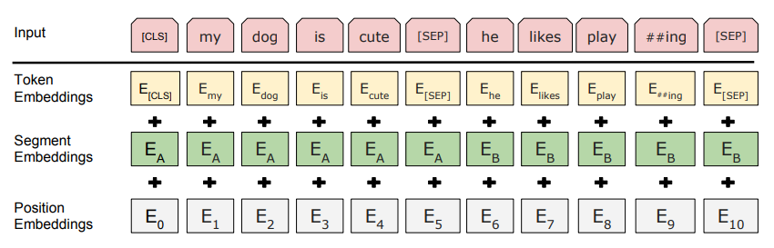
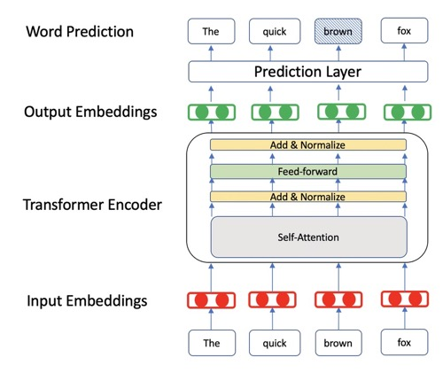
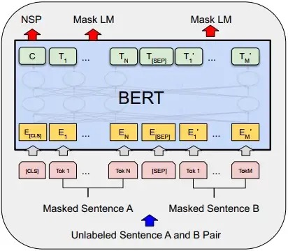
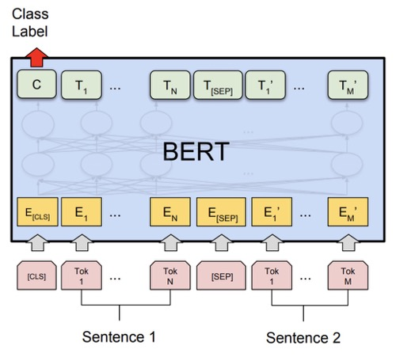

# **BERT**
[BERT: Pre-training of Deep Bidirectional Transformers for Language Understanding](https://arxiv.org/abs/1810.04805)

## **Model Arch**

BERT是2018年10月由Google AI研究院提出的一种预训练模型。BERT的全称是Bidirectional Encoder Representation from Transformers。其采用了 Transformer 架构的编码器部分用于学习词在给定上下文下词的 Embedding 表示，相较于之前的RNN，其最大的优势是可以并行训练。 BERT 的主要创新点在于pre-train方法上，即用了Masked  LM 和 Next Sentence Prediction 两种方法分别捕捉词语和句子级别的 representation 。因此，使用BERT训练的pre-train 模型对于 NLP 下游任务非常友好。

### Embedding

BERT的 Embedding 处理由三种 Embedding 求和而成：
<div align=center></div>

其中：
- Token Embeddings是词向量，第一个单词是CLS标志，可以用于之后的分类任务
- Segment Embeddings用来区别两种句子，因为预训练不光做LM还要做以两个句子为输入的分类任务
- Position Embeddings和之前文章中的Transformer不一样，不是三角函数而是学习出来的，而是类似普通的词嵌入一样为每一个位置初始化了一个向量，然后随着网络一起训练得到

</br>

### BertEncoder

如下图所示便是 Bert Encoder 的结构示意图，其整体由多个 BertLayer（也就是论文中所指代的 Transformer blocks）所构成

<div align=center></div>

具体的，在论文中作者分别用 L 来表示 BertLayer 的层数，即 BertEncoder 是由 L 个 BertLayer 所构成；用 H 来表示模型的维度；用 A 来表示多头注意力中多 头的个数。同时，在论文中作者分别就 $`BERT_{BASE}`$ (L=12, H=768, A=12) 和 $`BERT_{LARGE}`$ (L=24, H=1024, A=16) 这两种尺寸的 BERT 模型进行了实验对比。 

</br>

### MLM 与 NSP 任务

为了能够更好训练 BERT 网络，论文作者在 BERT 的训练过程中引入两个任务，MLM 和 NSP。对于 MLM 任务来说，其做法是随机掩盖掉输入序列中 15% 的 Token（即用 “[MASK]” 替换掉原有的 Token），然后在 BERT 的输出结果中取对应掩盖位置上的向量进行真实值预测。虽然 MLM 的这种做法能够得到一个很好的预训练模型，但是仍旧存在不足之处。由于在 fine-tuning 时，由于输入序列中并不存在“[MASK]” 这样的 Token，因此这将导致 pre-training 和 fine-tuning 之间存在不匹配不一致的问题（GAP）。为了解决这一问题，作者在原始 MLM 的基础了做了部分改动，即先选定15%的 Token，然后将其中的80%替换为“[MASK]”、10%随机替换为其它 Token、剩下的 10% 不变。最后取这 15% 的 Token 对应的输出做分类来预测其真实值。

由于很多下游任务需要依赖于分析两句话之间的关系来进行建模，例如情感分析，问答等。为了使得模型能够具备有这样的能力，作者在论文中又提出了二分类的下句预测任务具体地，对于每个样本来说都是由 A 和 B 两句话构成，其中 50% 的情况 B 确实为 A 的下一句话（标签为 IsNext），另外的 50% 的情况是 B 为语料中其它 的随机句子（标签为 NotNext），然后模型来预测 B 是否为 A 的下一句话。

<div align=center></div>

如上图所示便是 ML 和 NSP 这两个任务在 BERT 预训练时的输入输出示意图，其中最上层输出的C在预训练时用于 NSP 中的分类任务；其它位置上的 $`T_{i}`$ , $`T^{'}_{j}`$ 则用于预测被掩盖的 Token。

</br>
</br>

## **Model Info**
> - 以下数据为模型来源官方数值指标
> - 基于GLUE数据集，BERT模型对下游任务的性能验证

|Model|Score|CoLA|SST-2|**MRPC**|STS-B|QQP|MNLI-m|MNLI-mm|QNLI|RTE|WNLI|AX|
|---|:---:|:---:|:---:|:---:|:---:|:---:|:---:|:---:|:---:|:---:|:---:|:---:|
|BERT-Tiny|64.2|0.0|83.2|**81.1/71.1**|74.3/73.6|62.2/83.4|70.2|70.3|81.5|57.2|62.3|21.0|
|BERT-Mini|65.8|0.0|85.9|**81.1/71.8**|75.4/73.3|66.4/86.2|74.8|74.3|84.1|57.9|62.3|26.1|
|BERT-Small|71.2|27.8|89.7|**83.4/76.2**|78.8/77.0|68.1/87.0|77.6|77.0|86.4|61.8|62.3|28.6|
|BERT-Medium|73.5|38.0|89.6|**86.6/81.6**|80.4/78.4|69.6/87.9|80.0|79.1|87.7|62.2|62.3|30.5|
|BERT-Base|79.6|52.1|93.5|**88.9**|85.8|71.2|84.6|83.4|90.5|66.4|/|/|
|BERT-Large|82.1|60.5|94.9|**89.3**|86.5|72.1|86.7|85.9|92.7|70.1|/|/|

</br>


### 测评数据集说明
####  1. MRPC
<div align=center></div>
MRPC(The Microsoft Research Paraphrase Corpus，微软研究院释义语料库)，相似性和释义任务，是从在线新闻源中自动抽取句子对语料库，并人工注释句子对中的句子是否在语义上等效。类别并不平衡，其中68%的正样本，所以遵循常规的做法，评估准确率（accuracy）和F1值。

- 样本个数：训练集3668个，验证集408个，测试集1725个。
- 任务：句子分类任务，是否释义二分类，是释义，不是释义两类。
- 评价准则：准确率（accuracy）和F1值。

本任务的数据集，包含两句话，每个样本的句子长度都非常长，且数据不均衡，正样本占比68%，负样本仅占32%。

</br>

#### 2. SQuAD 1.1
<div align=center></div>
SQuAD是Stanford Question Answering Dataset 的首字母缩写。这是一个阅读理解数据集，由众包工作者在一组维基百科文章上提出的问题组成，其中每个问题的答案都是相应文章中的一段文本，某些问题可能无法回答。SQuAD 1.1 包含针对 500+ 文章的 10万+ 问答对。

- 样本个数：107785 个问答对。
- 任务：问答任务，获取句子的起始和结束位置。
- 评价准则：精确匹配(EM)，模糊匹配(F1-Score)

</br>

#### 3. china-people-daily-ner-corpus
对于任意一个NLP任务来说模型最后所要完成的基本上都可看作是一个分类任务。根据给出的标签来看，对于原始句子中的每个字符来说其都有一个对应的类别标签，因此对于NER任务来说只需要对原始句子里的每个字符进行分类即可，然后再将预测后的结果进行后处理便能够得到句子从存在的相应实体。

china-people-daily-ner-corpus 是一个中文命名实体识别数据集，共有7类，其中 B- 表示该类实体的开始标志，I- 表示该类实体的延续标志，分别是：

- "B-ORG":组织或公司(organization)
- "I-ORG":组织或公司
- "B-PER":人名(person)
- "I-PER":人名
- "O":其他非实体(other)
- "B-LOC":地名(location)
- "I-LOC":地名
测试集样本：4646个；评价指标：F1和Accuracy。

</br>

## **VACC**

### step.1 模型finetune 
#### google-bert
- bert-base-mrpc - 模型微调说明：[google_bert_mrpc.md](./finetune/google_bert_mrpc.md)

#### bert4torch 
- bert-base-ner - 模型微调说明：[bert4torch_ner_crf.md](./finetune/bert4torch_ner_crf.md)

### step.2 准备预训练模型
#### google-bert
- bert-base-mrpc
    - 从 step.1 google-bert 获得预训练模型；
    - 将预训练模型导出 pb， 代码可参考： [ckpt2pb_classifer.py](./tools/ckpt2pb_classifer.py)

        运行 ckpt2pb_classifer.py
        ```bash
        cd nlp/bert/tools
        python ckpt2pb_classifer.py \
          --init_checkpoint path/to/bert/tmp/mrpc_output/model.ckpt \
          --bert_config_file path/to/bert/weights/uncased_L-12_H-768_A-12/bert_config.json \
          --output_dir output/google_bert_mrpc
        ```
        - init_checkpoint：根据 step.1 进行微调后的 `ckpt` 权重文件路径
        - bert_config_file： 预训练模型 bert-base_uncased 的配置文件路径
        - output_dir： 模型转换后的 `pb` 格式文件保存路径

#### bert4torch 
- bert-base-ner
    - 从 step.1 bert4torch 获得预训练模型；

### step.3 准备数据集
- MPRC
    - MRPC 数据集为bert classifer 任务微调使用的公开数据集， 用户可自行准备数据集，[MRPC](https://gluebenchmark.com/)

        ```
        ├── MRPC
        |   ├── train.tsv   
        │   ├── test.tsv
        |   ├── dev.tsv
        |   ├── .....
        ```
    - 模型量化以及推理所需数据的格式为`.npz`，输入为3个, 包括：`input_ids_1、segment_ids_2、input_mask_1`，输入长度为128，数据类型为 `int32`, 用户可依据上述要求自行解析 MRPC 数据集。

- china-people-daily-ner-corpus
    - china-people-daily-ner-corpus 数据集为 bert ner 任务微调使用的公开数据集， 用户可自行准备数据集, [china-people-daily](http://s3.bmio.net/kashgari/china-people-daily-ner-corpus.tar.gz)
        ```
        ├── china-people-daily-ner-corpus
        |   ├── example.train  
        │   ├── example.dev
        |   ├── example.test
        |   ├── .....
        ```
    - 模型量化以及推理所需数据的格式为`.npz`，输入为3个, 包括：`inputs_ids、segment_ids、input_mask`，输入长度为256，数据类型为 `int32`, 用户可依据上述要求自行解析 china-people-daily-ner-corpus 数据集。

### step.4 模型转换

1. 根据具体模型修改配置文件
   - [google_bert_mprc](./build_config/google_bert_mprc.yaml)
   - [bert4torh_ner](./build_config/bert4torh_ner.yaml)

2. 命令行执行转换

   ```bash
   vamc build ./build_config/cfg.yaml
   ```

### step.5 模型推理和精度评估
1. 根据step.4 配置模型三件套信息，[model_info](./model_info/model_info_bert.json)
2. 执行推理，调用入口 [sample_bert_classifer](../../inference/nlp/bert/sample_bert_classifer.py)， 源码可参考 [nlp_bert](../../inference/nlp/bert/nlp_bert.py)
    ```bash
    # 执行run stream 脚本
    cd ../../inference/nlp/bert

    python sample_bert.py \
      --task_name mrpc \
      --model_info /path/to/nlp/bert/model_info/model_info_bert.json \
      --eval_path /path/to/data/MRPC/dev.tsv \
      --bytes_size 512 \
      --data_dir /path/to/data/MRPC/dev408 \
      --save_dir /path/to/output
    ```
    - task_name： nlp下游任务名称
    - model_info：指定上阶段转换的模型路径
    - eval_path：精度评估数据集的路径
    - bytes_size： 转换成bytes的数据大小，如128长度的序列，数据类型为int32，则转换成bytes类型后的长度为 128 * 4 = 512
    - data_dir： step.3 阶段转换成npz格式的数据，用于模型推理所需数据
    - save_dir： 输出 feature 和精度评估结果保存路径地址

3.  在执行 `sample_bert.py` 脚本后， 会在模型推理阶段结束后进行精度评估，并保存精度评估结果


## **Reference**

- https://github.com/google-research/bert
- https://rajpurkar.github.io/SQuAD-explorer/
- https://gluebenchmark.com/

