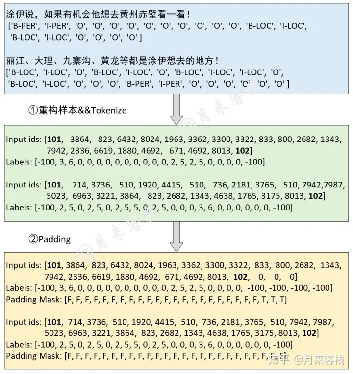

# **XLM-RoBERTa**
[Unsupervised Cross-lingual Representation Learning at Scale](https://arxiv.org/abs/1911.02116)


## **Model Arch**
XLM-RoBERTa 的改进

1. 在 XLM 和 RoBERTa 中使用的跨语言方法的基础上（本质就是 XLM+RoBERTa），在新模型中增加了语种数量和训练数据集的数量，具体来说使用超过 2TB 预处理过的 CommonCrawl 数据集，以无监督的方式训练跨语言表征

2. 在 fine-tuning 期间，基于多语言模型的能力来使用多语言的标注数据，以提升下游任务的性能

3. 调整了模型的参数，以抵消以下不利因素：使用跨语言迁移来将模型扩展到更多的语言时限制了模型理解每种语言的能力。参数更改包括在训练和词汇构建过程中对低资源语言进行上采样，生成更大的共享词汇表，以及将整体模型增加到 5.5 亿参数量。

4. XLM-RoBERTa 的模型主体还是 Transformer，训练目标是多语种的 MLM，基本和 XLM 一样。作者从每个语种的语料中采样出文本，再预测出被 Mask 的 tokens。从各语种采样的方法与 XLM 中相同。另一个与 XLM 不同的是，文本不使用  Language Embeddings。


</br>

## **Model Info**

### 测评数据集说明
####  1. NER (peoples_daily_ner)

对于任意一个NLP任务来说模型最后所要完成的基本上都可看作是一个分类任务。根据给出的标签来看，对于原始句子中的每个字符来说其都有一个对应的类别标签，因此对于NER任务来说只需要对原始句子里的每个字符进行分类即可，然后再将预测后的结果进行后处理便能够得到句子从存在的相应实体。
<div align=center></div>

[peoples_daily_ner](https://huggingface.co/datasets/peoples_daily_ner) 数据集共有7类，B-表示该类实体的开始标志，I-表示该类实体的延续标志，分别是：

- "B-ORG":组织或公司(organization)
- "I-ORG":组织或公司
- "B-PER":人名(person)
- "I-PER":人名
- "O":其他非实体(other)
- "B-LOC":地名(location)
- "I-LOC":地名

验证集样本：4646个；评价指标：F1和Accuracy。

</br>


## **Deploy**

### step.1 模型 finetune
-  huggingface，模型微调说明：[huggingface_xlmroberta_ner.md](./huggingface/source_code/finetune/huggingface_xlmroberta_ner.md)

### step.2 获取模型
- huggingface，预训练模型导出至torchscript格式，说明: [pt2torchscript](./huggingface/source_code/pretrain_model/README.md)


### step.3 获取数据集
- 校准数据集
    - [huggingface](https://drive.google.com/drive/folders/1nWpOWQrtsB_g9y8JeEMbb71LddHxEUFX)
- [评估数据集-v1.3](https://drive.google.com/drive/folders/1Hj9sk3scunvGQrd48QKOsmOpJINrosMt)
- [评估数据集-v1.5](https://drive.google.com/drive/folders/1QOLVh7TZSrKpm6c34hTGF5wh2OBPRlXm)
- labels: [instance_Peoples_Daily.txt](https://drive.google.com/drive/folders/15O2QrYHCXVP8NjwwByFQ6lUPbYOHvf-r)
> 注意： 由于 compiler 1.5 版本将 bert 相关模型的输入改变为6个。 因此，1.5 版本的校验数据集需使用 `评估数据集-v1.5`。

### step.4 模型转换
1. 根据具体模型修改配置文件

    - [huggingface](./huggingface/build_in/build/huggingface_xlmroberta_ner.yaml)

    > - runstream推理，编译参数`backend.type: tvm_vacc`
    > - fp16精度: 编译参数`backend.dtype: fp16`
    > - int8精度: 编译参数`backend.dtype: int8`，需要配置量化数据集和预处理算子

2. 模型编译

    ```bash
    cd xlmroberta
    mkdir workspace
    cd workspace
    vamc compile ../huggingface/build_in/build/huggingface_xlmroberta_ner.yaml
    vamc compile ../huggingface/build_in/build/huggingface_xlmroberta_ner_fp16.yaml
    ```
### step.5 模型推理

- 基于 [sequence2npz.py](../../sentence_classification/common/utils/sequence2npz.py)，获得推理数据`npz`以及对应的`npz_datalist.txt`

   ```bash
   python ../../common/utils/sequence2npz.py \
       --npz_path /path/to/test4636_6inputs \
       --save_path npz_datalist.txt
   ```
- runstream 运行
  - `compiler version <= 1.5.0 并且 vastsream sdk == 1.X`

    运行 [sample_nlp.py](../common/sdk1.0/sample_nlp.py) 脚本，获取 runstream 结果，示例：

    ```bash
    cd ../../common/sdk1.0/
    python sample_nlp.py \
        --model_info ./network.json \
        --bytes_size 1024 \
        --datalist_path npz_datalist.txt \
        --save_dir ./output
    ```

    > 可参考 [network.json](../../question_answering/common/sdk1.0/network.json) 进行修改

  - `compiler version >= 1.5.2 并且 vastsream sdk == 2.X`

    运行 [vsx_ner.py](../common/vsx/python/vsx_ner.py) 脚本，获取 runstream 结果，示例：

    ```bash
    python ../../common/vsx/python/vsx_ner.py \
        --data_list npz_datalist.txt \
        --model_prefix_path ./deploy_weights/xlmroberta_base_zh_ner/mod \
        --device_id 0 \
        --batch 1 \
        --save_dir ./out

    # fp16
    python ../../common/vsx/python/vsx_ner.py \
        --data_list npz_datalist.txt \
        --model_prefix_path ./deploy_weights/fp16/xlmroberta_base_zh_ner/mod \
        --device_id 0 \
        --batch 1 \
        --save_dir ./out_fp16
    
    # torchscript pt
    python ../../common/utils/run_torchscript.py \
        --data_list npz_datalist.txt \
        --model_path ../huggingface/source_code/pretrain_model/xlmroberta_base_zh_ner-256.torchscript.pt \
        --save_dir ./out_torch

    > `--model_prefix_path` 为转换的模型三件套的文件前缀路径

- 精度评估

   基于 [people_daily_eval.py](../common/eval/people_daily_eval.py)，解析npz结果，并评估精度
   ```bash
   python ../../common/eval/people_daily_eval.py \
       --result_dir ./out \
       --label_path /path/to/instance_Peoples_Daily.txt
    
   # vacc fp16
   python ../../common/eval/people_daily_eval.py \
       --result_dir ./out_fp16 \
       --label_path /path/to/instance_Peoples_Daily.txt
    
   # torchscript pt
   python ../../common/eval/people_daily_eval.py \
       --result_dir ./out_torch \
       --label_path /path/to/instance_Peoples_Daily.txt
    
   ```
   ```
   # vacc int8
   F1:  0.09142857142857144
   accuracy:  0.8204338602614111

   # vacc fp16
   F1:  0.7655719139297849
   accuracy:  0.9234927804010128
   
   # torchscript pt
   F1:  0.7657887284055508
    accuracy:  0.9233559159652365

   ```

### step.6 性能精度测试
1. 基于[sequence2npz.py](../../sentence_classification/common/utils/sequence2npz.py)，生成推理数据`npz`以及对应的`npz_datalist.txt`, 可参考 step.5

2. 执行测试：
    ```bash
    vamp -m deploy_weights/bert_base_chinese_ner_256-int8-max-mutil_input-vacc/bert_base_chinese_ner_256 \
        --vdsp_params ../../common/vamp_info/bert_vdsp.yaml \
        --batch_size 1 \
        --instance 6 \
        --processes 2
        --datalist npz_datalist.txt \
        --path_output ./save/bert
    ```
    > 相应的 `vdsp_params` 等配置文件可在 [vamp_info](../common/vamp_info/) 目录下找到
    >
    > 如果仅测试模型性能可不设置 `datalist`、`path_output` 参数


3. 精度评估

    基于 [people_daily_eval.py](../common/eval/people_daily_eval.py)，解析npz结果，并评估结果，可参考 step.5

    ```bash
    python ../../common/eval/people_daily_eval.py \
       --result_dir ./vamp_bert_out \
       --label_path /path/to/people_daily/instance_Peoples_Daily.txt
   ```