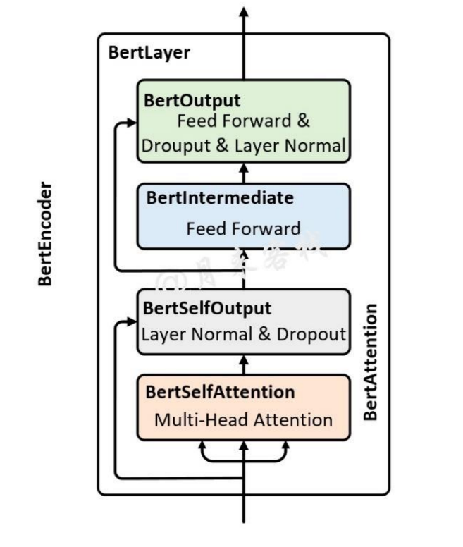
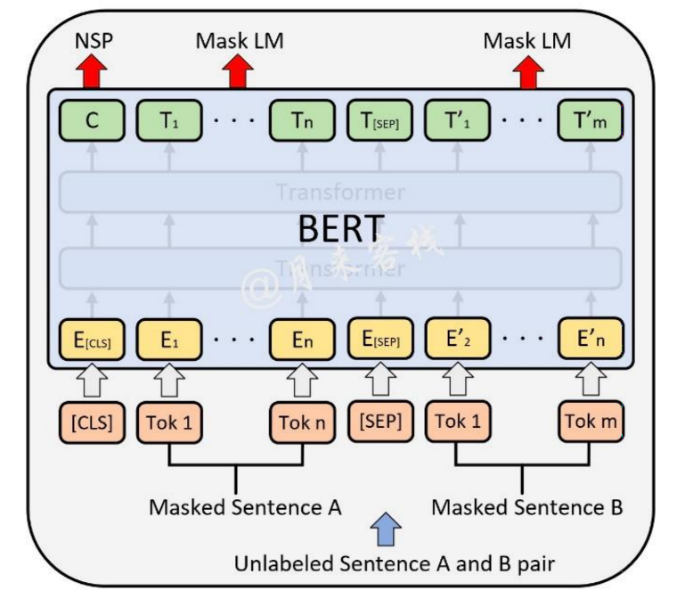

# **BERT**
[Well-Read Students Learn Better: On the Importance of Pre-training Compact Models](https://arxiv.org/abs/1908.08962)

## **Model Arch**

BERT是2018年10月由Google AI研究院提出的一种预训练模型。BERT的全称是Bidirectional Encoder Representation from Transformers。其采用了 Transformer 架构的编码器部分用于学习词在给定上下文下词的 Embedding 表示，相较于之前的RNN，其最大的优势是可以并行训练。 BERT 的主要创新点在于pre-train方法上，即用了Masked  LM 和 Next Sentence Prediction 两种方法分别捕捉词语和句子级别的 representation 。因此，使用BERT训练的pre-train 模型对于 NLP 下游任务非常友好。

### Embedding

BERT的 Embedding 处理由三种 Embedding 求和而成：

其中：
- Token Embeddings是词向量，第一个单词是CLS标志，可以用于之后的分类任务
- Segment Embeddings用来区别两种句子，因为预训练不光做LM还要做以两个句子为输入的分类任务
- Position Embeddings和之前文章中的Transformer不一样，不是三角函数而是学习出来的，而是类似普通的词嵌入一样为每一个位置初始化了一个向量，然后随着网络一起训练得到

 

### BertEncoder

如下图所示便是 Bert Encoder 的结构示意图，其整体由多个 BertLayer（也就是论文中所指代的 Transformer blocks）所构成

具体的，在论文中作者分别用 L 来表示 BertLayer 的层数，即 BertEncoder 是由 L 个 BertLayer 所构成；用 H 来表示模型的维度；用 A 来表示多头注意力中多 头的个数。同时，在论文中作者分别就 $`BERT_{BASE}`$ (L=12, H=768, A=12) 和 $`BERT_{LARGE}`$ (L=24, H=1024, A=16) 这两种尺寸的 BERT 模型进行了实验对比。 

 

### MLM 与 NSP 任务

为了能够更好训练 BERT 网络，论文作者在 BERT 的训练过程中引入两个任务，MLM 和 NSP。对于 MLM 任务来说，其做法是随机掩盖掉输入序列中 15% 的 Token（即用 “[MASK]” 替换掉原有的 Token），然后在 BERT 的输出结果中取对应掩盖位置上的向量进行真实值预测。虽然 MLM 的这种做法能够得到一个很好的预训练模型，但是仍旧存在不足之处。由于在 fine-tuning 时，由于输入序列中并不存在“[MASK]” 这样的 Token，因此这将导致 pre-training 和 fine-tuning 之间存在不匹配不一致的问题（GAP）。为了解决这一问题，作者在原始 MLM 的基础了做了部分改动，即先选定15%的 Token，然后将其中的80%替换为“[MASK]”、10%随机替换为其它 Token、剩下的 10% 不变。最后取这 15% 的 Token 对应的输出做分类来预测其真实值。

由于很多下游任务需要依赖于分析两句话之间的关系来进行建模，例如问题回答等。为了使得模型能够具备有这样的能力，作者在论文中又提出了二分类的下句预测任务具体地，对于每个样本来说都是由 A 和 B 两句话构成，其中 50% 的情况 B 确实为 A 的下一句话（标签为 IsNext），另外的 50% 的情况是 B 为语料中其它 的随机句子（标签为 NotNext），然后模型来预测 B 是否为 A 的下一句话。

如上图所示便是 ML 和 NSP 这两个任务在 BERT 预训练时的输入输出示意图，其中最上层输出的C在预训练时用于 NSP 中的分类任务；其它位置上的 $`T_{i}`$ , $`T^{'}_{j}`$ 则用于预测被掩盖的 Token。

 
 

## **Model Info**
- BERT模型在SQUAD 1.1（问答）数据集的性能

Model                                    | SQUAD 1.1 F1/EM 
---------------------------------------- | :-------------: 
BERT-Large, Uncased (Original)           | 91.0/84.3       
BERT-Large, Uncased (Whole Word Masking) | 92.8/86.7       
BERT-Large, Cased (Original)             | 91.5/84.8       
BERT-Large, Cased (Whole Word Masking)   | 92.9/86.7       
**BERT-Base, Uncased**                       | **88.4/81.2**       
BERT-Large, Uncased                      | 90.0/84.4       

 
 

### 测评数据集说明
#### 1. SQuAD 1.1

[SQuAD](https://rajpurkar.github.io/SQuAD-explorer/) 是 Stanford Question Answering Dataset 的首字母缩写。这是一个阅读理解数据集，由众包工作者在一组维基百科文章上提出的问题组成，其中每个问题的答案都是相应文章中的一段文本，某些问题可能无法回答。SQuAD 1.1 包含针对 500+ 文章的 10万+ 问答对。

- 样本个数：107785 个问答对。
- 任务：问答任务，获取句子的起始和结束位置。
- 评价准则：精确匹配(EM)，模糊匹配(F1-Score)

 

 

## Build_In Deploy

- [tensorflow_deploy.md](./tensorflow/tensorflow_deploy.md)
- [huggingface_deploy.md](./huggingface/huggingface_deploy.md)
