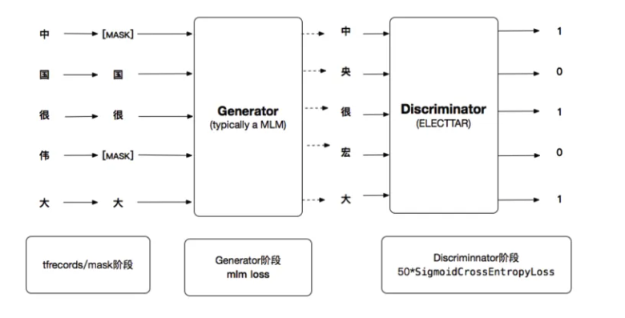

 # **Electra**
 [ELECTRA: PRE-TRAINING TEXT ENCODERS AS DISCRIMINATORS RATHER THAN GENERATORS](https://openreview.net/pdf?id=r1xMH1BtvB)

## **Model Arch**
ELECTRA 是 Manning  联合 google brain 与 2020年3月开源的 nlp 预训练大模型，一经发布就迅速火爆整个 NLP 圈，其中 ELECTRA-small 模型参数量仅为 BERT-base 模型的 1/10，性能却依然能与 BERT、RoBERTa 等模型相媲美。其中的关键是 ELECTRA 模型的训练思想。

### 模型框架
首先，ELECTRA 作者在分析了 BERT MLM 任务在微调阶段与预训练阶段之间是割裂的，于是他提出采用 RTD(replaced token detection) 这种方式来代替 MLM。为了方便采用 RTD 预训练，ELECTRA 借鉴了 GAN 的思想，使用生成器将 带有[MASK] 的token进行替换，将替换后的句子输入到判别器中去判别每个token是否是原始输入。而判别器此时会转换成一个二分类模型。这个转换可以带来效率的提升，对所有位置的词进行预测，收敛速度会快的多。

如上图，electra 由两部分组成，分别是 generator 以及 discriminator，两个都是 transformer 的 encoder结构，只是两者的 size 不同：

- generator：实际是一个小的 masked language model（通常是 1/4 的discriminator的size），该模块的具体作用是他采用了经典的bert的MLM方式：
首先随机选取15%的tokens，替代为[MASK]token，(取消了bert的80%[MASK],10%unchange, 10% random replaced 的操作，具体原因也是因为没必要，因为我们finetuning使用的discriminator)
使用generator去训练模型，使得模型预测masked token，得到corrupted tokens
generator的目标函数和bert一样，都是希望被masked的能够被还原成原本的original tokens
如上图， token，the 和 cooked 被随机选为被masked，然后generator预测得到corrupted tokens，变成了the和ate；

- discriminator：discriminator的接收被generator corrupt之后的输入，discriminator的作用是分辨输入的每一个token是original的还是replaced，注意：如果generator生成的token和原始token一致，那么这个token仍然是original的
所以，对于每个token，discriminator都会进行一个二分类，最后获得loss

以上的方式被称为 replaced token detection。

- learn from all tokens (instead of 15%)
- compute efficient
- paramter efficient
- improves downstream task performance

## **Model Info**
### 测评数据集说明
####  1. MRPC
[MRPC](https://gluebenchmark.com/) (The Microsoft Research Paraphrase Corpus，微软研究院释义语料库)，相似性和释义任务，是从在线新闻源中自动抽取句子对语料库，并人工注释句子对中的句子是否在语义上等效。类别并不平衡，其中68%的正样本，所以遵循常规的做法，报告准确率（accuracy）和F1值。

- 样本个数：训练集3668个，验证集408个，测试集1725个。
- 任务：句子分类任务，是否释义二分类，是释义，不是释义两类。
- 评价准则：准确率（accuracy）和F1值。

本任务的数据集，包含两句话，每个样本的句子长度都非常长，且数据不均衡，正样本占比68%，负样本仅占32%。

 

#### 2. CIB
CIB 送测使用的中文二分类数据集，数据集仅包括测试数据，共 27450 条数据。
- 样本个数：测试集 27450 个。
- 任务：句子分类任务，共 2 个类别。
- 评价准则：准确率（accuracy）。

## Build_In Deploy
- [CIB](./cib/cib_deploy.md)
- [huggingface](./huggingface/huggingface_deploy.md)