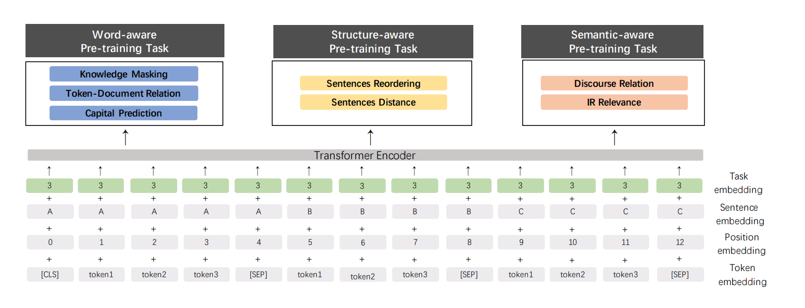
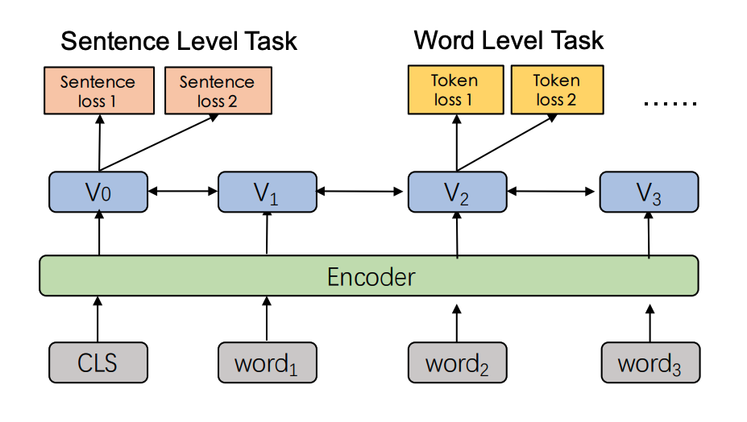
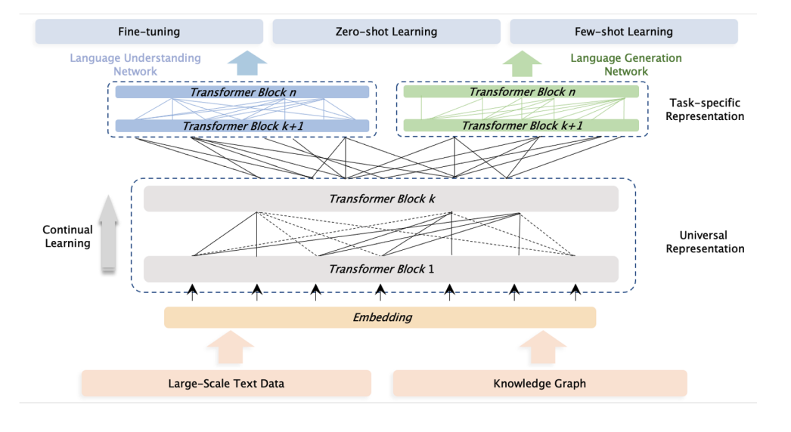

# **ERNIE**
[ERNIE: Enhanced Representation through Knowledge Integration](https://arxiv.org/abs/1904.09223v1)

[ERNIE 2.0: A Continual Pre-training Framework for Language Understanding](https://arxiv.org/abs/1907.12412)

[ERNIE 3.0: Large-scale Knowledge Enhanced Pre-training for Language Understanding and Generation](https://arxiv.org/abs/2107.02137)


## **Model Arch**
ERNIE 是由百度和清华共同发布的 NLP 预训练大模型，自2019年，ERNIE 1.0 发布以来，至今已经发布了3个版本，而最新的版本 ERNIE 3.0 的发表更是刷新了50多个 NLP 任务基准，其英文模型在国际权威的复杂语言理解任务评测 SuperGLUE 上，以超越人类水平 0.8 个百分点的成绩登顶全球榜首。ERNIE 3.0 同时具备超强语言理解能力以及写小说、歌词、诗歌、对联等文学创作能力。

### ERNIE 结构
<div align=center></div>

</br>

相比transformer , ERNIE 基本上是 transformer 的 encoder 部分，并且 encoder 在结构上是全部一样的，但是并不共享权重，具体区别如下:

- Transformer: 6 encoder layers, 512 hidden units, 8 attention heads
- ERNIE Base: 12 encoder layers, 768 hidden units, 12 attention heads
- ERNIE Large: 24 encoder layers,1024 hidden units, 16 attention heads

从输入上来看第一个输入是一个特殊的 `[CLS]`, `[CLS]` 表示分类任务就像 transformer 的一般的 encoder, ERINE 将一序列的 words 输入到 encoder 中. 每层使用self-attention, feed-word network, 然后把结果传入到下一个encoder。
<div align=center></div>

### **ERNIE 1.0**
相比于BERT, ERNIE 1.0 改进了两种 masking 策略，一种是基于phrase (在这里是短语 比如 a series of, written 等)的 masking 策略，另外一种是基于 entity (在这里是人名，位置, 组织，产品等名词 比如 Apple, J.K. Rowling)的masking 策略。在 ERNIE 当中，将由多个字组成的 phrase 或者 entity 当成一个统一单元，相比于 bert 基于字的 mask, 这个单元当中的的所有字在训练的时候，统一被 mask. 对比直接将知识类的query 映射成向量然后直接加起来，ERNIE 通过统一mask的方式可以潜在的学习到知识的依赖以及更长的语义依赖来让模型更具泛化性。

**Knowledge Masking**: ERNIE的mask的策略是通过三个阶段学习的，在第一个阶段，采用的是BERT的模式，用的是basic-level masking，然后再加入词组的mask(phrase-level masking), 然后再加入实体级别entity-level的mask。如下图:
<div align=center></div>

- Basic level masking: 在预训练中，第一阶段是先采用基本层级的masking，即随机mask掉中文中的一个字
- Phrase level masking: 第二阶段是采用词组级别的masking。我们mask掉句子中一部分词组，然后让模型预测这些词组，在这个阶段，词组的信息就被encoding到word embedding中了
- Entity level masking: 在第三阶段命名实体，如：人名，机构名，商品名等，在这个阶段被mask掉，模型在训练完成后，也就学习到了这些实体的信息

**DLM (Dialogue Language Model) task**: 对话的数据对语义表示很重要，因为对于相同回答的提问一般都是具有类似语义的，不同于BERT的输入形式，ERNIE能够使用多轮对话的形式，采用的是三个句子的组合[CLS]S1[SEP]S2[SEP]S3[SEP] 的格式。这种组合可以表示多轮对话，例如QRQ，QRR，QQR。Q：提问，R：回答。为了表示dialog的属性，句子添加了dialog embedding组合，这个和segment embedding很类似。

</br>

### **ERNIE 2.0**
传统的pre-training 模型主要基于文本中 words 和 sentences 之间的共现进行学习, 事实上，训练文本数据中的词法结构，语法结构，语义信息也同样是很重要的。在命名实体识别中人名，机构名，组织名等名词包含概念信息对应了词法结构。句子之间的顺序对应了语法结构，文章中的语义相关性对应了语义信息。为了去发现训练数据中这些有价值的信息，在 ERNIE 2.0 中，提出了一个预训练框架，可以在大型数据集合中进行增量训练。

#### **1. 预训练连续学习**

ERNIE 的预训练连续学习分为两步，首先，连续用大量的数据与先验知识连续构建不同的预训练任务。其次，不断的用预训练任务更新ERNIE 模型。对于第一步，ERNIE 2.0 分别构建了词法级别，语法级别，语义级别的预训练任务。所有的这些任务，都是基于无标注或者弱标注的数据。需要注意的是，在连续训练之前，首先用一个简单的任务来初始化模型，在后面更新模型的时候，用前一个任务训练好的参数来作为下一个任务模型初始化的参数。这样不管什么时候，一个新的任务加进来的时候，都用上一个模型的参数初始化保证了模型不会忘记之前学习到的知识。通过这种方式，在连续学习的过程中，ERNIE 2.0 框架可以不断更新并记住以前学习到的知识可以使得模型在新任务上获得更好的表现。

#### **2.encoder**

ERNIE 2.0 用了我们前文提到的transformer 结构encoder, 结构基本一致，但是权重并不共享。

#### **3.task embedding**
ERNIE 2.0 用了不同的task id 来标示预训练任务，task id 从1 到N 对应下面的e, f ,g中提到的预训练任务。对应的token segment position 以及task embedding 被用来作为模型的输入。
<div align=center></div>

</br>

#### **4.构建词法级别的预训练任务，来获取训练数据中的词法信息**
- knowledge masking task, 即 ERNIE 1.0 中的e ntity mask 以及 phrase entity mask 来获取p hrase 以及 entity 的先验知识，相较于 sub-word masking, 该策略可以更好的捕捉输入样本局部和全局的语义信息;
- Capitalization Prediction Task, 大写的词比如 Apple 相比于其他词通常在句子当中有特定的含义，所以在 Erine 2.0 加入一个任务来判断一个词是否大写;
- Token-Document Relation Prediction Task， 类似于 tf-idf, 预测一个词在文中的A 段落出现，是否会在文中的 B 段落出现。如果一个词在文章当中的许多部分出现一般就说明这个词经常被用到或者和这个文章的主题相关。通过识别这个文中关键的的词, 这个任务可以增强模型去获取文章的关键词语的能力。
<div align=center></div>

</br>

#### **5.构建语法级别的预训练任务，来获取训练数据中的词法信息**
- Sentence Reordering Task, 在训练当中，将 paragraph 随机分成1 到m 段，将所有的组合随机shuffle. 我们让 pre-trained 的模型来识别所有的这些segments正确的顺序. 这便是一个k 分类任务
- Sentence Distance Task, 构建一个三分类任务来判别句子的距离，0表示两个句子是同一个文章中相邻的句子，1表示两个句子是在同一个文章，但是不相邻，2表示两个句子是不同的文章。通过构建这样一个三分类任务去判断句对 (sentence pairs) 位置关系 (包含邻近句子、文档内非邻近句子、非同文档内句子 3 种类别)，更好的建模语义相关性。

#### **6.构建语义级别的预训练任务，来获取训练数据中的词法信息**
- Discourse Relation Task，除了上面的 distance task, ERNIE通过判断句对 (sentence pairs) 间的修辞关系 (semantic & rhetorical relation)，更好的学习句间语义。
- IR Relevance Task, 在这里主要是利用 baidu 的日志来获取这个关系，将 query 作为第一个 sentence, title 作为第二个 second sentence. 0 表示强关系, 1 表示弱关系，2表示无关系，通过类似 google-distance 的关系来衡量 两个query之间的语义相关性，更好的建模句对相关性。

</br>

### **ERNIE 3.0**
为了解决单一自回归框架带来的问题，并探索大规模参数的知识增强预训练模型的性能，我们提出了一个名为ERNIE 3.0的统一框架，通过融合自回归网络和自编码网络，在由纯文本和大规模知识图谱组成的4TB语料库上训练大规模知识增强模型。提出的ERNIE 3.0可以通过zero-shot学习、few-shot学习或微调来处理自然语言理解任务和自然语言生成任务。此外，提议的框架支持在任何时候引入各种定制任务。这些任务共享相同的编码网络，并通过多任务学习进行训练。这种方法使不同任务之间的词汇、句法和语义信息的编码成为可能。此外，当给定一个新任务时，我们的框架可以根据以前的训练参数逐步训练分布式表示，而不需要从头开始训练。

#### **模型结构**

<div align=center></div>

- 通用表示模块: ERNIE 3.0 使用多层 Transformer-XL 作为骨干网络，就像其他预训练模型如 XLNet、Segatron和ERNIE-Doc一样，其中Transformer-XL 与 Transformer 相似，但引入了一个辅助递归记忆模块以帮助对长文本建模。ERNIE 3.0设置了规模较大的通用表示模块，通过学习不同范式的各种预训练任务，使模型能够有效地从训练数据中捕获通用词汇和句法信息;
- 特定任务的表示模块: 与基本共享表示模块类似，特定任务表示模块也是一个多层 Transformer-XL，用于捕捉不同任务范式的顶层语义表示。ERNIE 3.0将特定任务的表示模块设置为可管理的规模，即基础模型规模，而不是多任务学习中常用的多层感知器或浅层Transformer;

#### **预训练任务**
- 单词意识的预训练任务
    - 知识 mask语言模型：ERNIE 1.0 提出了一个有效的策略，通过知识集成来加强表示，即知识集成 mask 语言模型任务。它引入了短语 mask 和命名实体 mask，预测整个被 mask 的短语和命名实体，以帮助模型学习本地语境和全球语境中的依赖信息。
    - 文档语言模型：生成性预训练模型通常利用传统的语言模型（如GPT，GPT-2）或 seq2seq 的语言模型（如BART，T5，ERNIE-GEN）作为预训练任务，后者在网络上进行辅助解码器结构训练。ERNIE 3.0 选择了传统的语言模型作为预训练任务，以降低网络的复杂性，提高统一预训练的效果。此外，为了使ERNIE 3.0的NLG网络能够对较长的文本进行建模，引入了 ERNIE-Doc 中提出的增强递归记忆机制，该机制通过将转移一层向下的递归改为同层递归，可以对比传统递归transformer更大的有效语境长度进行建模。
- 结构感知的预训练任务
    - 句子重排：句子重排任务是在ERNIE 2.0中引入的，目的是训练模型通过重组排列的句段来学习句子之间的关系。在长度上，一个给定的段落在预训练中被随机分词成1到m个片段，所有的组合被随机的排列组合打乱。然后，预训练的模型被要求重组这些被排列的句段，被建模为一个k类分类问题，k为排列的总个数
    - 句子距离： 句子距离任务是传统的下一句预测（NSP）任务的延伸，被广泛用于各种预训练模型中，以提高其学习句子级信息的能力，它可以被建模为一个3类分类问题。这三类分别代表两个句子是相邻的，不相邻但在同一个文档中，以及来自两个不同的文档。
- 通用知识-文本预测：为了将知识纳入一个预训练语言模型，ERNIE 3.0 引入了通用知识-文本预测（UKTP）任务，它是知识mask语言模型的一个延伸。

<div align=center></div>

</br>

## **Model Info**
> 论文中， ERNIE2.0 及其他模型对 GLUE-test 数据集的精度验证

|Model|MNLI-m/mm|QNLI|QQP(Accuracy/F1)|RTE|SST-2|MRPC(Accurary/F1)|CoLA|STS-B(Pearson Corr./Spearman Corr.) |WNLI|
|---|:---:|:---:|:---:|:---:|:---:|:---:|:---:|:---:|:---:|
|BERT-base      |84.6/83.4|90.5 |89.2/71.2|66.4|93.5|84.8/88.9|52.1|87.1/85.8|65.1|
|ERNIE-2.0-base |86.1/85.5|92.9 |89.8/73.2|74.8|95.0|86.1/89.9|55.2|87.6/86.5|65.1|
|BERT-large     |86.7/85.9|92.7 |89.3/72.1|70.1|94.9|85.4/89.3|60.5|87.6/86.5|65.1|
|ERNIE-2.0-large|88.7/88.8|94.6 |90.1/73.8|80.2|95.6|87.4/90.2|63.5|91.2/90.6|67.8|

</br>


### 测评数据集说明
####  1. MRPC
[MRPC](https://gluebenchmark.com/) (The Microsoft Research Paraphrase Corpus，微软研究院释义语料库)，相似性和释义任务，是从在线新闻源中自动抽取句子对语料库，并人工注释句子对中的句子是否在语义上等效。类别并不平衡，其中68%的正样本，所以遵循常规的做法，报告准确率（accuracy）和F1值。

- 样本个数：训练集3668个，验证集408个，测试集1725个。
- 任务：句子分类任务，是否释义二分类，是释义，不是释义两类。
- 评价准则：准确率（accuracy）和F1值。

本任务的数据集，包含两句话，每个样本的句子长度都非常长，且数据不均衡，正样本占比68%，负样本仅占32%。

</br>


## Build_In Deploy

### step.1 模型 finetune
-  huggingface，模型微调说明：[huggingface_ernie_people_daily.md](./huggingface/source_code/finetune/huggingface_ernie_people_daily.md)

### step.2 获取模型
- huggingface，预训练模型导出至torchscript格式，说明: [pt2torchscript](./huggingface/source_code/pretrain_model/README.md)


### step.3 获取数据集
- 校准数据集
    - [huggingface](https://drive.google.com/drive/folders/1FbQr7IYiFJJlY2kCytxYjAkdDLOAJ5Z8)
- [评估数据集-v1.3](https://drive.google.com/drive/folders/1i5iWGYYnfM9LWOoxxer8041iNpbBHVhl)
- [评估数据集-v1.5](https://drive.google.com/drive/folders/1whjFLfxYUjPFOM_ALp17WbfnUTAecDhC)
- labels： [dev.tsv](https://drive.google.com/drive/folders/1kv675JT_IzanhIvB6kiz5_pNFiRdHEFX)
> 注意： 由于 compiler 1.5 版本将 bert 相关模型的输入改变为6个。 因此，1.5 版本的校验数据集需使用 `评估数据集-v1.5`。

### step.4 模型转换
1. 根据具体模型修改配置文件
   - [huggingface](./huggingface/build_in/build/huggingface_ernie_cls.yaml)

    > - 编译参数`backend.type: tvm_vacc`
    > - fp16精度: 编译参数`backend.dtype: fp16`
    > - int8精度: 编译参数`backend.dtype: int8`，需要配置量化数据集和预处理算子

2. 模型编译

    ```bash
    cd ernie
    mkdir workspace
    cd workspace
    vamc build ../huggingface/build_in/build/huggingface_ernie_cls.yaml
    ```

### step.5 模型推理

- 基于 [sequence2npz.py](../common/utils/sequence2npz.py)，获得对应的 `npz_datalist.txt`

   ```bash
   python ../../common/utils/sequence2npz.py \
       --npz_path /path/to/MRPC/dev408_6inputs \
       --save_path npz_datalist.txt
   ```

- 推理 运行
  - `compiler version <= 1.5.0 并且 vastsream sdk == 1.X`

    运行 [sample_nlp.py](../common/sdk1.0/sample_nlp.py) 脚本，获取 推理 结果，示例：

    ```bash
    cd ../../common/sdk1.0/
    python sample_nlp.py \
        --model_info ./network.json \
        --bytes_size 512 \
        --datalist_path npz_datalist.txt \
        --save_dir ./result/dev408
    ```

    > 可参考 [network.json](../../question_answering/common/sdk1.0/network.json) 进行修改

  - `compiler version >= 1.5.2 并且 vastsream sdk == 2.X`

    运行 [vsx_sc.py](../common/vsx/python/vsx_sc.py) 脚本，获取 推理 结果，示例：

    ```bash
    cd ../../common/vsx/python/
    python vsx_sc.py \
        --data_list npz_datalist.txt\
        --model_prefix_path ./build_deploy/bert_base_128/bert_base_128 \
        --device_id 0 \
        --batch 1 \
        --save_dir ./result/dev408
    ```

    > `--model_prefix_path` 为转换的模型三件套的文件前缀路径

- 精度评估

   基于[mrpc_eval.py](../common/eval/mrpc_eval.py)，解析npz结果，并评估精度
   ```bash
   python ../../common/eval/mrpc_eval.py --result_dir ./result/dev408 --eval_path /path/to/MRPC/dev.tsv
   ```

### step.6 性能精度测试
1.  基于[sequence2npz.py](../common/utils/sequence2npz.py)，推理数据`npz`以及对应的`npz_datalist.txt`，可参考 step.5

2. 执行测试：
    ```bash
   vamp -m deploy_weights/bert_ernie2_mrpc-int8-max-mutil_input-vacc/bert_base_mrpc \
        --vdsp_params ../../common/vamp_info/bert_vdsp.json \
        --iterations 1024 \
        --batch_size 1 \
        --instance 6 \
        --processes 2 \
        --datalist npz_datalist.txt \
        --path_output ./save/bert
    ```
    > 相应的 `vdsp_params` 、`hwconfig` 可在 [vamp_info](../common/vamp_info/) 目录下找到
    >
    > 如果仅测试模型性能可不设置 `datalist`、`path_output` 参数

3. 精度评估

    基于[mrpc_eval.py](../common/eval/mrpc_eval.py)，解析vamp 输出的 `*.npz` 结果，并评估结果，可参考 step.5
