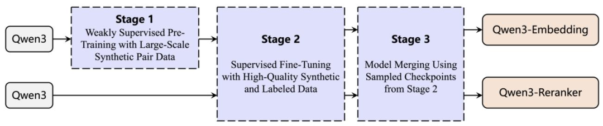
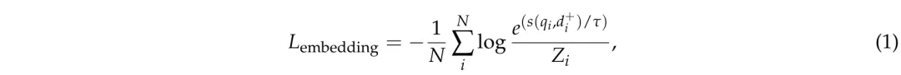
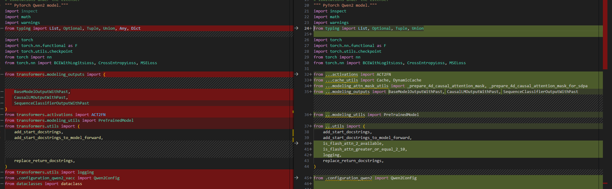
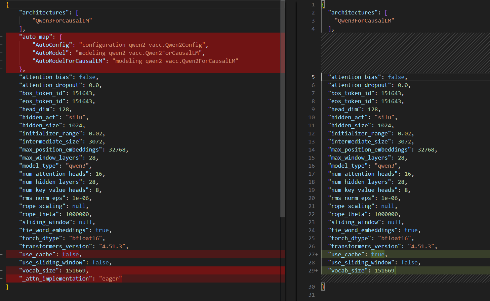
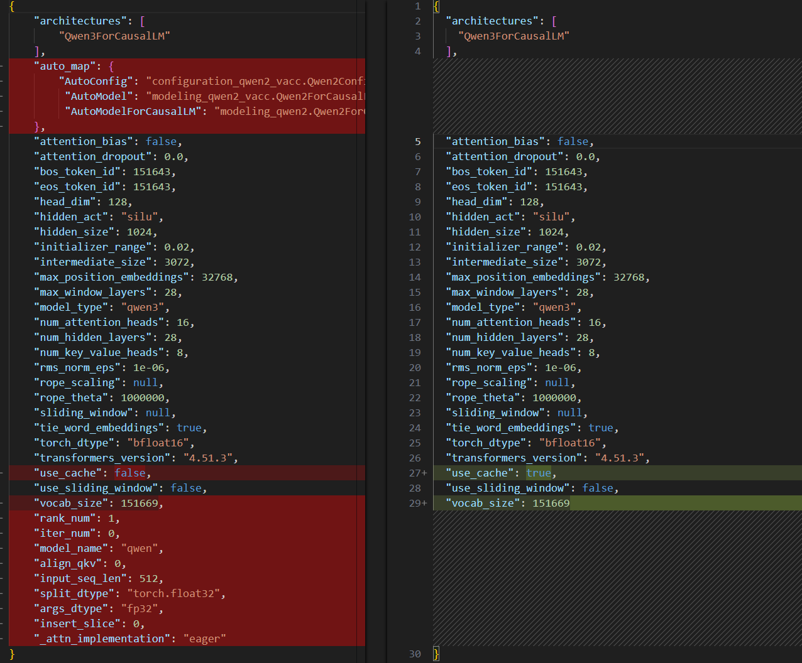

# Qwen3 Embedding & Reranker

- Technical Report
  - https://arxiv.org/abs/2506.05176
- Huggingface
  - https://huggingface.co/collections/Qwen/qwen3-embedding
  - https://huggingface.co/collections/Qwen/qwen3-reranker


## Model Arch
- Qwen3 Embedding 系列模型基于Qwen3基础模型的不同规模（0.6B、4B、8B），成功训练出了三个文本Embedding模型与三个文本重排序模型。这些模型具备诸多实用特性，如Embedding模型支持灵活的维度表示，Embedding与重排序模型均支持自定义指令，能够更好地满足不同下游任务的需求。

- Qwen3-Embedding（左）和Qwen3-Reranker（右）的模型架构


- 无论是Embedding还是重排序，核心目标都是评估文本间的相关性，而这种评估需要“任务感知”——即根据具体任务的指令来判断。例如，当用户输入“推荐科幻小说”时，模型需要根据“推荐”这一指令，判断文档是否属于科幻类别并适合推荐。

### Embedding

#### 架构基础与初始化
Qwen3-Embedding模型基于Qwen3基础模型的稠密版本构建，包含0.6B、4B、8B三种参数规模。之所以选择Qwen3作为 backbone，是因为其预训练阶段已积累了强大的文本建模能力，如同站在巨人的肩膀上开启新的征程。

#### Embedding生成的核心逻辑
Embedding模型的目标是将文本转化为固定维度的向量，这个过程需要兼顾指令的引导。具体来说：

- 输入格式：将指令与查询拼接在一起，形成`{Instruction}{Query}<|endoftext|>`的输入，文档则保持原样。例如，指令“判断语义相似性”与查询“苹果”拼接后，模型会基于此生成包含语义判断信息的向量。

    ```Bash
    {Instruction}{Query}<|endoftext|>
    ```

- 向量提取：在输入序列末尾添加[EOS]标记，模型通过因果注意力机制处理整个序列后，取[EOS]对应的最后一层隐藏状态作为最终Embedding向量。这一步如同从一篇文章的结尾提炼核心观点，简洁而精准。

#### 灵活性设计
模型支持“MRL（多语言表示）”和“指令感知”特性。例如，Embedding维度可自定义（0.6B为1024维，8B为4096维），适应不同任务对语义细节的需求；指令的灵活性则让同一模型可切换于“检索”“分类”等多种任务场景，避免为每个任务单独训练模型的繁琐。

### Reranker

重排序模型的任务是在初步检索结果中进一步筛选更相关的文档，这需要更精细的语义匹配。Qwen3重排序模型采用了类似对话的输入模板，将问题转化为二进制分类（“文档是否符合查询和指令要求”）：

模型通过计算“yes”的概率生成相关性分数，这种设计如同让模型扮演一个“裁判”，根据给定的规则（指令）对文档进行打分。相较于Embedding模型，重排序模型更聚焦于`单一场景下的精准判断`，因此无需处理向量维度，而是直接利用LLM的生成能力完成分类。


## Model Training
Qwen3-Embedding和重排序模型的训练流程如下：


Embedding模型与重排序模型的训练目标截然不同：

- Embedding模型：采用改进的InfoNCE对比损失函数（公式1），核心是让正例查询-文档对的Embedding向量在空间中尽可能接近，负例对尽可能远离。这如同在向量空间中为相似文本“划圈”，让同类文本聚在一起，异类文本隔开。


- 重排序模型：使用监督微调（SFT）损失函数（公式2），将问题转化为二分类任务，判断文档是否相关。这更像是给模型一本“对错题集”，通过大量标注数据教会它精准判断相关性。


两种目标分别对应“聚类思维”与“判断思维”，前者注重全局语义分布，后者聚焦局部精准决策。


Qwen3系列采用`多阶段`训练策略：

1. 第一阶段：大规模弱监督预训练
    - 数据来源：利用Qwen3-32B模型生成1.5亿对合成数据，覆盖检索、语义相似性、分类等多任务，语言包含中英等多语种。

    - 生成策略：通过“角色库+多维提示”模拟真实用户查询。例如，为一篇科技文档分配“学生”“研究员”等角色，生成不同难度、长度的查询，让模型接触多样化的语义关联。

    - 核心价值：用弱监督数据（无需人工标注）让模型建立基础的跨任务、跨语言语义理解能力，如同让孩子在海量阅读中培养语感，而非死记硬背语法规则。

2. 第二阶段：高质量监督微调
    - 数据筛选：从1.5亿合成数据中，通过余弦相似性过滤出1200万对高质量数据（相似性>0.7），保留语义关联最可靠的样本。

    - 训练目标：针对具体下游任务，用标注更精准的数据进一步优化模型，如同在语感基础上进行专业写作训练，提升特定场景的表现。

    - 重排序模型的特殊性：跳过弱监督阶段，直接从高质量标注数据开始训练，因为其任务更依赖精准判断而非泛化能力。

3. 第三阶段：模型合并
    - 技术细节：采用球面线性插值（slerp）合并多个训练检查点，如同调和不同风味的食材，取各家之长。

    - 效果提升：实验表明，未使用模型合并的版本在MTEB基准上得分降低约2-3分，说明合并能增强模型在不同数据分布下的稳定性，避免“偏科”。


## Build_In Deploy

### step.1 模型准备

1. 下载模型权重

- Embedding

| Model Type       | Models               | Size | Layers | Sequence Length | Embedding Dimension | MRL Support | Instruction Aware |
|------------------|----------------------|------|--------|-----------------|---------------------|-------------|----------------|
| Text Embedding   | [Qwen3-Embedding-0.6B](https://huggingface.co/Qwen/Qwen3-Embedding-0.6B) | 0.6B | 28     | 32K             | 1024                | Yes         | Yes            |


- ReRanker

| Model Type       | Models               | Size | Layers | Sequence Length | Embedding Dimension | MRL Support | Instruction Aware |
|------------------|----------------------|------|--------|-----------------|---------------------|-------------|----------------|
| Text Reranking   | [Qwen3-Reranker-0.6B](https://huggingface.co/Qwen/Qwen3-Reranker-0.6B) | 0.6B | 28     | 32K             | -                   | -           | Yes            |
 
> **Note**:
> - `MRL Support` 表示嵌入模型是否支持自定义最终嵌入的维度。 
> - `Instruction Aware` 标注了嵌入或重排序模型是否支持根据不同任务定制输入指令。


2. 模型修改

- Embedding
    - 为在瀚博软件栈部署`Qwen3`系列模型，在官方源码的基础上，需要对`modeling_qwen2.py`做一些修改，其中左图为修改的代码

    - [modeling_qwen2_vacc.py](./source_code/embedding/modeling_qwen2_vacc.py)
        - 修改相关依赖的导入方式
        
        - 基于config.insert_slice来判断是否插入strided_slice
        
        - 删除lm_head，因为Embedding模型不需要lm_head
        
        
        
    - [configuration_qwen2_vacc.py](./source_code/embedding/configuration_qwen2_vacc.py)
        - 修改对于相关依赖的导入方式
        

    - [config_vacc.json](./source_code/embedding/config_vacc.json)
        - 添加auto_map选项
        - 修改use_cache为false
        - 添加_attn_implementation选项，并将其只配置为eager；
        
        
    
    - 将以上修改后文件，放置于原始权重目录下

- Reranker
    - [modeling_qwen2_vacc.py](./source_code/reranker/modeling_qwen2_vacc.py)
        - 修改相关依赖的导入方式
        
        - 基于config.insert_slice来判断是否插入strided_slice
        

    - [config_vacc.json](./source_code/reranker/config_vacc.json)
        
        - 添加auto_map选项
        - 添加_attn_implementation选项，并将其只配置为eager；
        
    
    - [configuration_qwen2_vacc.py](./source_code/embedding/configuration_qwen2_vacc.py)
        - 同Embedding模型
    
    - 将以上修改后文件，放置于原始权重目录下

### step.2 数据集
1. 精度评估数据集：
    - embedding
        - 英文：[mteb/sts12-sts](https://huggingface.co/datasets/mteb/sts12-sts)
        - 中文：[C-MTEB/BQ](https://huggingface.co/datasets/C-MTEB/BQ)
    - reranker：[zyznull/msmarco-passage-ranking](https://huggingface.co/datasets/zyznull/msmarco-passage-ranking)
    - 数据集下载和转换为jsonl格式：[download_datasets.py](../common/source_code/download_datasets.py)

### step.3 模型转换
1. 根据具体模型修改模型转换配置文件
    - [embedding_config_fp16.yaml](./build_in/build/embedding_config_fp16.yaml)
    - [reranker_config_fp16.yaml](./build_in/build/reranker_config_fp16.yaml)

    > - 编译参数`backend.type: tvm_vacc`
    > - fp16精度: 编译参数`backend.dtype: fp16`

    > - 配置文件中的input_ids需根据需求进行修改，例如：编译512尺寸的模型，则为input_ids: [[512],[]]；编译1024尺寸的模型，则为input_ids: [[1024],[]]

2. 模型编译
    ```bash
    cd qwen3-0.6b
    mkdir workspace
    cd workspace
    vamc compile ../build_in/build/embedding_config_fp16.yaml
    vamc compile ../build_in/build/reranker_config_fp16.yaml
    ```

### step.4 模型推理
1. 推理：[demo.py](./build_in/vsx/demo.py)
    - 配置模型路径等参数，推理脚本内指定的文本对

    ```bash
    #embedding
    python ../build_in/vsx/demo.py \
        --vacc_weight /path/to/vacc_deploy/Qwen3-Embedding-0.6B-VACC-512/prefill_512_rank0/mod \
        --torch_weight /path/to/Qwen3-Embedding-0.6B \
        --task embedding \
        --eval_engine vacc \
        --seqlen 512 \
        --batch_size 1 \
        --device_id 0
    
    #reranker
    python ../build_in/vsx/demo.py \
        --vacc_weight /path/to/vacc_deploy/Qwen3-Reranker-0.6B-VACC-512/prefill_512_rank0/mod \
        --torch_weight /path/to/Qwen3-Reranker-0.6B \
        --task reranker \
        --eval_engine vacc \
        --seqlen 512 \
        --batch_size 1 \
        --device_id 0
    ```

### step.5 性能精度测试
1. 性能测试
    - 参考推理脚本：[performace.py](./build_in/vsx/performace.py)，修改参数并运行如下脚本

    ```bash
    #测试最大吞吐
    python3 performace.py \
        --model_prefix /path/to/vacc_deploy/Qwen3-Embedding-0.6B-VACC-512/prefill_512_rank0/mod \
        --device_ids [0] \
        --batch_size 1 \
        --instance 1 \
        --iterations 100 \
        --percentiles "[50, 90, 95, 99]" \
        --input_host 1 \
        --queue_size 1 

    #测试最小时延
    python3 performace.py \
        --model_prefix /path/to/vacc_deploy/Qwen3-Embedding-0.6B-VACC-512/prefill_512_rank0/mod \
        --device_ids [40] \
        --batch_size 1 \
        --instance 1 \
        --iterations 100 \
        --percentiles "[50, 90, 95, 99]" \
        --input_host 1 \
        --queue_size 0
    ```

2. 精度测试：[demo.py](./build_in/vsx/demo.py)
    - 配置模型路径等参数，指定`--eval_mode`参数为True，进行精度评估

    ```bash
    #embedding
    python demo.py \
        --vacc_weight /path/to/Qwen3-Embedding-0.6B-VACC-512/prefill_512_rank0/mod \
        --torch_weight /path/to/Qwen3-Embedding-0.6B \
        --task embedding \
        --eval_mode \
        --eval_engine vacc \
        --eval_dataset /path/to/mteb-sts12-sts_test.jsonl \
        --seqlen 512 \
        --batch_size 1 \
        --device_id 0

    #reranker
    python demo.py \
        --vacc_weight /path/to/Qwen3-Reranker-0.6B-VACC-512/prefill_512_rank0/mod \
        --torch_weight /path/to/Qwen3-Reranker-0.6B \
        --task reranker \
        --eval_mode \
        --eval_engine vacc \
        --eval_dataset /path/to/zyznull-msmarco-passage-ranking_dev.jsonl \
        --seqlen 512 \
        --batch_size 1 \
        --device_id 0
    ```
## Tips
- 目前仅支持fp16精度，后续会支持int8精度