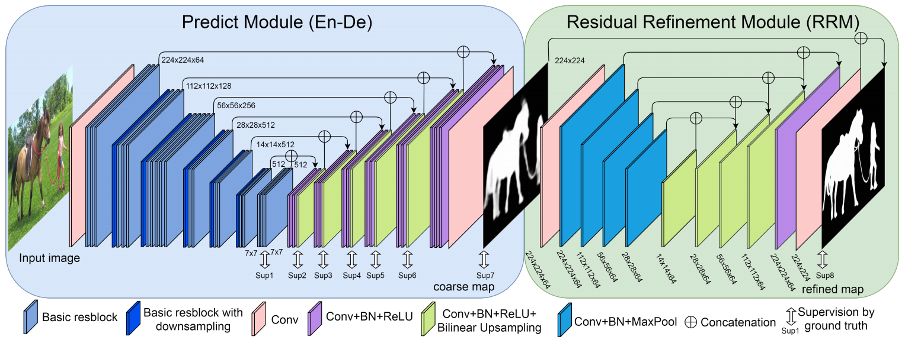
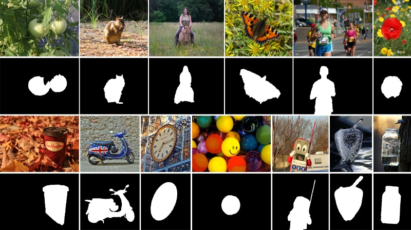

# BASNet

[BASNet: Boundary-Aware Salient Object Detection](https://openaccess.thecvf.com/content_CVPR_2019/html/Qin_BASNet_Boundary-Aware_Salient_Object_Detection_CVPR_2019_paper.html)

## Code Source
```
# SALOD
link: https://github.com/moothes/SALOD
branch: master
commit: 59a4b280463ac9519420ad87c4f6666414f20aed

# Official
link: https://github.com/xuebinqin/BASNet
branch: master
commit: 56393818e239fed5a81d06d2a1abfe02af33e461
```

## Model Arch

### pre-processing

BASNet系列网络的预处理操作可以按照如下步骤进行，即先对图片进行resize至一定尺寸，然后对其进行归一化等操作(两个来源预处理一致)：

```python
image = cv2.imread(image_file)
img = cv2.resize(image, (input_size, input_size), interpolation=cv2.INTER_AREA)
img = cv2.cvtColor(img, cv2.COLOR_BGR2RGB)
mean = np.array([0.485, 0.456, 0.406])
std = np.array([0.229, 0.224, 0.225])
img = (img / 255.0 - mean) / std
img = np.ascontiguousarray(np.transpose(img, (2, 0, 1))).astype(np.float32) # HWC to CHW
img = np.expand_dims(img, axis=0)
```

### post-processing

BASNet系列网络的后处理操作，主要有sigmoid和反归一化(两个来源后处理不一致，具体参考推理代码)：
```python
out = np.squeeze(heatmap)
out = torch.from_numpy(out)
pred = (torch.sigmoid(out) * 255).cpu().numpy()
```

### backbone
整个BASNet的网络结构分为三个部分：
- 一部分是Predict Module，这部分网络输入一张图像，然后经过encode和decode层，输出初步预测的显著性图。这部分网络就是毕竟经典的Ecode-Decode网络，前面的Encode对图像进行提取特征，使用Pooling方法得到了分辨率逐步变小的高层语义特征，后面的Decode部分则负责将高层语义信息逐步还原放大，从而逐步获得大分辨率的feature map图，最终输出和原图一样大小的显著性图。在Encode和Decode之间，会有shortcut，将相同分辨率的feature map图相加，从而让最终的输出的feature map能够兼顾low-level和high-level的特征。值得一提的是， 在decode的过程中，共有 6 种不同分辨率的feature map图，再加上encode阶段最后一层的feature map，一共使用了7个feature map进行loss算，这种多层多loss的方法有点类似于中继loss，一方面可以帮助网络更好的收敛，另一方面可以让网络关注到不同尺度的显著性图。
- 另一部分是Residual Refinement Module，这部分的网络结构其实和前面的Predict Module模块网络结构一样，使用conv、BN、RELU构造encode和decode，只不过与前面的Predict Module相比，这部分的网络结构要简单一些，网络深度低一些。另外，这部分的loss只用最后一层的输出作为loss，中间层的输出则没有。
- 提出了hybrid loss。通过将Binary Cross Entropy (BCE)，Structural SIMilarity (SSIM)和Intersection-over-Union (IoU)三种loss进行结合，让模型能够关注到图像的pixel-level，patch-level和map-level三个不同层级的显著性信息。从而获得更加精确的显著性结果。

<div  align="center">

</div>

### common
- Ecode-Decode
- Residual Refinement Module
- Hybrid Loss

## Model Info

### 模型性能
| Models  |Code Source | Flops(G) | Params(M) | MAE ↓ | avg F-Measure ↑ | SM ↑ | Shapes |
| :---: | :--: |  :--: |:--: | :---: | :--------: | :---: | :--------: |
| BASNet |[SALOD](https://github.com/moothes/SALOD) | 104.926 | 95.522 | 0.034  |  0.923 | 0.929  | 3x320x320  |
| BASNet **vacc fp16** |  -  |  -  | -  |  0.069  |  0.865  | 0.873  | 3x320x320 |
| BASNet **vacc kl_divergence int8** |  -  |  -  | -  |   0.066  |  0.870 | 0.878 |  3x320x320  |
| BASNet |[Official](https://github.com/xuebinqin/BASNet) | 442.353  |  87.060 | 0.045   |  0.906  | 0.901  | 3x320x320  |
| BASNet **vacc fp16** |  -  |  -  | -  |  0.045  |  0.909  | 0.900  | 3x320x320 |
| BASNet **vacc kl_divergence int8** |  -  |  -  | -  |   0.049  |  0.906 | 0.898 |  3x320x320  |

> Tips
> 
> 512 size fp16&int8，两个来源run均超时
> 

### 测评数据集说明


[ECSSD](http://www.cse.cuhk.edu.hk/leojia/projects/hsaliency/dataset.html)数据集，由香港中文大学的Yan等人于2013年建立, 包含了1000张图像, 这些图像由互联网得到。该数据集中的显著物体包含较复杂的结构, 且背景具备一定的复杂性。


<div  align="center">

</div>

### 评价指标说明
显著性目标检测主要的评测指标包括：
- 均值绝对误差（Mean Absolute Error，MAE），用于通过测量归一化映射和真值掩码之间平均像素方向的绝对误差来解决这个问题
- EMD距离(earth movers distance，EMD)，衡量的是显著性预测结果P与连续的人眼注意力真值分布Q之间的相似性, 该度量方式被定义为:从显著性预测结果P上的概率分布转移到连续的人眼注意力真值分布Q上的最小代价。因而, EMD距离越小, 表示估计结果越准确
- 交叉熵(kullback-leibler divergence，KLD)，主要基于信息理论, 经常被用于衡量两个概率分布之间的距离，在人眼关注点检测中, 该指标被定义为:通过显著性预测结果P来近似连续的人眼注意力真值分布Q时产生的信息损失。越小越好
- 标准化扫描路径显著性(normalized scanpath saliency, NSS)，是专门为显著性检测设计的评估指标，该指标被定义为:对在人眼关注点位置归一化的显著性(均值为0和归一化标准差)求平均。越小越好
- 线性相关系数(linear correlation coefficient, CC)，是一种用于衡量两个变量之间相关性的统计指标，在使用该度量时, 将显著性预测结果P和连续的人眼注意力真值分布Q视为随机变量。然后, 统计它们之间的线性相关性。该统计指标的取值范围是[-1, +1].当该指标的值接近-1或+1时, 代表显著性预测结果与真值标定高度相似
- 相似性测度(similarity metric, SIM)指标，将显著性预测结果P和连续的人眼注意力真值分布Q视为概率分布, 将二者归一化后, 通过计算每一个像素上的最小值, 最后加和得到。当相似性测度为1时, 表示两个概率分布一致; 为0时, 表示二者完全不同
- AUC指标(the area under the receiver operating characteristic curve, 简称ROC曲线), 即受试者工作特性曲线下面积.ROC曲线是以假阳性概率(false positive rate, FPR)为横轴, 以真阳性概率(true positive rate, 简称TPR)为纵轴所画出的曲线。AUC即为ROC曲线下的面积, 通过在[0, 1]上滑动的阈值, 能够将显著性检测结果P进行二值化, 从而得到ROC曲线。ROC曲线越趋近于左上方, AUC数值越大, 说明算法性能越好。当接近1时, 代表着显著性估计与真值标定完全一致
- F-Measure，由于查准率和查全率相互制约, 且查准率-查全率曲线包含了两个维度的评估指标, 不易比较, 因而需要就二者进行综合考量。该指标同时考虑了查准率和查全率, 能够较为全面、直观地反映出算法的性能。F-值指标的数值越大, 说明算法性能越好
- 结构相似性（Structural measure，S-measure）：用以评估实值显著性映射与真实值之间的结构相似性，其中So和Sr分别指对象感知和区域感知结构的相似性。

## VACC部署
- [salod.md](./source_code/salod.md)
- [official.md](./source_code/official.md)

## Tips
- 两个来源模型的预处理一致
- salod来源中后处理有sigmoid；officia来源，模型内部已包含sigmoid，所以此来源后处理没有此激活过程