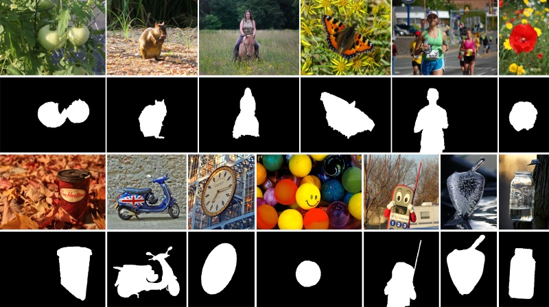

# GCPANet

[Global Context-Aware Progressive Aggregation Network for Salient Object Detection](https://arxiv.org/abs/2003.00651)

## Code Source
```
link: https://github.com/JosephChenHub/GCPANet
branch: master
commit: 8ab0d6dcfe3e9f14f7853393425745136c98a950
```

## Model Arch

### pre-processing

GCPANet系列网络的预处理操作可以按照如下步骤进行，即先对图片进行resize至一定尺寸，然后对其进行归一化等操作：

```python
image = cv2.imread(image_file)
img = cv2.resize(image, (input_size, input_size), interpolation=cv2.INTER_AREA)
img = cv2.cvtColor(img, cv2.COLOR_BGR2RGB)
mean = np.array([117.15, 112.48, 92.86])
std = np.array([56.36, 53.82, 54.23])
img = (img - mean) / std
img = np.ascontiguousarray(np.transpose(img, (2, 0, 1))).astype(np.float32) # HWC to CHW
img = np.expand_dims(img, axis=0)
```

### post-processing

GCPANet系列网络的后处理操作，主要有sigmoid和反归一化：
```python
out = np.squeeze(heatmap)
out = torch.from_numpy(out)
pred = (torch.sigmoid(out) * 255).cpu().numpy()
```

### backbone

这篇文章和F3Net在想法上有很大的相似之处，都认为现有的作品主要采用了多层特征集成，但忽略了不同特征之间的差距。另外，由于高级特征在自顶向下传递的过程中存在稀释现象，因此也参考了之前的PoolNet。

因此，总体而言，本文认为当前基于FCN的模型存在两个问题：

- 由于不同层次特征之间的差距，语义信息和外观信息的简单组合不足以考虑不同特征对显著目标检测的不同贡献
- 大多数之前的作品忽略了全局上下文信息，而全局上下文信息可以有利于推断多个显著区域之间的关系并生成更完整的显著性结果

为了解决这两个问题，GCPANet模型骨架网络采用ResNet-50作为编码器，之后作者提出由多个模块组合的解码器用来整合各种特征。

- 对于第一个问题：Feature Interweaved Aggregation (FIA) 模块充分整合了高级语义特征、低级细节特征和全局上下文特征，旨在抑制噪声但恢复更多的结构和细节信息
- Head Attention (HA) 模块利用空间和通道注意力降低信息冗余并增强顶层特征。通过利用空间和通道注意机制来学习更具有选择性和代表性的特征
- Self Refinement (SR) 模块用于进一步细化和提高输入特征。在通过 HA 模块和 FIA 模块后，通过使用乘法和加法操作来进一步细化和增强特征图。SR本身很简单，就是一个三层的卷积结构
- 对于第二个问题：Global Context Flow (GCF) 模块在不同阶段生成全局上下文信息，旨在学习不同显著区域之间的关系并减轻高级特征的稀释效应。与PoolNet不同，这里考虑了不同阶段的不同贡献。首先使用全局平均池化获取全局上下文信息，然后为每个阶段的全局上下文特征图的不同通道重新分配不同的权重

<div  align="center">

</div>

特征交织聚合模块（FIA: Feature Interweaved Aggregation Module），首先，低层次的特征先经过一个 1*1 的卷积压缩其特征，之后高层次特征分支经过或不经过卷积与压缩后低特征相乘，另一条分支则采用每个阶段经过全局网络得到的全局特征相乘。最后，连接三个优化特征合并输入卷积层获得最终聚合特征。


<div  align="center">

</div>

### common

- Feature Interweaved Aggregation
- Head Attention
- Self Refinement
- Global Context Flow

## Model Info

### 模型性能
| Models  | Flops(G) | Params(M) | MAE ↓ | avg F-Measure ↑ | SM ↑ | Shapes |
| :---: | :--: | :--: | :---: | :--------: | :---: | :--------: |
| [GCPANet](https://github.com/JosephChenHub/GCPANet) | 308.969 | 67.056 | 0.035  |  0.915  | 0.926 | 3x512x512  |
| GCPANet **vacc fp16** |  -  |  -  |  0.101  |  0.753 | 0.764  | 3x512x512  |
| GCPANet **vacc kl_divergence int8** |  -  |  -  |  0.046  | 0.899| 0.905 |  3x512x512  |

> Tips
> 
> 1080*1920 vacc fp16&int8 build ok, run超内存

### 测评数据集说明


[ECSSD](http://www.cse.cuhk.edu.hk/leojia/projects/hsaliency/dataset.html)数据集，由香港中文大学的Yan等人于2013年建立, 包含了1000张图像, 这些图像由互联网得到。该数据集中的显著物体包含较复杂的结构, 且背景具备一定的复杂性。


<div  align="center">

</div>

### 评价指标说明
显著性目标检测主要的评测指标包括：
- 均值绝对误差（Mean Absolute Error，MAE），用于通过测量归一化映射和真值掩码之间平均像素方向的绝对误差来解决这个问题，越小越好
- EMD距离(earth movers distance，EMD)，衡量的是显著性预测结果P与连续的人眼注意力真值分布Q之间的相似性, 该度量方式被定义为:从显著性预测结果P上的概率分布转移到连续的人眼注意力真值分布Q上的最小代价。因而, EMD距离越小, 表示估计结果越准确
- 交叉熵(kullback-leibler divergence，KLD)，主要基于信息理论, 经常被用于衡量两个概率分布之间的距离，在人眼关注点检测中, 该指标被定义为:通过显著性预测结果P来近似连续的人眼注意力真值分布Q时产生的信息损失，越小越好
- 标准化扫描路径显著性(normalized scanpath saliency, NSS)，是专门为显著性检测设计的评估指标，该指标被定义为:对在人眼关注点位置归一化的显著性(均值为0和归一化标准差)求平均。越小越好
- 线性相关系数(linear correlation coefficient, CC)，是一种用于衡量两个变量之间相关性的统计指标，在使用该度量时, 将显著性预测结果P和连续的人眼注意力真值分布Q视为随机变量。然后, 统计它们之间的线性相关性。该统计指标的取值范围是[-1, +1].当该指标的值接近-1或+1时, 代表显著性预测结果与真值标定高度相似
- 相似性测度(similarity metric, SIM)指标，将显著性预测结果P和连续的人眼注意力真值分布Q视为概率分布, 将二者归一化后, 通过计算每一个像素上的最小值, 最后加和得到。当相似性测度为1时, 表示两个概率分布一致; 为0时, 表示二者完全不同
- AUC指标(the area under the receiver operating characteristic curve, 简称ROC曲线), 即受试者工作特性曲线下面积.ROC曲线是以假阳性概率(false positive rate, FPR)为横轴, 以真阳性概率(true positive rate, 简称TPR)为纵轴所画出的曲线。AUC即为ROC曲线下的面积, 通过在[0, 1]上滑动的阈值, 能够将显著性检测结果P进行二值化, 从而得到ROC曲线。ROC曲线越趋近于左上方, AUC数值越大, 说明算法性能越好。当接近1时, 代表着显著性估计与真值标定完全一致
- F-Measure，由于查准率和查全率相互制约, 且查准率-查全率曲线包含了两个维度的评估指标, 不易比较, 因而需要就二者进行综合考量。该指标同时考虑了查准率和查全率, 能够较为全面、直观地反映出算法的性能。F-值指标的数值越大, 说明算法性能越好
- 结构相似性（Structural measure，S-measure）：用以评估实值显著性映射与真实值之间的结构相似性，其中So和Sr分别指对象感知和区域感知结构的相似性，越大越好
## VACC部署
- [official.md](./source_code/official.md)