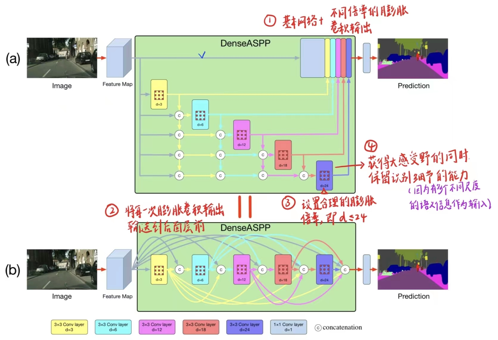
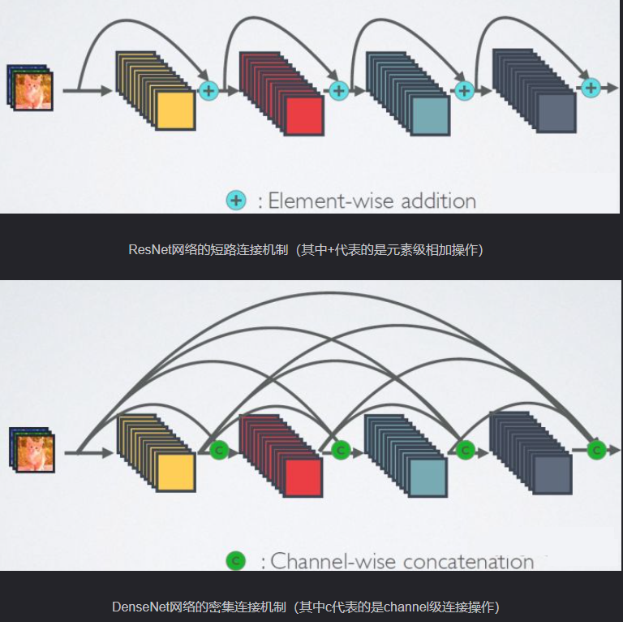
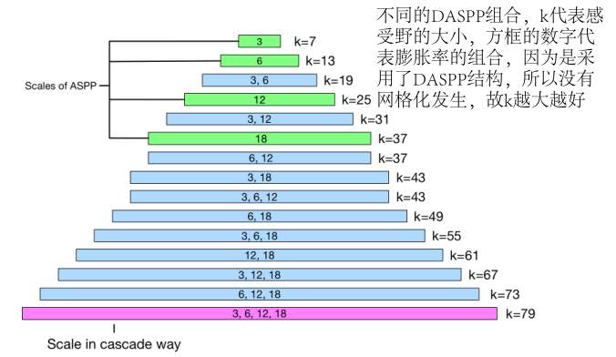
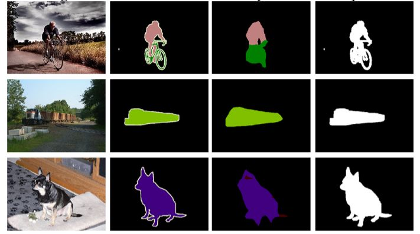

## DenseASPP

[DenseASPP for Semantic Segmentation in Street Scenes](https://openaccess.thecvf.com/content_cvpr_2018/papers/Yang_DenseASPP_for_Semantic_CVPR_2018_paper.pdf)

## Code Source

```
link: https://github.com/Tramac/awesome-semantic-segmentation-pytorch
branch: master
commit: b8366310de50869f89e836ed24de24edd432ece5
```

## Model Arch

<div  align="center">

</div>

### pre-processing

DenseASPP网络的预处理操作可以按照如下步骤进行，即先对图片进行resize至一定尺寸(320)，再CenterCrop至模型输入尺寸（256），然后对其进行归一化、减均值除方差等操作：

```python
[
    torchvision.transforms.Resize(scale_size),
    torchvision.transforms.CenterCrop(input_size),
    torchvision.transforms.ToTensor(),
    torchvision.transforms.Normalize(mean=[0.485, 0.456, 0.406], std=[0.229, 0.224, 0.225],),
]
```

### post-processing

DenseASPP算法的后处理即是对网络输出的heatmap进行逐像素判断，比如一共20个类别，则网络会输出21个通道(20class+background)尺寸等于原图大小的heatmap，然后逐像素判断哪个通道数值大，就表示当前像素点所代表的类别为当前通道对应的类别

### backbone

DenseASPP模型的骨架网络使用的是DenseNet(Densely connected convolutional networks)，它的基本思路与ResNet一致，但是它建立的是前面所有层与后面层的密集连接（dense connection）。

相比ResNet，DenseNet提出了一个更激进的密集连接机制：即互相连接所有的层，具体来说就是每个层都会接受其前面所有层作为其额外的输入。下图为ResNet网络的连接机制和DenseNet的密集连接机制对比图。可以看到，ResNet是每个层与前面的某层（一般是2~3层）短路连接在一起，连接方式是通过元素级相加。而在DenseNet中，每个层都会与前面所有层在channel维度上连接（concat）在一起，并作为下一层的输入。对于一个L层的网络，DenseNet共包含L(L+1)/2。

<div  align="center">

</div>

### detail

- FCN开创了语义分割任务的先河，高级语义信息在分割网络中起着至关重要的作用。为了提取高级信息，FCN使用多个池化层来增加输出神经元的接受域大小。然而，增加池化层的数量会导致feature map的大小减小，这对将分割输出上采样回全分辨率造成了严重的挑战
- Atrous Convolution，与传统的卷积算子相比，Atrous卷积能够在不增加核参数数目的情况下获得更大的接受域大小。由Atrous卷积产生的Feature Map可以与输入的大小相同，但是每个输出神经元拥有更大的接受域，因此可以编码更高层次的语义。虽然Atrous Convolution解决了Feature Map分辨率与接受域大小之间的矛盾，但输出的Feature Map中的所有神经元都具有相同的接受域大小，这意味着语义掩码的生成过程只利用了单一尺度上的特征
- ASPP提出将不同扩张率下的Atrous Convolution生成的Feature Map串联起来，使得输出Feature Map中的神经元包含多个接受域大小，对多尺度信息进行编码，最终提高性能
  然而，随着膨胀率的增加(如d>24)， Atrous Convolution变得越来越无效，逐渐失去了建模能力
- DenseASPP结合了并行和级联使用空洞卷积层的优点，在更大的范围内产生了更多的尺度特征。通过一系列的特征连接，每个中间特征图上的神经元从多个尺度对语义信息进行编码，不同的中间特征图从不同的尺度范围对多尺度信息进行编码。通过一系列的空洞卷积，较深层次的神经元获得越来越大的感受野，而不会出现ASPP的核退化问题。因此，DenseASPP最终的输出特征图不仅涵盖了大范围的语义信息，而且以非常密集的方式覆盖了该范围

DenseASPP的一个关键设计是使用紧密的连接来实现不同膨胀率的不同层次的集成。对于扩张速率为d、核大小为K的空洞卷积层，其等效接受域大小为: R = (d - 1) × (K - 1) + K
，以d=3的3×3卷积层为例，对应的接受域大小为7。

将两个卷积层叠加在一起可以得到更大的接受域。假设我们分别有两个核尺寸为K1和K2的卷积层叠加，新的接受域为: K = K1 + K2 - 1。例如，核大小为7的卷积层与核大小为13的卷积层叠加，接收域大小为19。

DenseASPP由包含扩张率为3，6，12，18的扩张卷积，每组数字的表示扩张率的组合，长度表示等效的卷积核大小，k表示实际的接收野，如下所示。很明显，每一个堆叠层的空洞卷积的密集连接能够构成更密集的特征金字塔模型，所以DenseASPP的感受野比ASPP的更大。

<div  align="center">

</div>

### common

- DenseNet
- Atrous Convolution
- Atrous Spatial Pyramid Pooling (ASPP)

## Model Info

## 模型精度

|                                        Methods                                        | FLOPs(G) | Params(M) |  MIoU  |   Shapes   |
| :-----------------------------------------------------------------------------------: | :------: | :-------: | :----: | :---------: |
| [DenseASPP-DenseNet121](https://github.com/Tramac/awesome-semantic-segmentation-pytorch) |  23.997  |   9.199   | 60.099 | 3×320×320 |
|                       DenseASPP-DenseNet121**vacc fp16**                       |    -    |     -     | 58.936 | 3×320×320 |
|                DenseASPP-DenseNet121**vacc int8 kl_divergence**                |    -    |     -     | 56.822 | 3×320×320 |
| [DenseASPP-DenseNet161](https://github.com/Tramac/awesome-semantic-segmentation-pytorch) |  75.528  |  30.257  | 68.509 | 3×320×320 |
|                       DenseASPP-DenseNet161**vacc fp16**                       |    -    |     -     | 3.495 | 3×320×320 |
|                DenseASPP-DenseNet161**vacc int8 kl_divergence**                |    -    |     -     | 3.310 | 3×320×320 |
|                       DenseASPP-DenseNet161**vacc fp16**                       |    -    |     -     | 63.659 | 3×256×256 |
|                DenseASPP-DenseNet161**vacc int8 kl_divergence**                |    -    |     -     | 61.814 | 3×256×256 |

### 测评数据集说明

[PASCAL VOC](http://host.robots.ox.ac.uk/pascal/VOC/voc2012/)数据集除了用于object detection任务之外，还用于segmentation等任务，该数据集包含20个对象类，加背景共21类。

数据集子文件夹SegmentationClass内存放了JPEGimages中部分对应的pixel-level标注，以png形式存放，用于语义分割。

<div  align="center">

</div>

### 指标说明

- IoU并交比：两个区域重叠的部分除以两个区域的集合部分，取值TP/(TP+FN+FP)
- MIoU平均并交比：分割图像一般都有好几个类别，把每个分类得出的分数进行平均得到mean IoU，也就是mIoU，其是各种基准数据集最常用的标准之一，绝大数的图像语义分割论文中模型评估比较都以此作为主要评估指标。

## VACC部署

- [awesome.md](./source_code/awesome.md)

## Tips

- 官方未提供预训练模型，自训练了DenseNet121和DenseNet161骨架的网络，精度一般；
