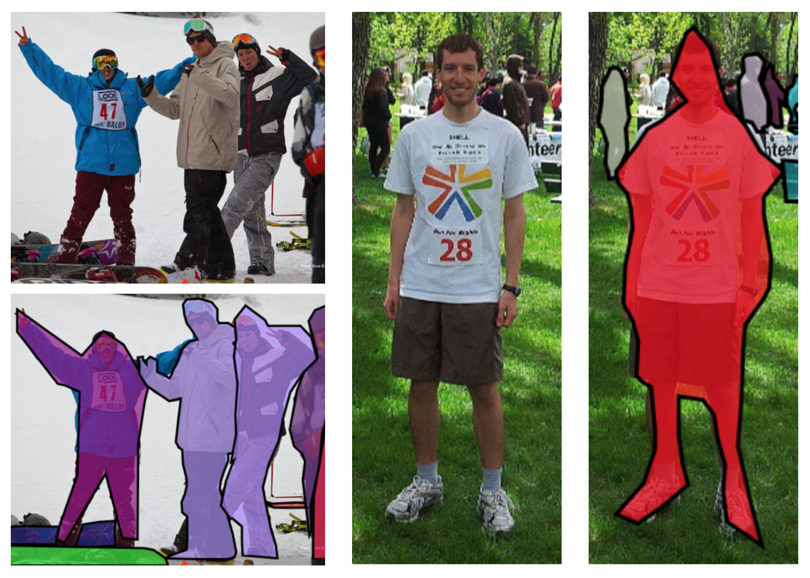

# Human_seg

## Code Source

```
link: https://github.com/thuyngch/Human-Segmentation-PyTorch
branch: master
commit: b15baef04e7b628c01a4526de5e14f9524f18da6
```

## Model Arch

### describe

将人物和背景在像素级别进行区分，是一个图像分割的经典任务，具有广泛的应用。 一般而言，该任务可以分为两类：针对半身人像的分割，简称肖像分割；针对全身和半身人像的分割，简称通用人像分割。

构建人体和背景两个类别，human_seg可直接使用unet等语义分割模型实现。

## Model Info

### 模型精度

|                                    Model                                    | FLOPs(G) | Params(M) | MIoU | Re-trained MIoU |        VACC MIOU        |
| :--------------------------------------------------------------------------: | :------: | :-------: | :---: | :----------: | :---------------------: |
|   [UNet_MobileNetV2](https://github.com/thuyngch/Human-Segmentation-PyTorch)   |   1.3   |    4.7    | 91.37 |    85.56    | fp16 76.35</br>int8 76.71 |
|     [UNet_ResNet18](https://github.com/thuyngch/Human-Segmentation-PyTorch)     |   9.1   |   16.6   | 90.09 |    91.62    | fp16 88.09</br>int8 88.00 |
| [DeepLab3Plus_ResNet18](https://github.com/thuyngch/Human-Segmentation-PyTorch) |   9.1   |   16.6   | 91.21 |    82.13    |   fp16 -</br> int8 73.92   |
|   [BiSeNet_ResNet18](https://github.com/thuyngch/Human-Segmentation-PyTorch)   |   4.7   |   11.9   | 87.02 |    80.77    |            -            |
|    [PSPNet_ResNet18](https://github.com/thuyngch/Human-Segmentation-PyTorch)    |   20.7   |   12.6   |  ---  |    90.85    |            -            |
|    [ICNet_ResNet18](https://github.com/thuyngch/Human-Segmentation-PyTorch)    |   2.0   |   11.6   | 86.27 |    87.74    |            -            |

### 测评数据集说明

[Supervisely Person](https://ecosystem.supervise.ly/projects/persons/)人像分割数据集，包含5711张图片，6884个人像注释。有一个背景，一个人像，共两个类别。

<div  align="center">

</div>

### 指标说明

- IoU并交比：两个区域重叠的部分除以两个区域的集合部分，取值TP/(TP+FN+FP)
- MIoU平均并交比：分割图像一般都有好几个类别，把每个分类得出的分数进行平均得到mean IoU，也就是mIoU，其是各种基准数据集最常用的标准之一，绝大数的图像语义分割论文中模型评估比较都以此作为主要评估指标。

## VACC部署

- [thuyngch.md](./source_code/thuyngch.md)
