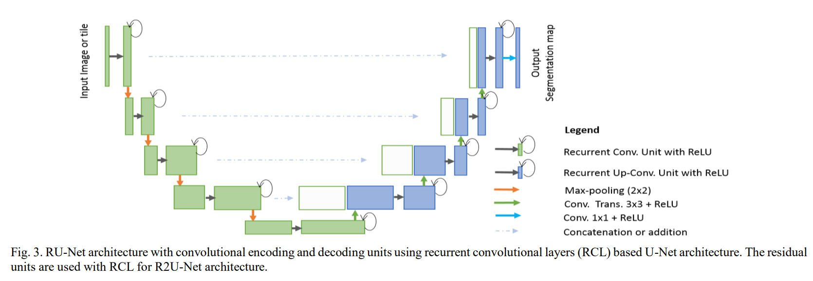
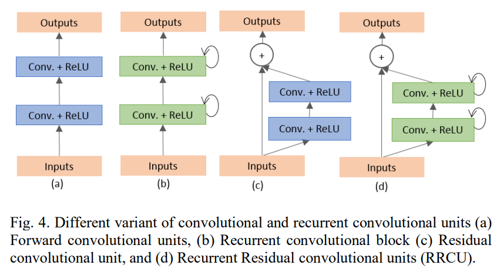
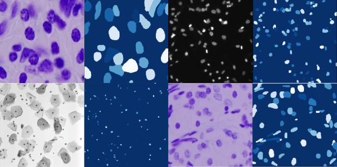

## R2U_Net

[Recurrent Residual Convolutional Neural Network based on U-Net (R2U-Net) for Medical Image Segmentation](https://arxiv.org/abs/1802.06955)

## Code Source

```
link: https://github.com/Andy-zhujunwen/UNET-ZOO
branch: master
commit: b526ce5dc2bef53249506883b92feb15f4f89bbb
```

## Model Arch

<div  align="center">

</div>

### pre-processing

R2U_Net网络的预处理操作可以按照如下步骤进行，即先对图片进行resize至一定尺寸(96)，然后对其进行归一化、减均值除方差等操作

```python
[
    torchvision.transforms.Resize(scale_size),
    torchvision.transforms.ToTensor(),
    torchvision.transforms.Normalize(mean=[0.5, 0.5, 0.5], std=[0.5, 0.5, 0.5],),
]
```

### post-processing

R2U_Net算法的后处理即是对网络输出的heatmap进行逐像素判断，比如一共20个类别，则网络会输出21个通道(20class+background)尺寸等于原图大小的heatmap，然后逐像素判断哪个通道数值大，就表示当前像素点所代表的类别为当前通道对应的类别。

### backbone

R2U_Net是基于unet的改进版模型，主要有一下优化：

- 在编解码过程中用的是recurrent residual block而不是传统的conv+relu层，这样可以有效增加网络深度
- 采用不同时间步的feature summation的方式得到更具有表达性的特征有助于提取较低层次的特征
- 在进行skip connections时没有采取原始UNet中裁剪的方式而是用了级联的操作
- 循环结构使得网铬层次加深，残差结构避免了随深度增加而出现的梯度消失问题
- 将UNet、残差网铬和RCNN的优势结合到了一起

<div  align="center">

</div>

### common

- recurrent residual block

## Model Info

### 模型精度

| Models |                    Code Source                    | FLOPs(G) | Params(M) |  MIoU  |  Shapes  |
| :-----: | :------------------------------------------------: | :------: | :-------: | :----: | :-------: |
| R2U_Net | [UnetZoo](https://github.com/Andy-zhujunwen/UNET-ZOO) |  47.787  |  39.091  | 77.443 | 3×96×96 |
| R2U_Net |                     vacc fp16                     |    -    |     -     | 77.421 | 3×96×96 |
| R2U_Net |              vacc int8 kl_divergence              |    -    |     -     | 77.417 | 3×96×96 |

### 测评数据集说明

[DSB2018](https://github.com/sunalbert/DSB2018)数据集，是显微镜下细胞图像中的细胞核分割数据，有细胞核和背景两个类别。

<div  align="center">

</div>

### 指标说明

- IoU并交比：两个区域重叠的部分除以两个区域的集合部分，取值TP/(TP+FN+FP)
- MIoU平均并交比：分割图像一般都有好几个类别，把每个分类得出的分数进行平均得到mean IoU，也就是mIoU，其是各种基准数据集最常用的标准之一，绝大数的图像语义分割论文中模型评估比较都以此作为主要评估指标。

## VACC部署

- [unetzoo.md](./source_code/unetzoo.md)
