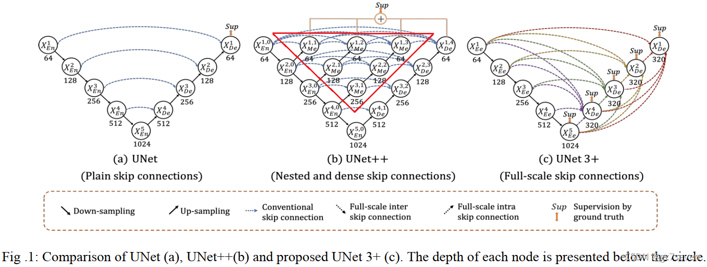
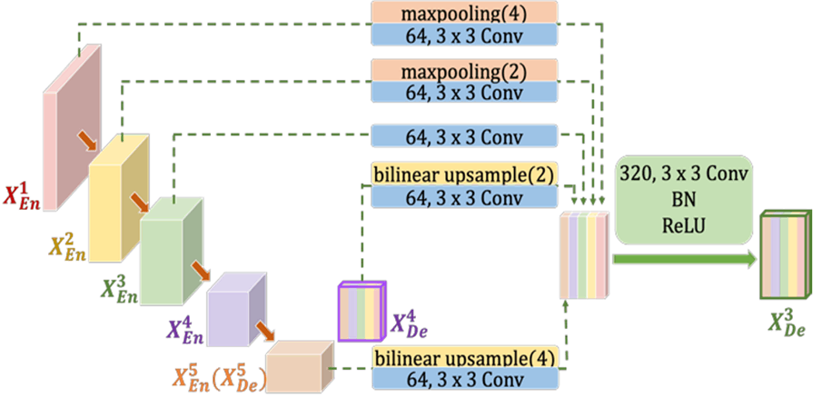
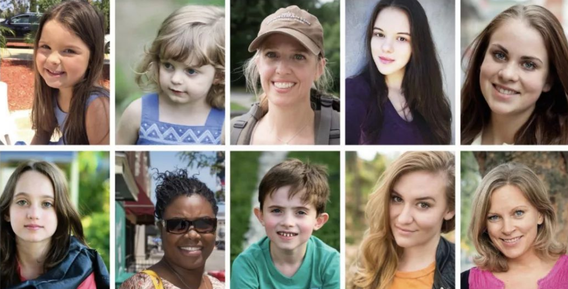

## UNet3P

[UNet 3+: A Full-Scale Connected UNet for Medical Image Segmentation](https://arxiv.org/abs/2004.08790)


## Code Source
```
link: https://github.com/avBuffer/UNet3plus_pth
branch: master
commit: 263534e4a48964e907324622b14b90f1c3b4270d
```

## Model Arch

<div  align="center">

</div>

### pre-processing

UNet3P网络的预处理操作可以按照如下步骤进行，即先对图片进行resize至一定尺寸(128)，然后对其进行归一化、减均值除方差等操作

```python
src_image = cv2.imread(image_path)
image = cv2.resize(src_image, (input_size[-1], input_size[-2]))
image = cv2.cvtColor(image, cv2.COLOR_BGR2RGB)
image = image / 255.0
image = image.transpose((2, 0, 1)).astype(np.float32)
image = image[np.newaxis, :]
```

### post-processing

UNet3P算法的后处理即是对网络输出的heatmap进行逐像素判断，比如一共20个类别，则网络会输出21个通道(20class+background)尺寸等于原图大小的heatmap，然后逐像素判断哪个通道数值大，就表示当前像素点所代表的类别为当前通道对应的类别。

### backbone
UNet3P使用自定义的encode-decode卷积网络作为特征提取backbone。UNet3P利用了全尺度的跳跃连接(skip connection)和深度监督(deep supervisions)。全尺度的跳跃连接把来自不同尺度特征图中的高级语义与低级语义直接结合（当然需要必要的上采样操作）;而深度监督则从多尺度聚合的特征图中学习层次表示。注意一点：UNetPP和UNet3P都用到了深度监督，但是监督的位置是完全不一样的。

所提出的全尺寸跳跃连接改变了编码器和解码器之间的互连以及解码器子网之间的内连接。无论是连接简单的UNet，还是连接紧密嵌套的UNetPP，都缺乏从全尺度探索足够信息的能力，未能明确了解器官的位置和边界。为了弥补UNet和UNetPP的缺陷，UNet3P中的每一个解码器层都融合了来自编码器中的小尺度和同尺度的特征图，以及来自解码器的大尺度的特征图，这些特征图捕获了全尺度下的细粒度语义和粗粒度语义。

<div  align="center">

</div>

为了从全尺度的聚合特征图中学习层次表示，UNet3P进一步采用了全尺度深度监督。不同于UNetPP，UNet3P中每个解码器阶段都有一个侧输出，是金标准(ground truth，GT)进行监督。为了实现深度监督，每个解码器阶段的最后一层被送入一个普通的3×3卷积层，然后是一个双线性上采样和一个sigmoid函数。(这里的上采样是为了放大到全分辨率)。

### common
- Full-scale Skip Connections
- Full-scale Deep Supervision
- Classification-guided Module (CGM)

## Model Info

### 模型精度


|Models|Code Source|FLOPs(G)|Params(M)|MIoU|Shapes|
|:-:|:-:|:-:|:-:|:-:|:-:|
|unet3p|[avBuffer](https://github.com/avBuffer/UNet3plus_pth)|110.928|26.972|80.284|3×128×128|
|unet3p **vacc fp16**|-|-|-|79.324|3×128×128|
|unet3p **vacc int8 kl_divergence**|-|-|-|79.357|3×128×128|
|unet3p_deepsupervision|[avBuffer](https://github.com/avBuffer/UNet3plus_pth)|110.965|26.990|71.411|3×128×128|
|unet3p **vacc fp16**|-|-|-|71.103|3×128×128|
|unet3p **vacc int8 kl_divergence**|-|-|-|70.823|3×128×128|


> Tips
>
> - 原仓库未提供预训练模型，基于`AutoPortraitMatting`1类别肖像分割数据集，自训练了两个子模型，精度一般


### 测评数据集说明

[Automatic Portrait Matting](http://www.cse.cuhk.edu.hk/leojia/projects/automatting/index.html)数据集包含2000张图，训练集1700张，测试集300张，数据都是来源于Flickr的肖像图，图像原始分辨率大小为600×800，其中Matting用closed-form matting和KNN matting方法生成。
<div  align="center">

</div>

### 指标说明
- IoU并交比：两个区域重叠的部分除以两个区域的集合部分，取值TP/(TP+FN+FP)
- MIoU平均并交比：分割图像一般都有好几个类别，把每个分类得出的分数进行平均得到mean IoU，也就是mIoU，其是各种基准数据集最常用的标准之一，绝大数的图像语义分割论文中模型评估比较都以此作为主要评估指标。


## VACC部署
- [avBuffer.md](./source_code/avBuffer.md)
