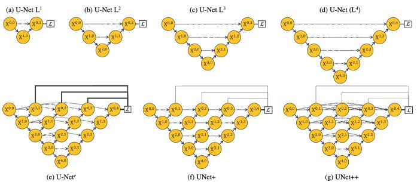

## UNetPP

[UNet++: Redesigning Skip Connections to Exploit Multiscale Features in Image Segmentation](https://arxiv.org/abs/1912.05074)

## Code Source

```
link: https://github.com/Andy-zhujunwen/UNET-ZOO
branch: master
commit: b526ce5dc2bef53249506883b92feb15f4f89bbb
```

## Model Arch

<div  align="center">

</div>

### pre-processing

UNetPP网络的预处理操作可以按照如下步骤进行，即先对图片进行resize至一定尺寸(96)，然后对其进行归一化、减均值除方差等操作

```python
[
    torchvision.transforms.Resize(scale_size),
    torchvision.transforms.ToTensor(),
    torchvision.transforms.Normalize(mean=[0.5, 0.5, 0.5], std=[0.5, 0.5, 0.5],),
]
```

### post-processing

UNetPP算法的后处理即是对网络输出的heatmap进行逐像素判断，比如一共20个类别，则网络会输出21个通道(20class+background)尺寸等于原图大小的heatmap，然后逐像素判断哪个通道数值大，就表示当前像素点所代表的类别为当前通道对应的类别

### backbone

可灵活使用各种分类网络作为骨架作特征提取。UNetPP解决了不同数据量、不同场景应用对网络深度的要求。通过短连接和上下采样等操作，间接融合了多个不同层次的特征，而非简单的Encoder与Decoder同层级特征的简单拼接。正因为此，Decoder可以感知不同感受野下大小不一的object。

- 在UNetPP中引入了一个内置的深度可变的UNet集合，可为不同大小的对象提供改进的分割性能，这是对固定深度UNet的改进。
- 重新设计了UNetPP中的跳接，从而在解码器中实现了灵活的特征融合，这是对UNet中仅需要融合相同比例特征图的限制性跳接的一种改进。
- 设计了一种方案来剪枝经过训练的UNetPP，在保持其性能的同时加快其推理速度。
- 同时训练嵌入在UNetPP体系结构中的多深度U-Net可以激发组成UNet之间的协作学习，与单独训练具有相同体系结构的隔离UNet相比，可以带来更好的性能。
- 展示了UNetPP对多个主干编码器的可扩展性，并进一步将其应用于包括CT、MRI和电子显微镜在内的各种医学成像模式。

### common

- deep supervision

## Model Info

### 模型精度

| Models |                    Code Source                    | FLOPs(G) | Params(M) |  MIoU  |  Shapes  |
| :----: | :------------------------------------------------: | :------: | :-------: | :----: | :-------: |
| UnetPP | [UnetZoo](https://github.com/Andy-zhujunwen/UNET-ZOO) |  10.897  |   9.163   | 84.164 | 3×96×96 |
| UnetPP |                     vacc fp16                     |    -    |     -     | 83.179 | 3×96×96 |
| UnetPP |              vacc int8 kl_divergence              |    -    |     -     | 83.052 | 3×96×96 |

### 测评数据集说明

[DSB2018](https://github.com/sunalbert/DSB2018)数据集，是显微镜下细胞图像中的细胞核分割数据，有细胞核和背景两个类别。

<div  align="center">

</div>

### 指标说明

- IoU并交比：两个区域重叠的部分除以两个区域的集合部分，取值TP/(TP+FN+FP)
- MIoU平均并交比：分割图像一般都有好几个类别，把每个分类得出的分数进行平均得到mean IoU，也就是mIoU，其是各种基准数据集最常用的标准之一，绝大数的图像语义分割论文中模型评估比较都以此作为主要评估指标。

## VACC部署

- [unetzoo.md](./source_code/unetzoo.md)
