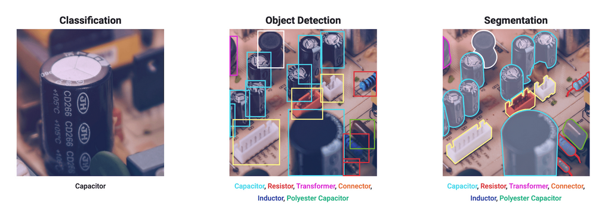

</a>

# Yolov8_seg

## Code Source

```
link: https://github.com/ultralytics/ultralytics
branch: main
commit: b1119d512e738
```

## Model Arch

### pre-processing

yolov8_seg系列的预处理主要是对输入图片利用 `letterbox`算子进行resize，然后进行归一化

### post-processing

yolov8_seg系列的后处理操作相比于yolov5没有改动，即进行box decode之后进行nms, 然后利用预测得到的box生成掩码

### backbone

Yolov8 backbone和Neck部分参考了YOLOv7 ELAN设计思想，将YOLOv5的C3结构换成了梯度流更丰富的C2f结构，并对不同尺度模型调整了不同的通道数，属于对模型结构精心微调，不再是无脑一套参数应用所有模型，大幅提升了模型性能

### head

yolov8_seg det Head部分和yolov8检测部分类似。det head相比YOLOv5改动较大，换成了目前主流的解耦头结构，将分类和检测头分离，同时也从Anchor-Based换成了Anchor-Free，Loss计算方面采用了TaskAlignedAssigner正样本分配策略，并引入了 Distribution Focal Loss。C2f模块之后是两个seg head， 用于学习输入图像的语义分割和mask

### common

- C2f
- SPPF
- letterbox
- DFL

## Model Info

### 模型性能

|   Models   |                      Code Source                      | mAP@.5 | mAP@.5:.95 | Flops(B) | Params(M) | Shapes |
| :---------: | :----------------------------------------------------: | :----: | :--------: | :------: | :-------: | :----: |
| yolov8n-seg | [ultralytics](https://github.com/ultralytics/ultralytics) |   -   |    30.5    |   12.6   |    3.4    |  640  |
| yolov8s-seg | [ultralytics](https://github.com/ultralytics/ultralytics) |   -   |    36.8    |   42.6   |   11.8   |  640  |
| yolov8m-seg | [ultralytics](https://github.com/ultralytics/ultralytics) |   -   |    40.8    |  110.2  |   27.3   |  640  |
| yolov8l-seg | [ultralytics](https://github.com/ultralytics/ultralytics) |   -   |    42.6    |  220.5  |   46.0   |  640  |
| yolov8x-seg | [ultralytics](https://github.com/ultralytics/ultralytics) |   -   |    43.4    |  344.1  |   71.8   |  640  |

### 测评数据集说明


[MS COCO](https://cocodataset.org/#download)的全称是Microsoft Common Objects in Context，是微软于2014年出资标注的Microsoft COCO数据集，与ImageNet竞赛一样，被视为是计算机视觉领域最受关注和最权威的比赛数据集之一。

COCO数据集支持目标检测、关键点检测、实例分割、全景分割与图像字幕任务。在图像检测和实例分割任务中，COCO数据集提供了80个类别，验证集包含5000张图片，上表的结果即在该验证集下测试。


### 评价指标说明

- mAP: mean of Average Precision, 多类别的AP的平均值；AP即平均精度，是Precision-Recall曲线下的面积
- mAP@.5: 即将IoU设为0.5时，计算每一类的所有图片的AP，然后所有类别求平均，即mAP
- mAP@.5:.95: 表示在不同IoU阈值（从0.5到0.95，步长0.05）上的平均mAP

## VACC部署

- [ultralytics_deploy](./source_code/ultralytics_deploy.md)
