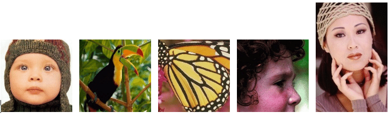

## DRRN

[Image Super-Resolution via Deep Recursive Residual Network](http://cvlab.cse.msu.edu/pdfs/Tai_Yang_Liu_CVPR2017.pdf)


## Code Source
```
link: https://github.com/jt827859032/DRRN-pytorch
branch: master
commit: 2cb8bc0aecef7503e259e1bb73f95612fd46b3be
```

## Model Arch

### pre-processing

DRRN网络的预处理操作可以按照如下步骤进行，即对图片进行resize至一定尺寸(256)，然后除以255：

```python
def get_image_data(image_file, input_shape = [1, 1, 256, 256]):
    """fix shape resize"""
    size = input_shape[2:]

    im_b_ycbcr = imread(image_file, pilmode="YCbCr")
    im_b_ycbcr = cv2.resize(im_b_ycbcr, size)
    im_b_y = im_b_ycbcr[:,:,0].astype(float)
    im_input = im_b_y/255.

    img = im_input[np.newaxis, :, :]
    img = torch.from_numpy(img).float()
    # img = torch.from_numpy(np.transpose(img, (2, 0, 1))).float()
    img = img.unsqueeze(0)

    return np.array(img)
```

> Tips
> 
> 模型训练时输入为YCbCr颜色空间的Y通道
> input shape (1, 1, 256, 256)

### post-processing

DRRN模型的后处理，对模型输出乘以255，像素恢复至[0, 255]，然后再添加回Cb、Cr颜色分量，得到最终高分辨率图像。

### detail

DRRN在一定程度上看做是DRCN的改良版，保留了DRCN的全局跳层连接和循环块提升网络深度但限制参数量的思想，增加了ResNet的局部跳层连接的思想，使得网络运行几层就会进行一次残差学习（这样更有利于网络运行过程中的高频信息重建和保持），同时在最后的输出层也会进行一次大的残差学习

<div  align="center">

</div>

<div  align="center">

</div>

### common

- residual layer

## Model Info

## 模型精度

| Model | Params(M)| Flops(G)| PSNR | size |
|:-:|:-:|:-:|:-:|:-:|
| [DRRN](https://github.com/DeokyunKim/Progressive-Face-Super-Resolution)   | 29.722 | 1074.077 | 31.704 | multi-size|
| [DRRN](https://github.com/DeokyunKim/Progressive-Face-Super-Resolution)  | - | - | 32.454 | 1x256x256 |
| DRRN **vacc fp16**  | - | - | 30.966 | 1x256x256 |
| DRRN **vacc int8 kl_divergence**  |- | - | 30.356 | 1x256x256 |

> Tips
> 
> 源模型输出实际会将图像变清晰，尺寸上没有放大

## 测评数据集说明
[Set5](https://github.com/twtygqyy/pytorch-vdsr/tree/master/Set5)是基于非负邻域嵌入的低复杂度单图像超分辨率的数据集（共5张BMP图像），该训练集被用于单幅图像超分辨率重构，即根据低分辨率图像重构出高分辨率图像以获取更多的细节信息。

<div  align="center">

</div>

### 指标说明
- 峰值信噪比(Peak Signal-to-Noise Ratio, PSNR)，PSNR是信号的最大功率和信号噪声功率之比，测量重构图像的质量，通常以分贝（dB）来表示。PSNR指标越高，说明图像质量越好
- 结构相似性评价(Structure Similarity Index, SSIM)，SSIM是衡量两幅图像相似度的指标，其取值范围为[0,1]，SSIM的值越大，表示图像失真程度越小，说明图像质量越好
- Fréchet Inception Distance，FID是衡量两个多元正态分布的距离，反映了生成图片和真实图片的距离，数据越小越好

## VACC部署
- [pytorch.md](./source_code/pytorch.md)