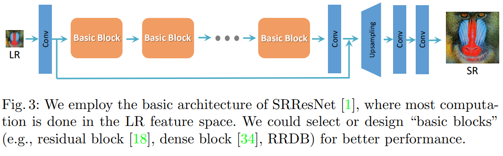
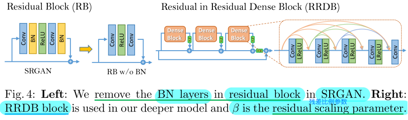

# ESRGAN

[ESRGAN: Enhanced Super-Resolution Generative Adversarial Networks](https://arxiv.org/abs/1809.00219v2)

## Code Source
```
link: https://github.com/xinntao/ESRGAN
branch: master
commit: 73e9b634cf987f5996ac2dd33f4050922398a921
```

## Model Arch

### pre-processing

ESRGAN系列网络的预处理操作可以按照如下步骤进行，即先对图片进行resize至128的尺寸，然后对其进行归一化等操作：

```python
def get_image_data(image_file, input_shape = [1, 3, 128, 128]):
    size = input_shape[2:]

    src_image = cv2.imread(image_file, cv2.IMREAD_UNCHANGED)
    image = cv2.resize(src_image, size, interpolation=cv2.INTER_AREA)

    img = image.astype(np.float32) / 255.
    img = img[:, :, [2, 1, 0]] # BGR to RGB
    img = np.ascontiguousarray(np.transpose(img, (2, 0, 1))) # HWC to CHW
    img = np.expand_dims(img, axis=0)

    return np.array(image), np.array(img)
```

### post-processing

ESRGAN系列网络的后处理操作，对模型输出乘以255，像素恢复至[0, 255]：
```python
output = np.squeeze(heatmap)
output = np.transpose(output[[2, 1, 0], :, :], (1, 2, 0))  # HWC, BGR
output = np.clip(output, 0, 1.0)
output = (output * 255.0).round().astype(np.uint8)
```

### backbone

ESRGAN 在 SRGAN 的基础上， 进一步改进了网络结构、对抗损失和感知损失，增强了超分辨率处理的图像质量。模型改进包括以下三个方面：
- 引入容量更大、更易于训练的 Residual-in-Residual Dense Block (RRDB) 来改善网络结构，删除 BN (Batch Normalization) 层，用 residual scaling 和 smaller initialization 来改善深度网络的训练；
- 用 RaGAN 改进判别器，预测高分辨率图像跟原始图像之间的相对真实性而不是绝对值，从而使得生成器恢复原始图像更真实的纹理细节；
- 改进感知损失，把先前 SRGAN 中激活后的 VGG features 改为激活前执行，提高输出图像的边缘清晰度和纹理真实性。
<div  align="center">

</div>
在不同的面向PSNR的任务中，包括SR和去模糊，去除BN层已被证明可以提高性能并降低计算复杂度。BN层在训练期间使用一批中的均值和方差来归一化特征，并且在测试期间使用整个训练数据集的估计均值和方差。当训练和测试数据集的统计差异很大时，BN层往往会引入令人不愉快的伪像，并限制泛化能力。我们根据经验观察到，当网络更深并且在GAN框架下训练时，BN层更可能带来伪像。这些伪影偶尔会出现在迭代和不同的设置中，违背了对训练的稳定性能的需求。因此，为了稳定的训练和一致的性能，我们去除了BN层。此外，去除BN层有助于提高泛化能力并减少计算复杂度和内存使用。


我们保留了SRGAN的高级架构设计，并使用了一种新的基本块，即RRDB。根据观察，更多的层和连接总是可以提高性能，提出的RRDB采用了比SRGAN中的原始残差块更深、更复杂的结构。具体地，所提出的RRDB具有残差中残差结构residual-in-residual structure，其中残差学习被用于不同的级别。我们在主路径中使用密集块dense block，受益于密集连接，网络容量变得更高。

<div  align="center">

</div>

### common

- RRDB
- Unet

## Model Info

### 模型性能

| Models  | Flops(G) | Params(M) | PSNR(dB) | SSIM | Shape |
| :---: | :--: | :--: | :---: | :----: | :--------: |
| [ESRGAN_x4](https://github.com/xinntao/ESRGAN) |  653.675  |  16.698  |  19.688 | 0.605  |  3x128x128  |
| ESRGAN_x4 **vacc fp16** |  -  |  -  |  21.939 | 0.639 |  3x128x128  |
| ESRGAN_x4 **vacc percentile int8** |  -  |  -  |  18.801 | 0.510 |  3x128x128  |

> Tips
>
> 模型实际效果较差，对边缘纹理增强太过明显

### 测评数据集说明


[DIV2K数据集](https://data.vision.ee.ethz.ch/cvl/DIV2K/)数据集是一个受欢迎的单图像超分辨率数据集，可用于通过低分辨率图像重建高分辨率图像。
此数据集包含 1000 张具有不同退化类型的低分辨率图像，分为：
- 训练数据：800 张低分辨率图像，并为降级因素提供高分辨率和低分辨率图像。
- 验证数据：100 张高清高分辨率图片，用于生成低分辨率的图像。
- 测试数据：100 张多样化的图像，用来生成低分辨率的图像。

<div  align="center">

</div>

### 评价指标说明
- 峰值信噪比(Peak Signal-to-Noise Ratio, PSNR)，PSNR是信号的最大功率和信号噪声功率之比，测量重构图像的质量，通常以分贝（dB）来表示。PSNR指标越高，说明图像质量越好
- 结构相似性评价(Structure Similarity Index, SSIM)，SSIM是衡量两幅图像相似度的指标，其取值范围为[0,1]，SSIM的值越大，表示图像失真程度越小，说明图像质量越好
- Fréchet Inception Distance，FID是衡量两个多元正态分布的距离，反映了生成图片和真实图片的距离，数据越小越好


## VACC部署
- [official.md](./source_code/official.md)