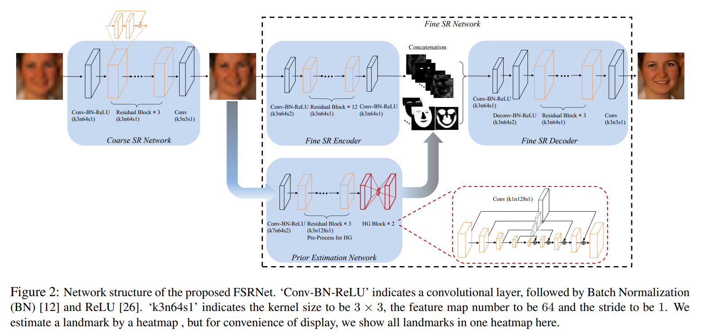
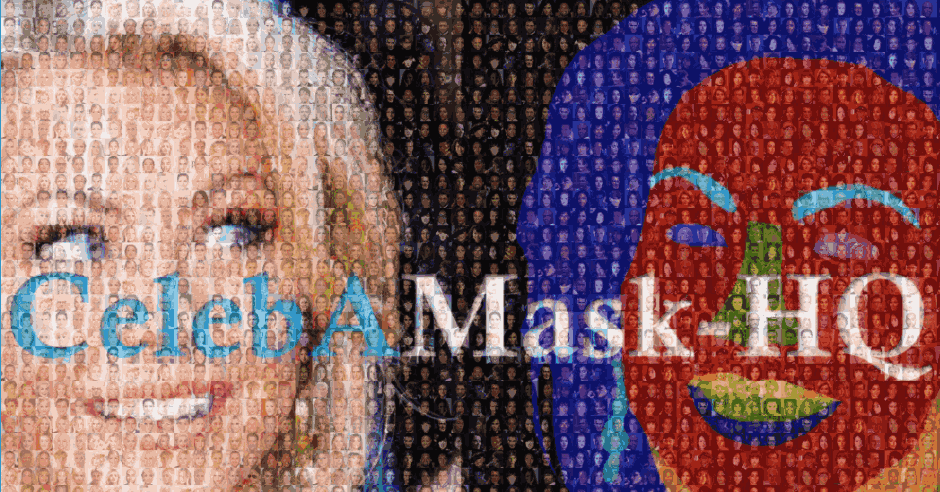

## FSRNet

[FSRNet: End-to-End Learning Face Super-Resolution with Facial Priors](https://arxiv.org/abs/1711.10703)


## Code Source
```
link: https://github.com/cs-giung/FSRNet-pytorch
branch: master
commit: 5b67fdf0657e454d1b382faafbeaf497560f4dc0
```


## Model Arch

<div  align="center">

</div>

### pre-processing

FSRNet网络的预处理操作可以按照如下步骤进行，即先对图片进行下采样resize至16，然后resize至128（构建LR图像用于恢复HR图像），最后对其进行归一化、减均值除方差等操作：

```python
size = [128, 128]

image_src = Image.open(image_file)
image_lr = image_src.resize([16, 16], Image.BICUBIC)
image_lr = image_lr.resize(size, Image.BICUBIC)

image = np.ascontiguousarray(image_lr)
image = np.array(image).transpose(0, 3, 1, 2)
image = (image - 127.5) / 127.5
image = np.clip(image, -1, 1)
```

### post-processing

FSRNet模型的后处理，在模型输出后只需反归一化至[0, 255]:

```python
output = output.permute(0, 2, 3, 1).cpu().numpy()
output = (output + 1) * 127.5
output = np.clip(output, 0, 255)
```

### detail

FSRNet模型是一个端到端的深度可训练面部超分辨网络，充分利用人脸图像的几何先验信息，即面部landmark的heatmap和人脸解析图，来对低分辨率人脸图像进行超分辨率。由coarse SR network, fine SR encoder, prior estimation network , fine SR decoder共4个模块组成。

首先构建粗的SR网络来生成粗的HR图像；然后，粗的HR图像会被送到两个分支去：
1. 精细的SR编码器，提取图像特征。
2. 先验信息预测网络，估计 landmark heatmap 和解析图。

最终，图像特征和先验信息会送到一个精细的SR解码器来恢复HR图像。整个网络的结构如上图所示。


- coarse SR network，从LR输入图像直接估计面部地标位置和解析地图是比较困难的，使用粗糙的SR网络可以缓解先验估计的困难

- prior estimation network，采用HourGlass (HG)结构在先验估计网络中估计面部地标热图和解析图。为了有效地整合跨尺度的特征，保存不同尺度的空间信息，沙漏块HourGlass block在对称层之间采用了跳跃连接skip-connection机制。生成地标热图和解析图

- fine SR encoder，利用残差块residual block进行特征提取，考虑到计算成本，将先验特征的大小降采样到64× 64。为了使特征大小一致，精细SR编码器从stride 2的3×3卷积层开始向下采样特征映射到64×64，再利用ResNet结构提取图像特征

- fine SR decoder，首先将先验特征p和图像特征f串联起来作为解码器的输入。然后一个3×3的卷积层将特征映射的数量减少到64个。利用一个4×4的反卷积层对特征图进行上采样，使其尺寸达到128×128。然后用3个残差块对特征进行解码。最后利用3×3的卷积层对HR图像进行恢复


### common

- Residual Block
- HourGlass Block


## Model Info

## 模型精度

| Model | Params(M)| PSNR| SSIM | Size |
|:-:|:-:|:-:|:-:|:-:|
| [FSRNet](https://github.com/cs-giung/FSRNet-pytorch) | 2.15 | 22.537 | 0.701 | 3×128×128 |
| FSRNet **vacc fp16**| - | 18.926 | 0.582 |  3×128×128 |
| FSRNet **vacc int8 kl_divergence**| - | 15.422 | 0.344 |  3×128×128 |

### 测评数据集说明


[CelebAMask-HQ](https://github.com/switchablenorms/CelebAMask-HQ)是一个大规模的面部图像数据集，通过遵循CelebA-HQ从CelebA数据集中选择了30,000张高分辨率面部图像。 每个图像具有对应于CelebA的面部属性的分割MASK，其采用512 x 512尺寸手动标注，分为19类，包括所有面部组件和配件，例如皮肤，鼻子，眼睛，眉毛，耳朵，嘴巴，嘴唇，头发，帽子，眼镜，耳环，项链，脖子和布。CelebAMask-HQ可用于训练和评估人脸解析，人脸识别以及用于人脸生成和编辑的GAN的算法。

<div  align="center">

</div>

### 指标说明
- 峰值信噪比(Peak Signal-to-Noise Ratio, PSNR)，PSNR是信号的最大功率和信号噪声功率之比，测量重构图像的质量，通常以分贝（dB）来表示。PSNR指标越高，说明图像质量越好
- 结构相似性评价(Structure Similarity Index, SSIM)，SSIM是衡量两幅图像相似度的指标，其取值范围为[0,1]，SSIM的值越大，表示图像失真程度越小，说明图像质量越好
- Fréchet Inception Distance，FID是衡量两个多元正态分布的距离，反映了生成图片和真实图片的距离，数据越小越好

## VACC部署
- [official.md](./source_code/official.md)
