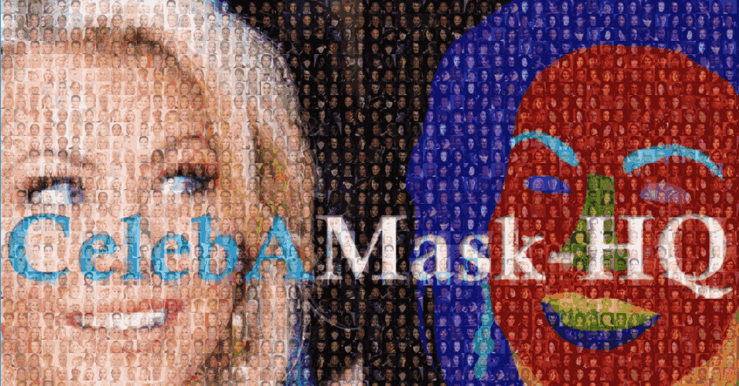

# GPEN

[GAN Prior Embedded Network for Blind Face Restoration in the Wild](https://arxiv.org/abs/2105.06070)

## Code Source
```
link: https://github.com/yangxy/GPEN
branch: master
commit: b611a9f2d05fdc5b82715219ed0f252e42e4d8be
```


## Model Arch

<div align=center></div>

### pre-processing

GPEN系列网络的预处理操作，可以按照如下步骤进行：

```python
  transform_ops:
    - type: DecodeImage
    - type: Resize
      size: [512, 512]
    - type: Normalize
      mean: [0.5, 0.5, 0.5]
      std: [0.5, 0.5, 0.5]
    - type: ToTensor
```

### post-processing

GPEN系列网络的后处理操作，可以按照如下步骤进行：
```python
output = np.squeeze(heatmap)
output = np.transpose(output[[2, 1, 0], :, :], (1, 2, 0))  # HWC, BGR
output = output * 0.5 + 0.5

output = np.clip(output, 0, 1) * 255.0
output = output.astype(np.uint8)
```

### backbone

从野外严重退化的人脸图像中恢复盲脸（BFR）是一个非常具有挑战性的问题。由于较大的畸变和退化，DNN难以在盲脸恢复中取得较好效果，现有GAN偏向生成过于平滑的修复结果。

作者先采用高精度人脸数据训练出GAN（StyleGAN2）生成器，将其作为先验解码器嵌入到U形DNN网络中，对输入低质量图像进行微调；
GAN 模块旨在确保输入到 GAN 的潜在代码和噪声可以分别从 DNN 的深层和浅层特征生成，控制重建图像的全局人脸结构、局部人脸细节和背景。所提出的 GAN 先验嵌入式网络 (GPEN) 易于实现，并且可以生成视觉上逼真的结果。

<div align=center></div>

图(a)是GAN先验网络，受StyleGAN结构的启发，使用映射网络将潜在代码z经过一个映射网络投射到空间w中。然后将中间代码w传播到每个GAN块。每个GAN采用的StyleGAN块体系结构，如图(b)
由于GAN-prior网络将嵌入到U shaped-DNN中进行微调，因此我们需要为Ushaped-DNN编码器提取的特征映射留出空间。因此，我们为每个GAN块提供额外的噪声输入。
此外，噪声输入是串联的，而不是添加到StyleGAN中的卷积中。这个串联方法可以在恢复的人脸图像中带来更多细节，作者也在后面的消融实验中进行了证明。
当使用某个数据集训练了GAN先验网络，我们将其作为解码器嵌入U形DNN中，如图(c)。潜在代码z被DNN编码器的全连接层所代替， GAN网络的噪声输入被编码器每一层的输出所代替，这将控制全局人脸结构、局部人脸细节以及人脸图像背景的重建


### common

- U shaped-DNN
- StyleGAN

## Model Info

### 模型性能

| Models  | Flops(G) | Params(M) | PSNR(dB) | SSIM | Shapes |
| :---: | :--: | :--: | :---: | :----: | :--------: |
| [GPEN](https://github.com/yangxy/GPEN) |  -  |  71.010  |  25.983 | - |  3x512x512  |
| GPEN **vacc fp16** |  -  |  -  |  - | - |  -  |
| GPEN **vacc mse int8** |  -  |  -  |  24.828 |  0.669 |  3x512x512  |


> Tips
>
> 此`GPEN`模型模型，大部分层无法计算flops
> 

### 测评数据集说明


[CelebAMask-HQ](https://github.com/switchablenorms/CelebAMask-HQ)是一个大规模的面部图像数据集，通过遵循CelebA-HQ从CelebA数据集中选择了30,000张高分辨率面部图像。 每个图像具有对应于CelebA的面部属性的分割MASK，其采用512 x 512尺寸手动标注，分为19类，包括所有面部组件和配件，例如皮肤，鼻子，眼睛，眉毛，耳朵，嘴巴，嘴唇，头发，帽子，眼镜，耳环，项链，脖子和布。CelebAMask-HQ可用于训练和评估人脸解析，人脸识别以及用于人脸生成和编辑的GAN的算法。

<div  align="center">

</div>

### 指标说明
- 峰值信噪比(Peak Signal-to-Noise Ratio, PSNR)，PSNR是信号的最大功率和信号噪声功率之比，测量重构图像的质量，通常以分贝（dB）来表示。PSNR指标越高，说明图像质量越好
- 结构相似性评价(Structure Similarity Index, SSIM)，SSIM是衡量两幅图像相似度的指标，其取值范围为[0,1]，SSIM的值越大，表示图像失真程度越小，说明图像质量越好
- Fréchet Inception Distance，FID是衡量两个多元正态分布的距离，反映了生成图片和真实图片的距离，数据越小越好


## VACC部署
- [official.md](./source_code/official.md)
