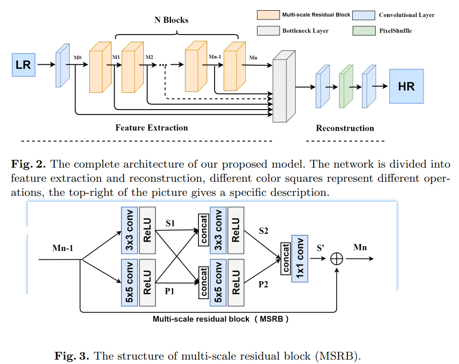
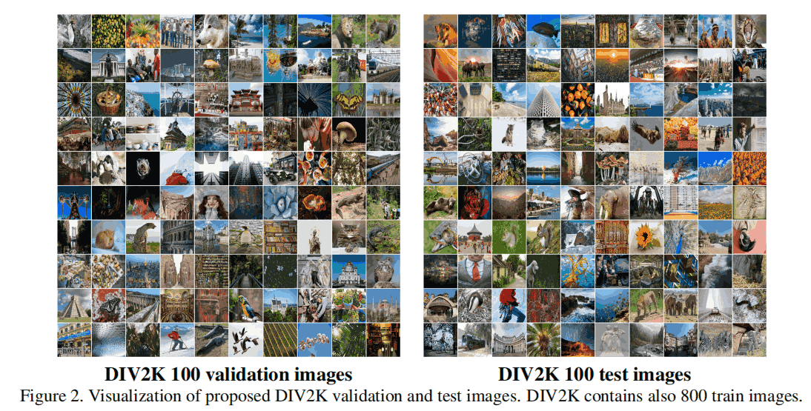

# MSRN

[Multi-scale Residual Network for Image Super-Resolution](https://openaccess.thecvf.com/content_ECCV_2018/papers/Juncheng_Li_Multi-scale_Residual_Network_ECCV_2018_paper.pdf)

## Code Source
```
# official
link: https://github.com/MIVRC/MSRN-PyTorch
branch: master
commit: a0e038de7eb42e21d2e88c38e6490b61a02c566e
```

## Model Arch

<div align=center></div>

### pre-processing

MSRN系列网络的预处理操作，可以按照如下步骤进行：

```python
def get_image_data(image_file, input_shape = [1, 3, 1080, 1920]):
    size = input_shape[2:][::-1]

    image = cv2.imread(image_file)
    img = cv2.resize(image, size) # , interpolation=cv2.INTER_AREA
    img = cv2.cvtColor(img, cv2.COLOR_BGR2RGB)

    img = np.ascontiguousarray(np.transpose(img, (2, 0, 1))) # HWC to CHW
    img = np.expand_dims(img, axis=0)

    return np.array(img)
```

### post-processing

MSRN系列网络的后处理操作，可以按照如下步骤进行：

```python
heatmap = vacc_model.get_output(name, 0, 0).asnumpy().astype("float32")

output = np.squeeze(heatmap)
output = np.transpose(output[[2, 1, 0], :, :], (1, 2, 0))  # HWC, BGR
```

### backbone

提出了一种新型的多尺度残差网络(MSRN)来充分挖掘图像特征，它的性能优于大多数最先进的方法。基于残差块，我们引入不同大小的卷积核来自适应地检测不同尺度的图像特征。同时，我们让这些特征相互作用，以获得最有效的图像信息，我们称这种结构为多尺度残差块（MSRB）。此外，每个MSRB的输出都会被用作全局特征融合的层次特征。最后，所有这些特征被送到重建模块，以恢复高质量的图像。
- 使用MSRB来获取不同尺度的图像特征（局部多尺度特征）。
- 将每个MSRB的输出组合起来进行全局特征融合。
- 将局部多尺度特征与全局特征相结合，最大限度地利用LR图像特征，彻底解决特征在传输过程中消失的问题。
- 引入了一个以1×1卷积核为瓶颈层用于获得全局特征融合。
- 本文还设计了一个简单而高效重建结构可以很容易地实现多尺度的放大。


### common

- Multi-Scale Residual Block
- Pixel-Shuffle

## Model Info

### 模型性能

| Models  |  Code Source |Flops(G) | Params(M) | PSNR(dB) | SSIM | Shape |
| :---: | :--: |:--: | :--: | :---: | :----: | :--------: |
| MSRN | [Official](https://github.com/yulunzhang/RCAN) |  477.094  |  0.103  |  32.600 | 0.772 | 3x1080x1920 |
| MSRN **vacc max int8** |  -  |  -  |  -  |  32.368 | 0.768 |  3x1080x1920  |


> Tips
>
> - MSRN基于原始模型[msrn.py](https://github.com/MIVRC/MSRN-PyTorch/blob/master/MSRN/Train/model/msrn.py)进行修改：原始模型参数：`n_feats = 64，n_blocks = 8`，减小为：`n_feats = 16，n_blocks = 2, scale = 2`，重新训练`2x`模型
>
> - 因有PixelShuffle，fp16 vacc暂不支持
> - 精度指标基于DIV2K valid两倍放大数据集


### 测评数据集说明

[DIV2K数据集](https://data.vision.ee.ethz.ch/cvl/DIV2K/)是一个受欢迎的单图像超分辨率数据集，可用于通过低分辨率图像重建高分辨率图像。
此数据集包含 1000 张具有不同退化类型的低分辨率图像，分为：
- 训练数据：800 张低分辨率图像，并为降级因素提供高分辨率和低分辨率图像。
- 验证数据：100 张高清高分辨率图片，用于生成低分辨率的图像。
- 测试数据：100 张多样化的图像，用来生成低分辨率的图像。

<div  align="center">

</div>


### 评价指标说明
- 峰值信噪比(Peak Signal-to-Noise Ratio, PSNR)，PSNR是信号的最大功率和信号噪声功率之比，测量重构图像的质量，通常以分贝（dB）来表示。PSNR指标越高，说明图像质量越好
- 结构相似性评价(Structure Similarity Index, SSIM)，SSIM是衡量两幅图像相似度的指标，其取值范围为[0,1]，SSIM的值越大，表示图像失真程度越小，说明图像质量越好
- Fréchet Inception Distance，FID是衡量两个多元正态分布的距离，反映了生成图片和真实图片的距离，数据越小越好


## VACC部署
- [official.md](./source_code/official.md)

## Tips
- 在`AI 1.5.2 SP1_0822`上验证，只能通过`int8 runstream`