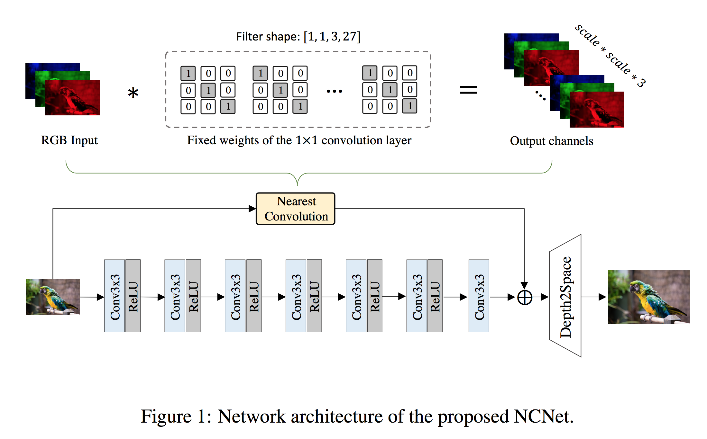

# NCNet

[Fast Nearest Convolution for Real-Time Image Super-Resolution](https://arxiv.org/abs/2208.11609)

## Code Source
```
# official
link: https://github.com/Algolzw/NCNet
branch: main
commit: 048486534a209c72ef6bbe991a4a926e61c18345

```


## Model Arch

<div align=center></div>

### pre-processing

RCAN系列网络的预处理操作，可以按照如下步骤进行（不同来源预处理和后处理可能不同，实际请参考对应推理代码）：

```python
def get_image_data(image_file, input_shape = [1, 3, 1080, 1920]):
    size = input_shape[2:][::-1]

    image = cv2.imread(image_file)
    img = cv2.resize(image, size) # , interpolation=cv2.INTER_AREA
    img = cv2.cvtColor(img, cv2.COLOR_BGR2RGB)

    img = np.ascontiguousarray(np.transpose(img, (2, 0, 1))) # HWC to CHW
    img = np.expand_dims(img, axis=0)

    return np.array(img)
```

### post-processing

RCAN系列网络的后处理操作，可以按照如下步骤进行：
```python
heatmap = vacc_model.get_output(name, 0, 0).asnumpy().astype("float32")

output = np.squeeze(heatmap)
output = np.transpose(output[[2, 1, 0], :, :], (1, 2, 0))  # HWC, BGR
```

### backbone

文中提出一个简单的普通卷积网络与快速最近卷积模块（NCNet），它对NPU友好，并能实时执行可靠的超分辨率。所提出的最近卷积具有与最近上采样相同的性能，但速度更快。 

### common

- Pixel-Shuffle

## Model Info

### 模型性能

| Models  |  Code Source |Flops(G) | Params(M) | PSNR(dB) | SSIM | Shape |
| :---: | :--: |:--: | :--: | :---: | :----: | :--------: |
| NCNet | [Official](https://github.com/Algolzw/NCNet) |  195.748  |  0.042  |  32.917 | 0.776 | 3x1080x1920|
| NCNet **vacc max int8** |  -  |  -  |  -  |  32.448 | 0.766 |  3x1080x1920  |


> Tips
>
> - 此模型来自官方仓库内的torch版本，tf版本暂有bug
> - torch版本只提供网络文件，未提供权重；基于[yulunzhang/RCAN](https://github.com/yulunzhang/RCAN)仓库自训练
> - 精度指标基于DIV2K valid两倍放大数据集


### 测评数据集说明

[DIV2K数据集](https://data.vision.ee.ethz.ch/cvl/DIV2K/)是一个受欢迎的单图像超分辨率数据集，可用于通过低分辨率图像重建高分辨率图像。
此数据集包含 1000 张具有不同退化类型的低分辨率图像，分为：
- 训练数据：800 张低分辨率图像，并为降级因素提供高分辨率和低分辨率图像。
- 验证数据：100 张高清高分辨率图片，用于生成低分辨率的图像。
- 测试数据：100 张多样化的图像，用来生成低分辨率的图像。

<div  align="center">

</div>


### 评价指标说明
- 峰值信噪比(Peak Signal-to-Noise Ratio, PSNR)，PSNR是信号的最大功率和信号噪声功率之比，测量重构图像的质量，通常以分贝（dB）来表示。PSNR指标越高，说明图像质量越好
- 结构相似性评价(Structure Similarity Index, SSIM)，SSIM是衡量两幅图像相似度的指标，其取值范围为[0,1]，SSIM的值越大，表示图像失真程度越小，说明图像质量越好
- Fréchet Inception Distance，FID是衡量两个多元正态分布的距离，反映了生成图片和真实图片的距离，数据越小越好


## VACC部署
- [official.md](./source_code/official.md)

## Tips
- 在`AI 1.5.2 SP1_0822`上验证，只能runstream，runmodel build段错误