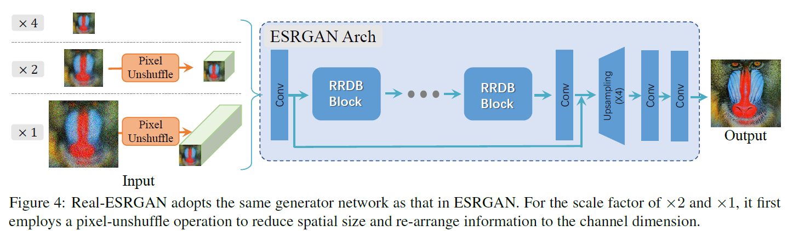
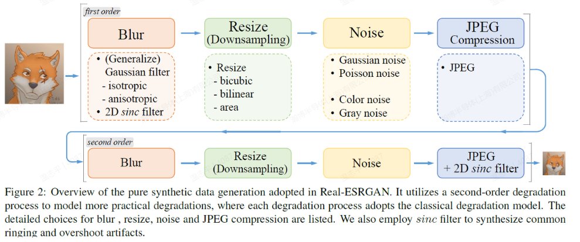

# Real_ESRGAN

[Real-ESRGAN: Training Real-World Blind Super-Resolution with Pure Synthetic Data](https://arxiv.org/abs/2107.10833)

## Code Source
```
link: https://github.com/xinntao/Real-ESRGAN
branch: master
commit: 5ca1078535923d485892caee7d7804380bfc87fd
```


## Model Arch

<div align=center></div>

### pre-processing

Real_ESRGAN系列网络的预处理操作可以按照如下步骤进行，即先对图片进行resize至128的尺寸，然后对其进行归一化等操作：

```python
def get_image_data(image_file, input_shape = [1, 3, 128, 128]):
    size = input_shape[2:]

    src_image = cv2.imread(image_file, cv2.IMREAD_UNCHANGED)
    image = cv2.resize(src_image, size, interpolation=cv2.INTER_AREA)

    img = image.astype(np.float32) / 255.
    img = img[:, :, [2, 1, 0]] # BGR to RGB
    img = np.ascontiguousarray(np.transpose(img, (2, 0, 1))) # HWC to CHW
    img = np.expand_dims(img, axis=0)

    return np.array(image), np.array(img)
```

### post-processing

Real_ESRGAN系列网络的后处理操作，对模型输出乘以255，像素恢复至[0, 255]：
```python
output = np.squeeze(heatmap)
output = np.transpose(output[[2, 1, 0], :, :], (1, 2, 0))  # HWC, BGR
output = np.clip(output, 0, 1.0)
output = (output * 255.0).round().astype(np.uint8)
```

### backbone

在现实世界中，图像分辨率的退化通常是由多种不同的退化复杂组合而成的。因此，作者将经典的一阶退化模型(first-order degradation model)拓展现实世界的高阶退化建模(high-order degradation modeling)，即利用多个重复的退化过程建模，每一个退化过程都是一个经典的退化模型。但是为了平衡简单性和有效性，作者在代码中实际采用的是二阶退化模型(second-order degradation model)。
<div align=center></div>

Generator：采用ESRGAN中的Generator，即使用 Residual-in-residul Dense Block(RRDB)。
Discriminator：使用有 spectral normalization(SN) 的 U-Net。使用 SN 是为了稳定训练过程，并且使用 SN 有助于缓和 oversharp 和 artifacts。

生成网络是ESRGAN的生成网络，基本没变，只是在功能上增加了对x2和x1倍的图像清晰度提升。对于x4倍的超分辨，网络完全按照ESRGAN的生成器执行；而对于X2和X1倍的超分辨，网络先进行pixel-unshuffle（pixel-shuffl的反操作，pixel-shuffle可理解为通过压缩图像通道而对图像尺寸进行放大），以降低图像分辨率为前提，对图像通道数进行扩充，然后将处理后的图像输入网络进行超分辨重建。举个例子：对于一幅图像，若只想进行x2倍放大变清晰，需先通过pixel-unshuffle进行2倍缩小，然后通过网络进行4倍放大。


### common

- RRDB
- Unet
- Pixel-UnShuffle

## Model Info

### 模型性能

| Models  | flops(G) | params(M) | PSNR(dB) | SSIM | Shape |
| :---: | :--: | :--: | :---: | :----: | :--------: |
| [RealESRGAN_x4plus](https://github.com/xinntao/Real-ESRGAN) |  653.675  |  16.698  |  24.845 | 0.710  |  source multi-shape  |
| RealESRGAN_x4plus |  -  |  -  |  22.377 | 0.640 |  3x128x128  |
| RealESRGAN_x4plus **vacc fp16** |  -  |  -  |  22.377 | 0.640 |  3x128x128  |
| RealESRGAN_x4plus **vacc percentile int8** |  -  |  -  |  22.163 | 0.600 |  3x128x128  |
| [RealESRGAN_x4plus_anime_6B](https://github.com/xinntao/Real-ESRGAN) |  208.149  |  4.468  |  23.930 | 0.688 |  source multi-shape  |
| RealESRGAN_x4plus_anime_6B |  -  |  -  | 21.849 | 0.622 |  3x128x128  |
| RealESRGAN_x4plus_anime_6B **vacc fp16** |  -  |  -  |  21.856 | 0.622 |  3x128x128  |
| RealESRGAN_x4plus_anime_6B **vacc percentile int8** |  -  |  -  |  21.340 | 0.577 |  3x128x128  |
| [RealESRNET_x4plus](https://github.com/xinntao/Real-ESRGAN) | 653.675  |  16.698  |  26.996 | 0.772  |  source multi-shape  |
| RealESRNET_x4plus |  -  |  -  | 24.582 | 0.721 |  3x128x128  |
| RealESRNET_x4plus **vacc fp16** |  -  |  -  |  24.584 |0.721 |  3x128x128  |
| RealESRNET_x4plus **vacc percentile int8** |  -  |  -  |  24.274 | 0.696 |  3x128x128  |

> Tips
>
> `RealESRGAN_x4plus_anime_6B`模型在进行4x超分同时进行了动漫风格化，所以评估指标在数值上没有直接意义

### 测评数据集说明


[DIV2K数据集](https://data.vision.ee.ethz.ch/cvl/DIV2K/)数据集是一个受欢迎的单图像超分辨率数据集，可用于通过低分辨率图像重建高分辨率图像。
此数据集包含 1000 张具有不同退化类型的低分辨率图像，分为：
- 训练数据：800 张低分辨率图像，并为降级因素提供高分辨率和低分辨率图像。
- 验证数据：100 张高清高分辨率图片，用于生成低分辨率的图像。
- 测试数据：100 张多样化的图像，用来生成低分辨率的图像。

<div  align="center">

</div>

### 评价指标说明
- 峰值信噪比(Peak Signal-to-Noise Ratio, PSNR)，PSNR是信号的最大功率和信号噪声功率之比，测量重构图像的质量，通常以分贝（dB）来表示。PSNR指标越高，说明图像质量越好
- 结构相似性评价(Structure Similarity Index, SSIM)，SSIM是衡量两幅图像相似度的指标，其取值范围为[0,1]，SSIM的值越大，表示图像失真程度越小，说明图像质量越好
- Fréchet Inception Distance，FID是衡量两个多元正态分布的距离，反映了生成图片和真实图片的距离，数据越小越好


## VACC部署
- [official.md](./source_code/official.md)