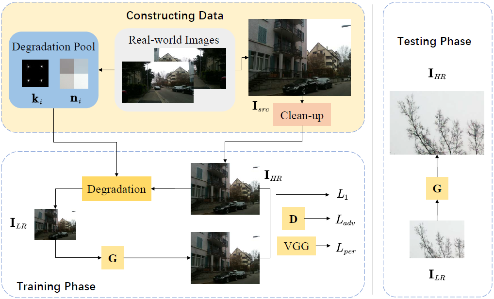
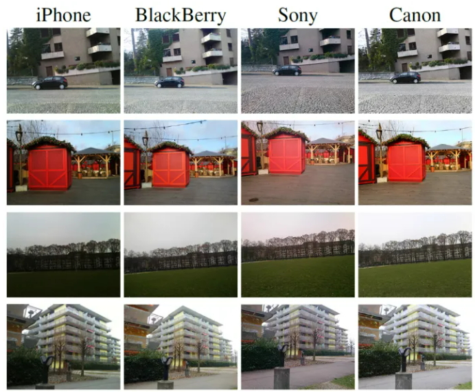

## RealSR

[Real-World Super-Resolution via Kernel Estimation and Noise Injection](https://openaccess.thecvf.com/content_CVPRW_2020/html/w31/Ji_Real-World_Super-Resolution_via_Kernel_Estimation_and_Noise_Injection_CVPRW_2020_paper.html)


## Code Source
```
link: https://github.com/Tencent/Real-SR
branch: master
commit: 10276f4e497894dcbaa6b4244c06bba881b9460c
```

## Model Arch

<div  align="center">

</div>

### pre-processing

RealSR网络的预处理操作可以按照如下步骤进行：

```python
def get_image_data(image_file, input_shape = [1, 3, 128, 128]):
    """fix shape resize"""
    size = input_shape[2:]

    src_image = cv2.imread(image_file, cv2.IMREAD_COLOR)
    img = cv2.resize(src_image, size, interpolation=cv2.INTER_AREA)
    img = img.astype(np.float32) / 255.
    img = img[:, :, [2, 1, 0]] # BGR to RGB
    img = np.ascontiguousarray(np.transpose(img, (2, 0, 1))) # HWC to CHW
    img = np.expand_dims(img, axis=0)

    return img
```


### post-processing

RealSR模型的后处理，对模型输出乘以255，像素恢复至[0, 255]：

```python
output = np.squeeze(heatmap)
output = np.transpose(output[[2, 1, 0], :, :], (1, 2, 0))  # HWC, BGR
output = np.clip(output, 0, 1.0)
output = (output * 255.0).round().astype(np.uint8)
```

### backbone

目前很多超分模型都是基于通过双三次下采样对原始图片进行降质后得到的LR和HR配对进行训练，但是用真实世界的图片对模型进行测试，结果并不理想（模糊且有噪声）。这是因为我们忽视了一些问题：

- 单一的双三次下采样方法使得原始图像损失了一些频率相关的细节，降质后得到的LR图像所属域X’与原始图像所属域X不同。因此，在模型训练过程中，模型会更注重X’的重要特征，而不是X的特征
- 通过双三次下采样得到的LR图片通常没有噪声（高频特征被忽略），但是真实图片是含有的
  
为解决以上问题，作者提出了一种新的降质框架，通过模糊核估计以及注入噪声使得降质得到的低分辨率图像与原始图像处于同一域，并基于ESRGAN模型进行了一些改进，最后得到了比较好的效果。

第一阶段：从真实数据中估计降质方法并生成真实的LR图像；（估计模糊核、噪声注入）

第二阶段：基于构建的数据集训练SR模型。

- Kernel Estimation：受KernelGAN灵感的启发，本文采用了相似的模糊核估计算法，并基于真实数据设置正确参数。KernelGAN的生成器是一个没有任何激活层的线性模型，因此所有层的参数可以整合成一个固定核。
- Noise Injection：为了确保降质图片和源图片有相同的噪声分布，所以我们直接从源数据中收集噪声patches。我们发现有较丰富内容的patch会有更大的方差，基于此我们提出了一个过滤规则，收集方差在一定范围内的噪声patch。将收集好的噪声块加入到降质池，通过随机从噪声池中裁剪patch完成噪声注入。
- 基于以上操作获得了模糊核和噪声patch后，构建一个降质池，基于此将HR图片进行模糊和加噪处理。
- 生成网络用的都是ESRGAN的模块（ESRGAN的鉴别器可能会导致伪影。与默认的ESRGAN设置不同，本文采用patch鉴别器而不是VGG-128），我们采用了一个SR模型并采用构造的数据集进行训练。生成器采用RRDB结构，生成图片的分辨率将被放大四倍。

### common

- Kernel Estimation
- KernelGAN
- ESRGAN
- RRDB


## Model Info

## 模型精度

| Model | flops(G)| Params(M)| PSNR(dB)| SSIM| Size |
|:-:|:-:|:-:|:-:|:-:|:-:|
| [DF2K](https://github.com/Tencent/Real-SR) |  652.697 |  16.698 | 23.699 | 0.685 | 3x128x128 |
| DF2K **vacc fp16**| - | - | 23.654 | 0.649 | 3x128x128 |
| DF2K **vacc int8 kl_divergence**| - |  - | 23.116 | 0.597| 3x128x128 |
| [DF2K-JPEG](https://github.com/Tencent/Real-SR) |  652.697 |  16.698 | 22.570  | 0.619 |  3x128x128 |
| [DPED](https://github.com/Tencent/Real-SR) |  652.697 |  16.698 | 18.040 | 0.531 |  3x128x128 |


> **Note**
> 
> vacc指标基于DIV2K_valid_HR，缩放至（4x128，4x128）作为HR，缩放至（128，128）作为LR，LR经模型获得SR，将SR与HR进行对比评估

```
- 仓库提供了三个权重，基于不同退化图像训练而来，网络结构是一样的，此处只验证DF2K子模型

- DF2K for corrupted images with processing noise. bicubic方法（track1）
- DPED for real images taken by cell phone camera. kernel_GAN方法（track2）
- DF2K-JPEG for compressed jpeg image. bicubic方法（track1）
- track1类似于一般的深度学习超分辨制作数据集的方法，对HR图像，使用双三次插值进行降采样s操作，但不使用模糊核k，注入的噪声n来自于高分辨Flick2k含噪图像数据集cut下来的噪声块。
- track2首先对DPED图像，使用kernel_GAN方法获取一些列的模糊核k（同时具有模糊k和将采样s的效果）。然后对clean up后的HR图像进行降采样s操作和模糊k操作，注入的噪声n来自于高分辨DPED数据集cut下来的噪声块
```

### 测评数据集说明

[DIV2K数据集](https://data.vision.ee.ethz.ch/cvl/DIV2K/)

DIV2K数据集是一个受欢迎的单图像超分辨率数据集，可用于通过低分辨率图像重建高分辨率图像。
此数据集包含 1000 张具有不同退化类型的低分辨率图像，分为：
训练数据：800 张低分辨率图像，并为降级因素提供高分辨率和低分辨率图像。
验证数据：100 张高清高分辨率图片，用于生成低分辨率的图像。
测试数据：100 张多样化的图像，用来生成低分辨率的图像。

<div  align="center">

</div>

[DF2K数据集](https://github.com/XPixelGroup/BasicSR/blob/a19aac61b277f64be050cef7fe578a121d944a0e/docs/Datasets.md) = [DIV2K数据集](https://data.vision.ee.ethz.ch/cvl/DIV2K/) + [Flick2k数据集](https://github.com/LimBee/NTIRE2017)；

DIV2K数据集 = 目标域图像 = target域 = HR = HR images set Y = 纯净的高分辨图像；

Flick2K = 源域图像 = source域 = src = real images set X = 含噪声的高分辨图像；

DIV2K和Flick2K数据集都是高分辨数据集，但DIV2K的HR数据是可以直接作为训练的HR使用的，Flick2K的src数据需要进行clean up才能变成训练时的HR图像。
[中文介绍](https://blog.csdn.net/sinat_28442665/article/details/108142434)

[DPED数据集](https://github.com/aiff22/DPED) 

这个数据集发布于2018年，采用了3个不同的手机和一个数码相机进行拍摄然后进行图片匹配和裁剪。三个手机分别是iPhone 3GS、BlackBerry Passport和Sony Xperia Z，相机则是 Canon 70D DSLR。该数据集覆盖了白天的各种常见光照和天气情况，采集时间持续3周，都使用了自动拍摄模式。为了确保他们同时工作，它们被安放在三角架上，通过无线控制。

索尼智能手机照片 4549 张，iPhone 手机照片 5727 张，黑莓手机照片 6015 张。对于每张智能手机照片都有一个来自佳能数码单反相机的相应照片。这些照片是在白天在各种各样的地方以及各种照明和天气条件下拍摄的。图像是以自动模式拍摄的，我们在整个采集过程中使用了所有相机的默认设置。手机拍摄和单反拍摄出来的画面有所不同，我们通过 SIFT 特征进行了额外的非线性变换，以确保图像平齐。


DPED数据集 = 源域图像 = source域 = src = real images set X = 含噪声的高分辨图像；

DPED的src数据需要进行clean up才能变成训练时的HR图像。

<div  align="center">

</div>

### 指标说明
- 峰值信噪比(Peak Signal-to-Noise Ratio, PSNR)，PSNR是信号的最大功率和信号噪声功率之比，测量重构图像的质量，通常以分贝（dB）来表示。PSNR指标越高，说明图像质量越好
- 结构相似性评价(Structure Similarity Index, SSIM)，SSIM是衡量两幅图像相似度的指标，其取值范围为[0,1]，SSIM的值越大，表示图像失真程度越小，说明图像质量越好
- Fréchet Inception Distance，FID是衡量两个多元正态分布的距离，反映了生成图片和真实图片的距离，数据越小越好

## VACC部署
- [official.md](./source_code/official.md)
