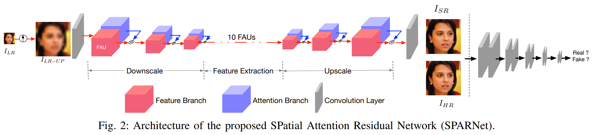
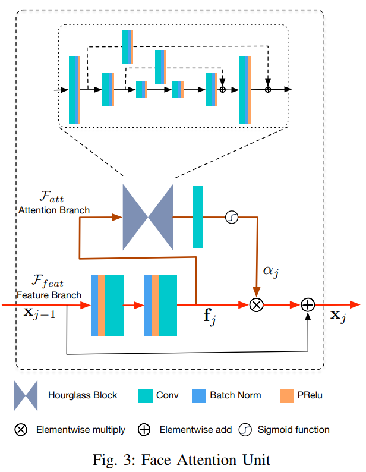
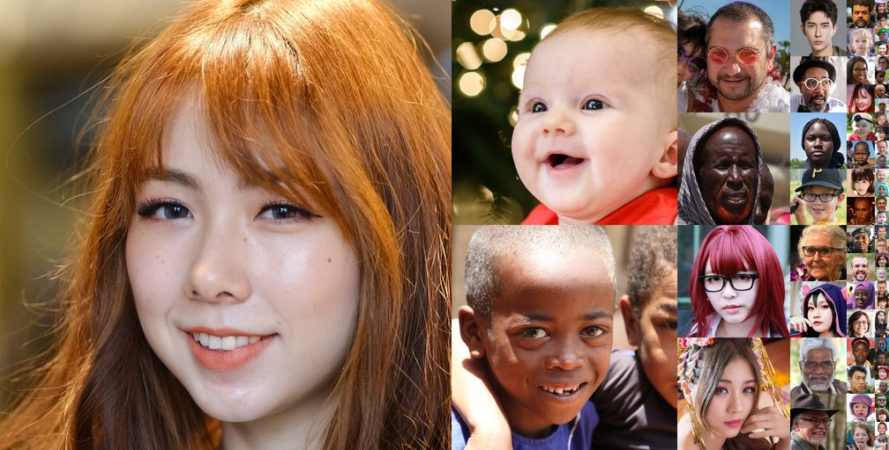
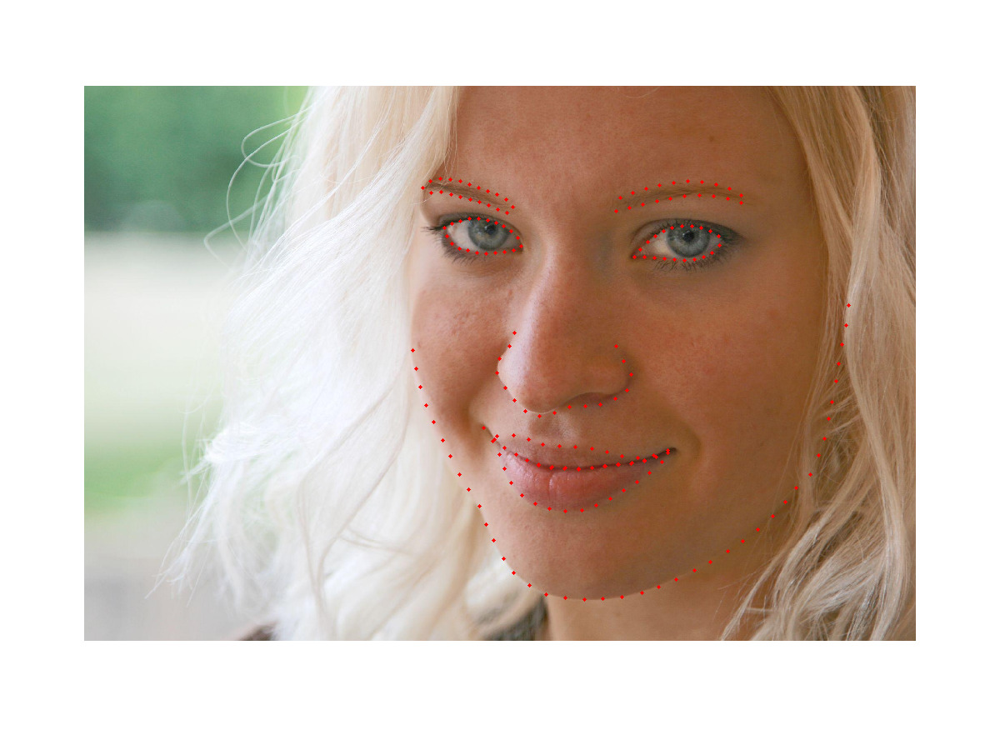

## SparNet

[Learning Spatial Attention for Face Super-Resolution](https://arxiv.org/abs/2012.01211)


## Code Source
```
link: https://github.com/chaofengc/Face-SPARNet
branch: master
commit: 5204283bcb584067a4b28e44231cf8f150cf07a3
```

## Model Arch

<div  align="center">

</div>

### pre-processing

SparNet网络的预处理操作可以按照如下步骤进行，即对图片进行resize至一定尺寸(128)，然后对其进行归一化、减均值除方差等操作：

```python
[
    torchvision.transforms.Resize(scale_size),
    torchvision.transforms.ToTensor(),
    torchvision.transforms.Normalize(mean=[0.5, 0.5, 0.5], std=[0.5, 0.5, 0.5],),
]
```

### post-processing

SparNet算法的后处理，在模型输出后只需反归一化至[0, 255]。

### backbone

作者通过设计一个新颖的Face Attention Unit（FAU），以构造用于人脸SR的空间注意力残留网络（SPARNet）。关键思想是使用2D空间注意力图来引导与关键脸部结构相关的特征。空间注意图不是硬选择，而是给特征图的每个空间位置分配介于0和1之间的分数。这允许通过梯度下降来学习空间注意力图的预测。网络的不同FAU中的空间注意图可以学习集中于不同的面部结构。


低分辨率图像首先经过双线性插值提升到与输出图像大小相当，然后进入SPARNet网络来产生高分图像。主要由三个模块构成：

- 降尺度模块
- 特征提取模块
- 升尺度模块

#### 空间注意力机制(Face Attention Unit)
它通过引入空间注意分支来扩展原始残差块。通过将FAU堆叠在一起，Face SR的重要特征不断增强。FAU中主要包括两个分支：注意力分支和特征分支。

<div  align="center">

</div>

- 注意力分支用于提取多尺度特征，使用的是HourGlass沙漏结构（该结构是一个对称的尺度升降拓扑全卷积结构，并含有中继监督，跳级结构辅助升采样。本质上是Residual模块的组合。在姿态估计场景中运用比较常见，用于提取关键点特征）

- 特征分支使用PReLU作为特征变换，下采样采用普通卷积，步长为2；上采样采用最近邻上采样层

#### SPARNetHD

将SPARNet扩展到SPARNetHD，以生成高分辨率和更逼真的SR图像（512×512）。SPARNetHD增加了SPARNet的通道数，并采用了类似于Pix2PixHD的多尺度鉴别器D。称这些鉴别器为D1、D2、和D3，它们分别用于从下采样到相同分辨率的GT中区分512×512、256×256和128×128三种不同尺度的SR图像。在不同尺度上使用多个鉴别器有助于提高SR图像的质量。


### common

- Face Attention Union (FAU)
- HourGlass Block
- Adopt Multiscale Discriminators


## Model Info

## 模型精度

| Model | Params(M)| Flops(G)| PSNR| SSIM | Shape |
|:-:|:-:|:-:|:-:|:-:|:-:|
| [SPARNet](https://github.com/chaofengc/Face-SPARNet) | - | - | 27.43 | 0.82 | 3x128x128 |
| [SPARNet-Light-Attn3D*](https://github.com/chaofengc/Face-SPARNet) | 5.242| 15.355 |27.39 | 0.82 | 3x128x128 |
| SPARNet-Light-Attn3D **vacc fp16**| - |- | 23.75 | 0.77 | 3x128x128 |
| SPARNet-Light-Attn3D **vacc int8 kl_divergence**| - |- |23.12 | 0.71 | 3x128x128 |
| [SPARNetHD-Attn3D*](https://github.com/chaofengc/Face-SPARNet) | - |- | 28.42| - | 3x512x512 |


> **Note**
> - 暂只支持SPARNet-Light-Attn3D，其它子模型build报错
> - SPARNetHD-Attn3D，GAN多尺度判别器，使用FID为评估指标，使用FFHQ数据集；其它子模型使用Helen数据集
> 

### 测评数据集说明

[FFHQ](https://github.com/NVlabs/ffhq-dataset)全称Flickr-Faces-High-Quality（Flickr-Faces-HQ），最初是作为生成式对抗网络(GAN)的基准创建的，也用于StyleGAN的训练数据集中，并由英伟达于2019年开源。FFHQ是一个高质量的人脸数据集，包含1024×1024分辨率的70000张PNG格式高清人脸图像，在年龄、种族和图像背景上丰富多样且差异明显，在人脸属性上也拥有非常多的变化，拥有不同的年龄、性别、种族、肤色、表情、脸型、发型、人脸姿态等，囊盖普通眼镜、太阳镜、帽子、发饰及围巾等多种人脸周边配件，因此该数据集也是可以用于开发一些人脸属性分类或者人脸语义分割模型的。FFHQ的图像从Flickr上爬取，且均有许可才会下载，并使用了dlib进行人脸对齐和裁剪，之后使用算法移除了一些非真实人脸如雕像、画作及照片等图像。

<div  align="center">

</div>

[Helen](http://www.ifp.illinois.edu/~vuongle2/helen/)数据集由2,330张400×40 像素的人脸图像组成。该数据集包括2000 张训练图像和330张测试图像，带有高度准确、详细和一致的人脸主要组成部分的标注。人脸图像是通过 Amazon Mechanical Turk 手动标注的，为眼睛、眉毛、鼻子、嘴唇和下颌线精确地手动标注轮廓线。
<div  align="center">

</div>

### 指标说明
- 峰值信噪比(Peak Signal-to-Noise Ratio, PSNR)，PSNR是信号的最大功率和信号噪声功率之比，测量重构图像的质量，通常以分贝（dB）来表示。PSNR指标越高，说明图像质量越好
- 结构相似性评价(Structure Similarity Index, SSIM)，SSIM是衡量两幅图像相似度的指标，其取值范围为[0,1]，SSIM的值越大，表示图像失真程度越小，说明图像质量越好
- Fréchet Inception Distance，FID是衡量两个多元正态分布的距离，反映了生成图片和真实图片的距离，数据越小越好

## VACC部署
- [official.md](./source_code/official.md)
