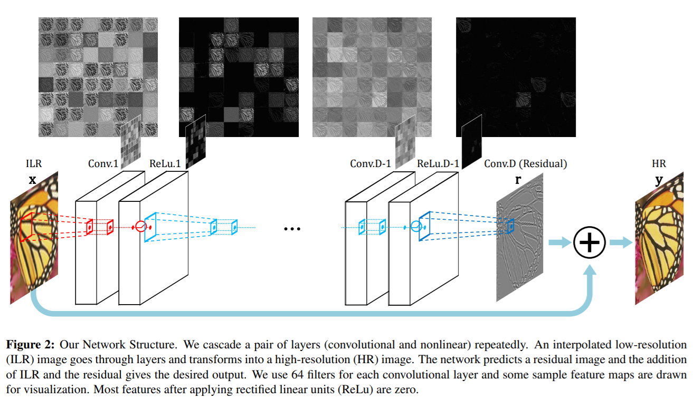

## VDSR

[Accurate Image Super-Resolution Using Very Deep Convolutional Networks](https://cv.snu.ac.kr/research/VDSR/VDSR_CVPR2016.pdf)


## Code Source
```
link: https://github.com/twtygqyy/pytorch-vdsr
branch: main
commit: 514b021044018baf909e79f48392783daa592888
```

## Model Arch

<div  align="center">

</div>

### pre-processing

VDSR网络的预处理操作可以按照如下步骤进行，即对图片进行resize至一定尺寸(256)，然后除以255：

```python
def get_image_data(image_file, input_shape = [1, 1, 256, 256]):
    """fix shape resize"""
    size = input_shape[2:]

    im_b_ycbcr = cv2.imread(image_file)
    im_b_ycbcr = cv2.cvtColor(im_b_ycbcr, cv2.COLOR_BGR2YCrCb)
    im_b_ycbcr = cv2.resize(im_b_ycbcr, size)
    
    im_b_y = im_b_ycbcr[:, :, 0].astype(float)
    im_input = im_b_y / 255.

    img_data = im_input[np.newaxis, np.newaxis, :, :] # NCHW

    return im_b_ycbcr, img_data

```
> Tips
> 
> 模型训练时输入为YCbCr颜色空间的Y通道，input shape (1, 1, 256, 256)


### post-processing

VDSR模型的后处理，对模型输出乘以255，像素恢复至[0, 255]，然后再添加回Cb、Cr颜色分量，得到最终高分辨率图像。

### backbone

VDSR模型使用了vgg19作为骨架网络。

作者使用20个网络层，除第一层和最后一层外，其余层具有相同的类型：64个大小为3x3x64的滤波器。输入层是经插值的低分辨率(ILR)图像经过层层转换成高分辨率(HR)图像。网络预测残差图像，ILR和残差相加得到期望的输出（LR和HR图像很大程度上是相似的，它们的低频信息相近，所不同的是LR缺少了很多高频信息。即：输出=低分辨输入+学习到的残差）。

- VDSR是在SRCNN的基础上，加深了网络的深度，最终的网络模型达到20层，可实现多尺度的超分辨率生成
- 在深层网络结构中多次级联小型滤波器，可以有效的利用大型图像区域上的上下文信息
- 通过仅学习残差和使用极高的学习率来改善深层网络收敛慢的问题
- 在训练阶段，SRCNN直接对高分辨率图像建模。一个高分辨率图像能够被分解为低频信息（对应低分辨率图像）和高频信息（残差图像或图像细节）。而输入和输出图像共享相同的低频信息。这说明SRCNN有两个作用：携带输入（我理解就是携带与输出图像共享的相同低频信息到终端层）到终端层和重建残差图像（这样最后将可以输出高分辨率图像了）。训练时间可能会花费在学习“携带输入到终端层”这一过程上，这样会导致重建残差图像过程的收敛率大大下降。相比SRCNN，VDSR网络直接对残差图像进行建模，所以有更快的收敛速度，甚至更好的精度。在训练的过程中，VDSR通过填充0，使得输出图像具有和输入图像相同的尺寸大小，而SRCNN模型的输出图像的尺寸小于输入图像。并且VDSR对所有层使用相同的学习率，而SRCNN为了实现稳定的收敛，对不同层使用不同的学习率


### common

- DNN
- Residual Block


## Model Info

## 模型精度

| Model | flops(G)| Params(M)| PSNR| Size |
|:-:|:-:|:-:|:-:|:-:|
| [VDSR](https://github.com/hamidreza-dastmalchi/WIPA-Face-Super-Resolution) |  96.805 |  0.664 | 31.464 | multi-size |
| [VDSR](https://github.com/hamidreza-dastmalchi/WIPA-Face-Super-Resolution) |  96.805 |  0.664 | 30.958 |  1x256x256 |
| VDSR **vacc fp16**| - | - | 30.956 |  1x256x256 |
| VDSR **vacc int8 kl_divergence**| - |  - | 30.219 | 1x256x256 |


### 测评数据集说明

[Set5](https://github.com/twtygqyy/pytorch-vdsr/tree/master/Set5)是基于非负邻域嵌入的低复杂度单图像超分辨率的数据集（共5张BMP图像），该训练集被用于单幅图像超分辨率重构，即根据低分辨率图像重构出高分辨率图像以获取更多的细节信息。

<div  align="center">

</div>

### 指标说明
- 峰值信噪比(Peak Signal-to-Noise Ratio, PSNR)，PSNR是信号的最大功率和信号噪声功率之比，测量重构图像的质量，通常以分贝（dB）来表示。PSNR指标越高，说明图像质量越好
- 结构相似性评价(Structure Similarity Index, SSIM)，SSIM是衡量两幅图像相似度的指标，其取值范围为[0,1]，SSIM的值越大，表示图像失真程度越小，说明图像质量越好
- Fréchet Inception Distance，FID是衡量两个多元正态分布的距离，反映了生成图片和真实图片的距离，数据越小越好

## VACC部署
- [pytorch.md](./source_code/pytorch.md)