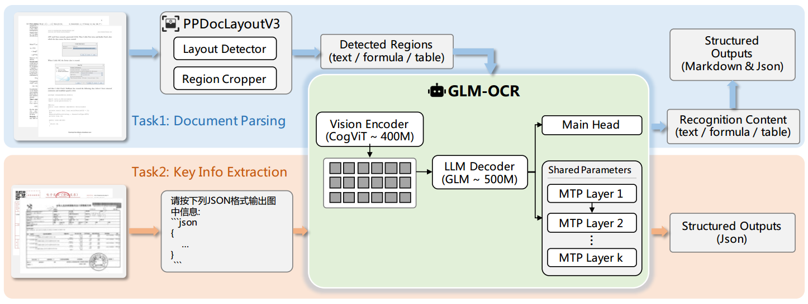
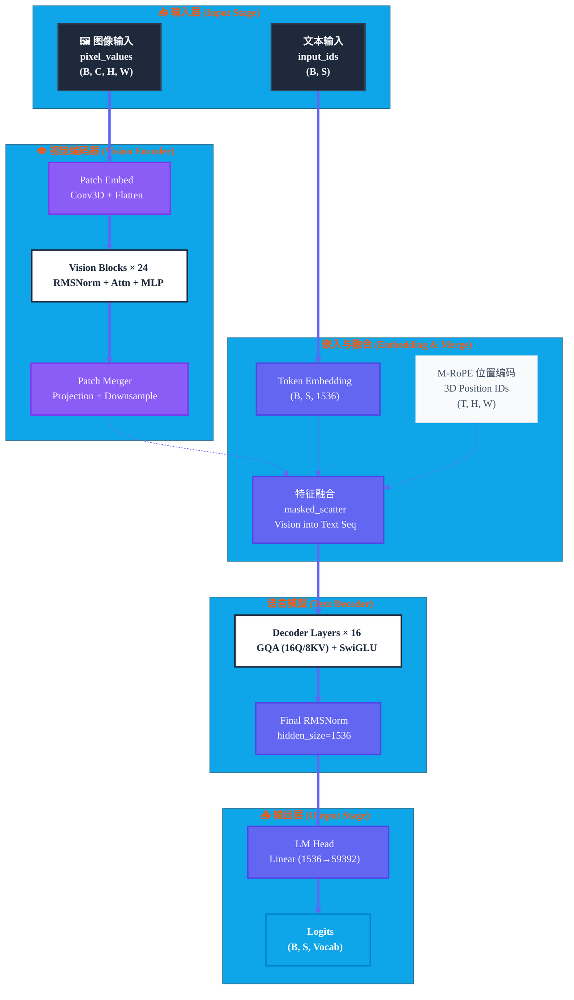
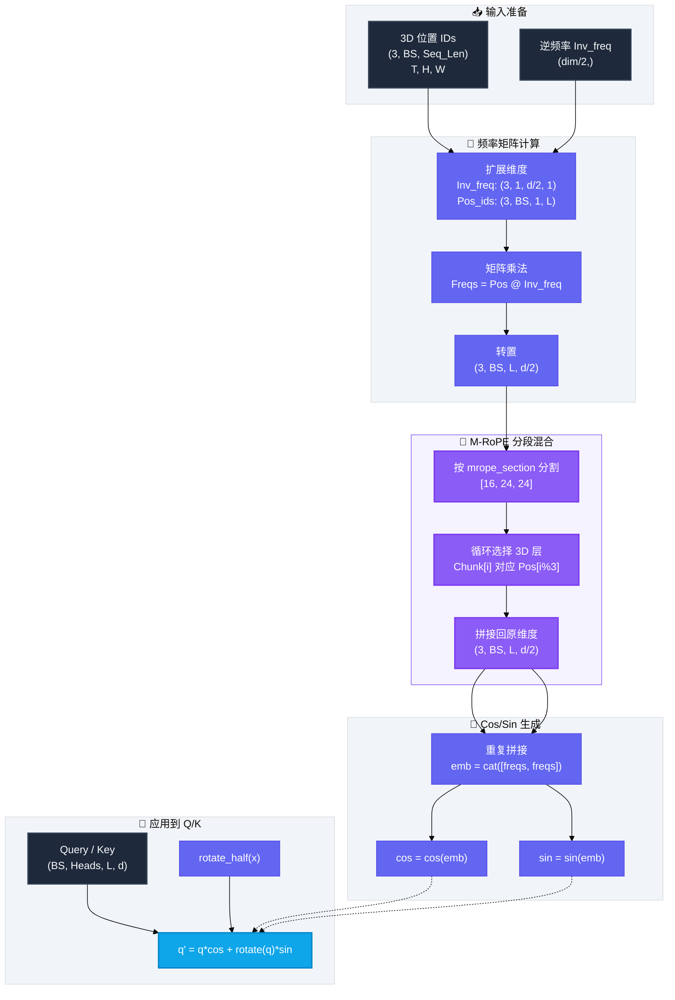
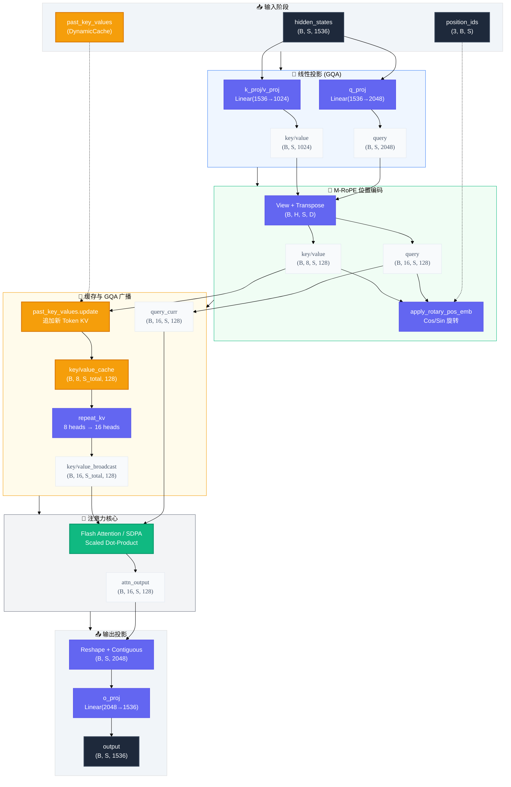
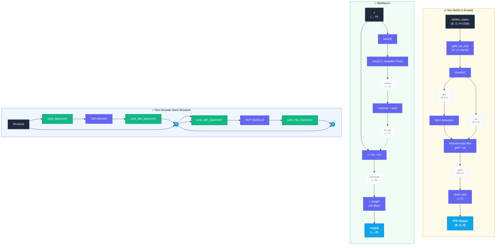
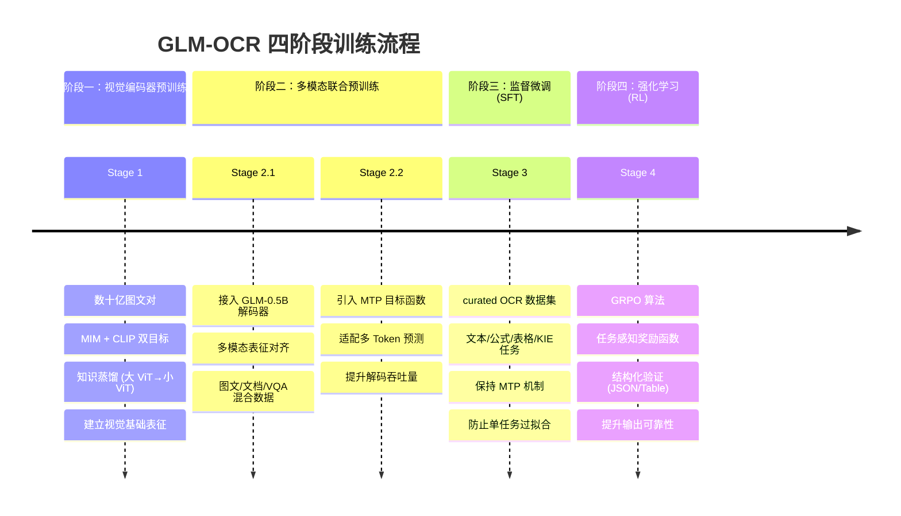

# GLM-OCR

- https://arxiv.org/abs/2603.10910
- https://github.com/zai-org/GLM-OCR
- https://modelscope.cn/models/ZhipuAI/GLM-OCR

## Model Arch
### 模型摘要

GLM-OCR 是由智谱 AI 开发的一款专为复杂文档理解设计的轻量级多模态 OCR 模型。作为 GLM-V 家族的最新成员，该模型在保持极低参数量（0.9B）的同时，实现了超越众多大参数通用视觉语言模型（VLM）的性能表现。本报告基于对模型架构配置、源代码实现、训练策略及部署实践的全面逆向工程分析，旨在揭示其如何在资源受限条件下实现SOTA的文档解析能力。GLM-OCR 并非单纯依赖参数堆叠，而是通过架构创新（如 M-RoPE、GQA）、训练策略优化（如 MTP、GRPO）以及系统级 pipeline 设计（两阶段布局分析），构建了一套高效、精准且易于部署的文档智能解决方案。

基于对模型元数据、架构设计及性能基准的综合评估，GLM-OCR 具备以下六大核心优势，这些优势构成了其在实际业务场景中落地的技术基石：

1. 卓越的 KV 缓存效率：GQA 机制实现 50% 显存压缩
- 技术支撑：模型文本解码器采用分组查询注意力（Grouped-Query Attention, GQA）机制。配置显示 num_attention_heads=16，而 num_key_value_heads=8，分组比为 2:1。相比标准多头注意力（MHA），KV 头数减半。
- 实际效益：在长上下文推理场景下，KV Cache 显存占用直接减半。根据显存计算模型，在 128K 上下文长度下，GQA 机制使得单卡推理成为可能，显著降低了服务部署的硬件门槛。

2. 多模态空间感知增强：3D M-RoPE 位置编码
- 技术支撑：引入多模态旋转位置编码（Multi-modal RoPE），将头维度分割为 [16, 24, 24] 三段，分别对应时间（T）、高度（H）、宽度（W）三维位置信息。
- 实际效益：解决了传统 1D RoPE 在处理图像网格和视频序列时的空间信息丢失问题，增强了模型对文档布局、表格结构及跨页内容的理解能力。

3. 推理吞吐量突破：多 Token 预测（MTP）机制
- 技术支撑：在训练和推理阶段引入 Multi-Token Prediction 损失函数，附加共享参数的辅助预测头，单步可同时预测多个未来 Token。
- 实际效益：打破了传统自回归模型单步生成一个 Token 的效率瓶颈，显著提升了长结构化内容（如表格 Markdown、JSON）的生成速度。

4. 系统级鲁棒性设计：两阶段 Pipeline 架构
- 技术支撑：系统级采用"布局分析（PP-DocLayout-V3）+ 区域识别”的两阶段流程，将复杂文档分解为简单子区域并行处理。
- 实际效益：有效规避了小模型直接处理全页复杂布局时易产生的幻觉问题，提升了复杂场景（如多栏排版、混合图文）的识别稳定性。

5. 结构化输出可靠性：GRPO 强化学习对齐
- 技术支撑：后训练阶段采用组相对策略优化（GRPO）算法，结合任务感知的奖励函数（如 TEDS 分数、JSON 解析验证）。
- 实际效益：提升了模型输出结构化数据（JSON、HTML 表格）的格式正确率，减少了后处理清洗成本，使其更易于对接业务系统。

6. 边缘部署友好性：极低的显存需求与量化支持
- 技术支撑：总参数量仅 0.9B（0.4B Vision + 0.5B LLM），支持 BF16/INT8/INT4 多种精度，兼容 vLLM、SGLang、Ollama 等主流推理框架。
- 实际效益：使得模型可在消费级显卡甚至边缘设备上运行，大幅降低了私有化部署成本。

在整体系统层面，GLM-OCR采用“版面分析→并行识别”的两阶段技术范式。

- 第一阶段，PP-DocLayoutV3负责执行精细的版面分析，包括对文档中的语义区域进行定位，并预测其正确的阅读顺序。这一阶段的关键在于其解耦设计，避免了大型VLM在处理长序列时可能出现的延迟、高内存消耗和“幻觉”问题，尤其在多栏或图文混排布局中表现更稳定。
- 第二阶段，GLM-OCR对第一阶段的不同类型crop图像进行VLM模型推理，识别图片内容

### 架构全景

GLM-OCR 的架构设计遵循"Vision Encoder + Connector + LLM Decoder"的经典多模态范式，但在具体实现上针对文档理解任务进行了深度定制。模型整体由智谱 AI 自研的 CogViT 视觉编码器、轻量级跨模态连接器以及 GLM 语言解码器组成。这种设计既保留了视觉模型强大的特征提取能力，又利用了语言模型优秀的序列生成与逻辑推理能力。

### 架构流程
- 视觉流：输入图像首先经过 GlmOcrVisionPatchEmbed 进行分块 Embedding，随后通过 24 层 GlmOcrVisionBlock 提取深层视觉特征。最后，GlmOcrVisionPatchMerger 将视觉 Token 压缩并投影到文本隐藏层维度（1536），以减少后续计算量。
- 融合流：视觉特征在GlmOcrVisionModel最后经GlmOcrVisionPatchMerger（MLP）处理后，通过 masked_scatter 操作直接填入文本嵌入序列中的特殊占位符位置。这种隐式融合策略减少了额外的注意力计算层，降低了推理延迟。
- 位置编码：get_rope_index 方法根据 image_grid_thw 计算 3D 位置索引（Temporal, Height, Width），文本部分使用标准 1D 索引，统一传入 M-RoPE 模块，确保多模态序列的空间一致性。
- 解码流：融合后的序列通过 16 层 Decoder 处理，每层采用 GQA 注意力机制和 SwiGLU MLP，最后经 LM Head 输出词汇表概率分布。

### 参数规模
- 视觉编码器：24 层 Vision Block，隐藏层维度 1024，参数量约 0.4B。采用 Conv3D 进行 Patch Embedding，支持视频/图像时空处理。
- 语言解码器：16 层 Text Decoder，隐藏层维度 1536，参数量约 0.5B。采用 GQA 机制，KV 头数为 Q 头数的一半，显著降低显存占用。
- 总参数量：0.9B。相比主流 7B 或 72B 模型，GLM-OCR 在参数量上减少了 1-2 个数量级，但通过专项训练和架构优化，在 OCR 特定任务上实现了性能反超。

## 关键组件
### 位置编码机制：M-RoPE
GLM-OCR 采用了先进的多模态旋转位置编码（Multi-modal RoPE, M-RoPE），这是其能够处理长文档和复杂布局的关键技术之一。传统的 1D RoPE 仅能编码序列顺序信息，而 M-RoPE 通过将头维度分割，分别编码时间、高度和宽度信息，实现了对多模态数据的空间感知。

### 注意力机制：GQA 与混合架构
注意力机制是 Transformer 模型的核心计算单元。GLM-OCR 在文本解码器和视觉编码器中采用了不同的注意力策略，以平衡性能与效率。

### 前馈网络与归一化
前馈网络（FFN）和归一化层是 Transformer 块中的另外两个关键组件，直接影响模型的表达能力和训练稳定性。

### 多模态架构
GLM-OCR 采用 Vision Encoder + Connector + LLM Decoder 的经典多模态架构，但在视觉编码器选型、特征压缩及融合方式上具有特定设计。
- 视觉编码器 (Vision Encoder): 类型为 CogViT，参数量 0.4B。架构细节包括使用 Conv3d 处理图像/视频块，支持时空 Patchify；24 层 GlmOcrVisionBlock；标准 MHA 注意力，支持变长序列 (cu_seqlens)；采用 Pre-Norm 结构。设计意图是 CogViT 在大规模图文数据上预训练，提供强大的视觉语义表示能力，且支持视频输入，为 OCR 任务提供丰富的上下文视觉特征。
- Connector (投影层): 类名为 GlmOcrVisionPatchMerger。功能包括投影（将视觉特征维度从 1024 映射到 1536）和下采样（减少视觉 Token 数量，降低后续 LLM 计算负载）。实现方式为线性投影 + 卷积下采样。
- 融合策略 (Fusion Strategy): 类型为 隐式融合 (Implicit Fusion) / Token 替换。实现机制是文本输入中预留特殊图像 Token 占位符，通过 masked_scatter 操作，将处理后的视觉特征直接填入文本嵌入序列的对应位置。无独立 Cross-Attention 层，视觉特征与文本特征在 LLM 内部通过自注意力 (Self-Attention) 直接交互。优势在于减少额外的注意力计算层，推理延迟更低，结构更简洁。

### 推理架构创新

- 两阶段 Pipeline (Two-Stage Pipeline):
    - 架构描述: 
        - Stage 1 使用 PP-DocLayout-V3 检测文档结构化区域 (段落、表格、公式等)；
        - Stage 2 将裁剪后的区域并行输入 GLM-OCR 模型进行识别。
    - 创新点: 降低幻觉（将复杂文档分解为简单子问题，避免小模型在处理全页复杂布局时产生幻觉）；并行加速（支持区域级并行推理，显著提升吞吐量）。

- 多 Token 预测 (Multi-Token Prediction, MTP):
    - 架构描述: 在训练和推理过程中，同时预测多个未来 Token。
    - 配置参数: multi_token_prediction: { enabled: true, num_nextn_predict_layers: 1 }。
    - 实现细节: 除主预测头外，附加 k 个共享参数的辅助头。训练时预测 10 个 Token，推理时平均每步生成 5.2 个 Token。
    - 收益: 解码吞吐量提升约 50%，同时保持显存开销低位。

## Train
GLM-OCR 的成功不仅源于架构设计，更得益于其精心设计的训练策略。模型采用了典型的 四阶段渐进式范式，从视觉编码器预训练到多模态对齐，再到任务-specific 的微调与强化学习。其核心在于引入了 Multi-Token Prediction (MTP) 机制以解决 OCR 任务的确定性生成效率问题，并通过 RL (GRPO) 优化结构化输出的可靠性。

## Dataset
- 数据来源：
    - Stage 1: 大规模图文对（数十亿级），包含 Grounding 和 Retrieval 数据。论文提到使用了内部更大参数 ViT 进行知识蒸馏。
    - Stage 3: curated OCR 数据集，覆盖文本识别、公式转录、表格结构恢复、关键信息提取（KIE）。
    - Stage 4: 基于 SFT 模型 Rollout 生成的数据，按难度分层（stratified by difficulty）。

- 数据规模：
    - Config: max_position_embeddings: 131072 (支持 128K 上下文)，表明模型具备处理长文档的潜力。
    - Paper: 提到 Stage 1 数据规模为 "tens of billions" (数百亿级别)。

- 质量过滤：
    - Stage 4: 采用自动评估与难度分层，构建分级优化集。论文 Table 2 显示了具体的奖励函数设计，隐含了对低质量输出的过滤。

# Deploy
## vLLM Deploy
- 参考：[vllm/README.md](./vllm/README.md)