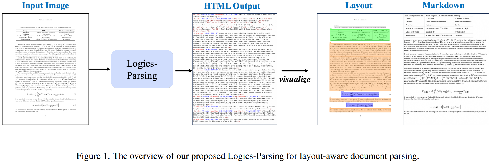
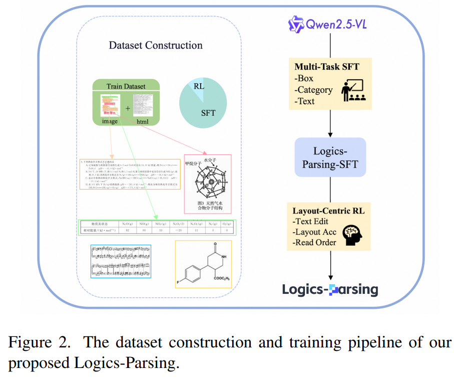

# Logics-Parsing

- [Logics-Parsing Technical Report](https://arxiv.org/abs/2509.19760)
- [github](https://github.com/alibaba/Logics-Parsing)

## Model Arch

### pre-processing

#### text encoder
- text encoder的预处理仅需要经过tokenizer转为相应token序列(预插入了image占位符)

#### image encoder
- 传统预处理包括：to_rgb -> to_array -> resize -> rescale -> normalize
- 以及后续特殊预处理（经VDSP自定义算子实现）：tile -> reshape -> transpose -> reshape
- 最后由image patches经patch_embed后进入VIT输出image_embeds

### post-processing
- llm decoder

### backbone
- `Logics-Parsing`是基于`Qwen2.5-VL-7B`在高质量页面级文档图像数据集上进行STF+RL学习优化而来，提升了文档解析能力

## output
- 模型输出形式是丰富的结构化HTML，保留其逻辑结构
- 每个内容块（例如段落、表格、图片、公式）都标记了其类别、边界框坐标和 OCR 文本
- 官方推理：[inference.py](https://github.com/alibaba/Logics-Parsing/blob/main/inference.py)

## train
Logics-Parsing，一个基于LVLM的端到端框架，结合强化学习来构建一个鲁棒且具有布局感知能力的文档解析模型。
- 采用两阶段SFT-then-RL训练策略来确保模型的有效性
   - 首先，通过将包括普通文本、数学公式、表格、化学公式和手写汉字在内的多种数据类型纳入训练，使用超过30万张高质量页面级文档图像对**Qwen2.5-VL-7B**进行微调，为文档解析打下坚实基础
   - 其次，通过布局感知的多组件奖励机制（LC-RL）以及一种新颖的硬样本挖掘策略，增强了模型正确识别页面布局结构的能力，然后在识别的布局下强制执行自然阅读顺序。这一阶段显著提升了在多列报纸和海报等复杂布局上的性能、
   - 此外，为了严格评估提出的Logics-Parsing模型，构建了一个包含1,078页级PDF图像的综合基准，涵盖九大主要类别（例如，学术论文、技术报告）和二十多个子类别，称为LogicsParsingBench。与 OminiDocBench相比，这是一个涵盖多种文档类型且具有丰富标注信息的顶级基准。

- SFT数据集
   - 一方面，我们将多个成熟的公共数据集系统地整合并规范化到我们的统一HTML标注模式中。
      - 具体来说，对于页面级解析，我们从 olmOCRmix-0225中精选样本子集，系统地将它们的原始标注转换为我们的标准 HTML格式。
      - 对于表格识别这一关键子任务，我们从包括 FinTabNet、TNCR 和 PubTabNet在内的领先基准中收集数据。这为模型提供了广泛接触各种表格结构的经验。
      - 对于化学结构识别，我们直接采用 ChEBI-20-MM 数据集，这是分子 OCR 的基准。这为模型提供了针对训练，以解释化学图的具体语法和布局规则。
   - 另一方面，我们构建了一个大规模的内部数据集，该数据集通过一个包含自动提取和基于专家模型的精炼的两阶段标注流程进行标注。
      - 首先，我们使用Mathpix对大量公共文档进行预标注，通过提取内容、边界框和语义类型。
      - 随后，为了解决 Mathpix 可能难以解析的复杂布局问题，我们使用 Gemini 2.5 Pro进行验证和修正步骤。这一步骤专注于修正嵌套公式和多层表格等复杂场景中的错误，从而确保标注的高准确性和可靠性。
      - 然而，仍然存在大量高度复杂的文档和边缘情况，所提出的自动化标注流程难以处理。对于这些样本，我们引入人工干预，约10,000 页样本由专家人工标注者进行严格审查和修正。
      - 除此之外，我们还为这些难以通过自动化工具实现的样本提供手动标注的文档阅读顺序。这种人工参与的方法严格保证了标注的准确性，并扩展了标注覆盖范围，生成了一个黄金标准子集，显著增强了模型对真实世界布局中内容和结构组织的理解。
- RL数据集。
   - 强化学习通常受益于一个规模虽小但高质量的数据库。为此，我们提出了一种新的硬样本挖掘策略，从上述SFT语料库中识别一个专注的子集。
      - 我们对整个训练集运行SFT模型，并选择预测结果与真实标签之间的归一化编辑距离落在特定范围[0.5, 0.8]内的样本。这个范围有效地捕捉了SFT模型可能部分理解但未能完美解析的实例，为后续基于RL的精炼形成了理想的“学习区”。
      - 通过这种方式，我们额外收集了约4,000个样本。
   - 上述数据挖掘策略共同为LC-RL阶段产生了约8,000个高质量、高难度的训练样本，其有效性高度依赖于一个专门针对SFT模型弱点的训练集。

## Build_In Deploy
- [deploy.md](./source_code/deploy.md)