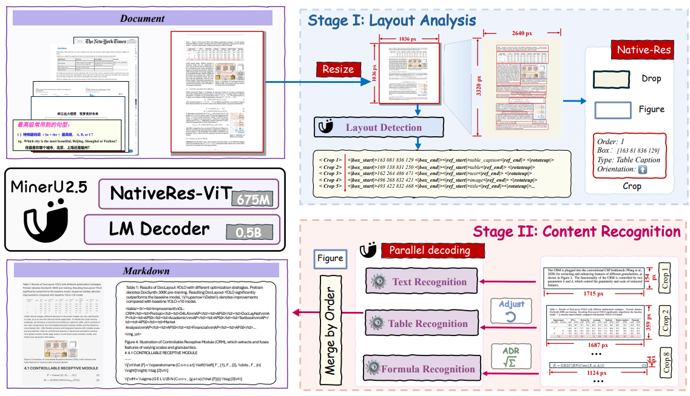
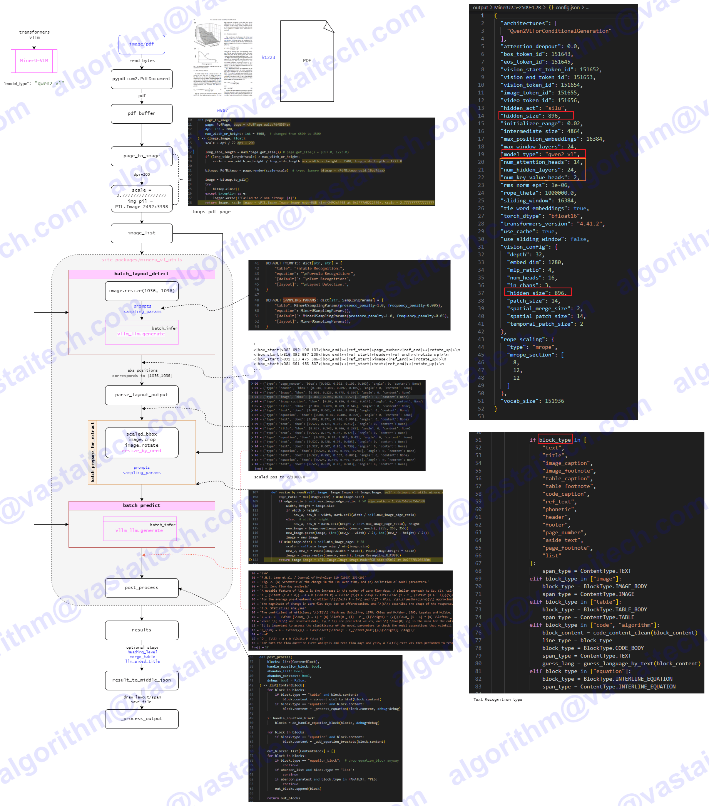
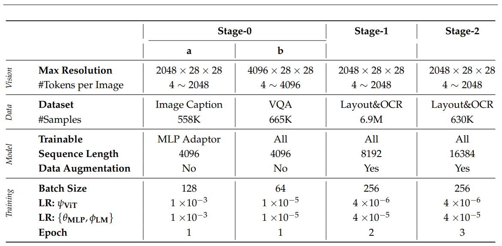
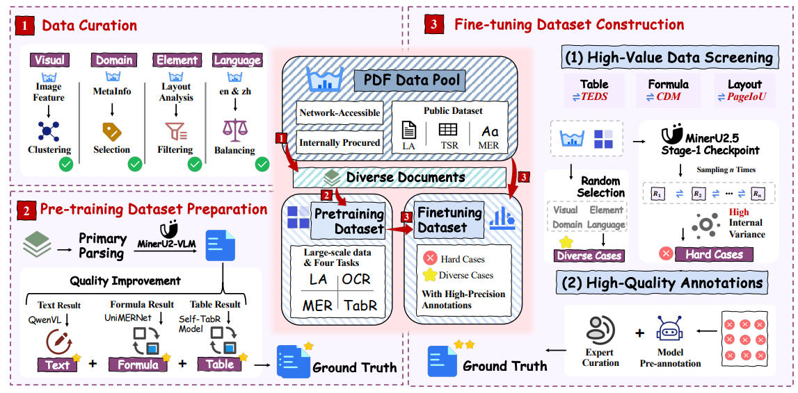

# MinerU2.5

- https://arxiv.org/abs/2509.22186
- https://github.com/opendatalab/MinerU
- https://huggingface.co/opendatalab/MinerU2.5-2509-1.2B

## Model Arch

MinerU2.5是一个专业的文本解析VLM模型（结构同Qwen2-VL）：

- 语言解码器：LLM（Qwen2-Instruct-0.5B），M-RoPE 替换了原始的 1D-RoPE
- 视觉编码器：使用Qwen2-VL视觉编码器（NaViT-675M）进行初始化
- patch merge：为了在效率和性能之间取得平衡，该架构在相邻的 2 × 2 视觉 token 上使用 pixel-unshuffe对聚合后的视觉 token 进行预处理，然后再将其输入大型语言模型。

MinerU2.5提出了一种两阶段解耦式解析策略（Two-Stage Decoupled Parsing）
- Stage I：全局布局分析。模型将整页文档缩放到 1036×1036 像素的缩略图上，快速检测出表格、图像、公式、标题等结构，捕捉全局逻辑与排版关系。
- Stage II：局部内容识别。再依据这些布局结果，从原始高分辨率图像中裁剪关键区域，在不降分辨率的前提下进行文字、表格、公式等细粒度识别。这套“先扫版面、后读细节”的机制，不仅让 MinerU2.5 将显存占用降低一个数量级，还有效减少了视觉冗余、避免幻觉错误，让模型能真正读懂复杂排版。

模型统一支持四大核心任务——布局分析、文字识别、表格理解与公式解析。通过不同的 prompt 激活不同任务，实现任务间特征共享，让模型在复杂场景下依然保持稳定表现。

## Train
MinerU2.5整体分三阶段训练
- 阶段0
    - 模态对齐图文对齐：仅训练两层 MLP，冻结其他模块。Image Caption数据集训练。
    - 指令微调：解冻所有模块，使用VQA数据训练。
- 阶段1
    - 文档解析预训练，使VLM具备两种能力：版面分析和内容识别，该阶段是解冻所有模块训练。
    - 训练数据集
        - 版式分析：大规模模型标注数据与公开数据集的混合数据，以确保足够的规模和文档多样性。在版面分析方面，为兼顾训练效率，将完整文档图像缩放到固定分辨率（1036 × 1036），并相应调整坐标，使用提示 “Layout Detection:”
        - 文本：输出为markdown格式，提示词：“Text Recognition:”
        - 表格：输出为以 OTSL 格式（采用 OTSL 是因为它相较于HTML 作为视觉语言模型的目标具有显著优势。其极简设计具有与表格视觉二维矩阵直接的结构对应关系，将结构 token 数量从超过 28 个减少到仅 5 个，并将平均序列长度缩短约50%。这使得它成为模型生成时更高效的输出目标。最后一阶段是将 OTSL 输出简单转换为标准HTML。），提示词：“Table Recognition:”
        - 公式：输出为latex公式，提示词：“Formula Recognition:”
    - 训练设置： 初始化阶段0的权重，训练了 2 轮次。每轮次总共包含 690 万个样本，其中包括 230 万用于版面分析，240 万用于文本块，110 万用于公式块，以及 110 万用于表格块。

- 阶段2
    - 文档解析微调目标是在保持 VLM 已具备的检测与解析能力的基础上，进一步提升在复杂场景下的解析性能。
        - 训练数据：通过数据工程从预训练数据集中抽取了高质量且多样化的样本，并将其纳入第二阶段训练，确保对不同文档元素类型的广泛覆盖。难样本人工标注。
        - 训练配置： 使用阶段1模型初始化，训练3轮。布局分析用 43 万样本，文本块用 300 万样本，公式块用 147 万样本，表格块用 140 万样本。

## Dataset
- 数据增强策略增强
    - 模型在开放世界情景下处理多样化文档的鲁棒性，在第一阶段和第二阶段均设计了多种针对性的数据增强策略。这些增强方法模拟了常见的文档干扰类型。

- 数据引擎版面多样性
    - 采用页面级图像聚类从广泛的视觉版面和风格中选择样本。
    - 文档类型多样性：利用文档元数据（例如，学科、标签），进行分层采样，以确保学术论文、教科书、报告和演示文稿等类型的均衡表示。
    - 元素平衡：初步的检测模型有助于确保所筛选数据集中关键元素（如标题、段落、表格、公式和图表）的类别分布均衡。
    - 语言平衡：对数据进行筛选，以保持中文和英文文档的可比数量。

## Deploy
- VACC基于vLLM部署方案，已提交至MinerU官方仓库
    - https://github.com/opendatalab/MinerU/blob/dev/docs/zh/usage/acceleration_cards/VastAI.md
    - https://opendatalab.github.io/MinerU/zh/usage/acceleration_cards/VastAI/
