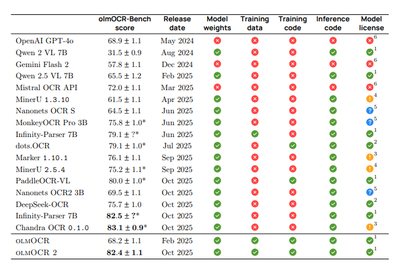

# olmOCR2

- [olmOCR: Unlocking Trillions of Tokens in PDFs with Vision Language Models](https://olmocr.allenai.org/papers/olmocr.pdf)
- https://huggingface.co/allenai/olmOCR-2-7B-1025

## Model Arch

### pre-processing

#### text encoder
- text encoder的预处理仅需要经过tokenizer转为相应token序列(预插入了image占位符)

#### image encoder
- 传统预处理包括：to_rgb -> to_array -> resize -> rescale -> normalize
- 以及后续特殊预处理（经VDSP自定义算子实现）：tile -> reshape -> transpose -> reshape
- 最后由image patches经patch_embed后进入VIT输出image_embeds

### post-processing
- llm decoder

### backbone
- `olmOCR`是基于`Qwen2.5-VL-7B-Instruct`在数据集`olmOCR-mix-1025`上fintune而来
- `Qwen2.5_VL`由`VIT Trained from scratch`和`Qwen2.5`构成，通过`MLP`将视觉模型和语言模型进行对齐

## train
- `olmOCR2`在`Qwen2.5-VL-7B-Instruct`基础上，进行finetune微调
- finetue数据：[allenai/olmOCR-mix-1025](https://huggingface.co/datasets/allenai/olmOCR-mix-1025)
- 该模型通过GRPO RL训练进一步提升了在数学公式、表格和其他复杂 OCR 场景下的性能。它是一个高效的文档识别工具，能够将大量文档转换为纯文本
- `olmOCR2`的训练分为监督微调（SFT） 和强化学习（RLVR） 两阶段，结合模型融合（Souping）进一步提升性能

### 阶段1：sft

让模型掌握基础的文档解析能力（文本提取、公式识别、表格结构感知），为后续RL优化打基础。选择`Qwen2.5-VL-7B-Instruct`，使用改进后的监督数据集 olmOCR-mix-1025（267962页，来自10万+PDF），相比旧版（olmOCR-mix-0225）的改进：

- 用GPT-4.1替代GPT-4o处理数据，减少幻觉；
- 统一公式格式（块级公式用\[，行内公式用\(）；
- 表格用HTML格式存储（而非纯文本）；
- 为图像添加基础alt文本；

### 阶段2：强化学习（RLVR）
核心是用合成数据的单元测试作为奖励信号，通过GRPO算法优化模型，解决SFT阶段未覆盖的复杂场景（如多列、公式、表格）。

- 训练数据：olmOCR2-synthmix-1025的合成文档（带单元测试）；
- 采样策略：每个文档生成28个不同的模型输出（completions），确保覆盖足够多的候选结果；

### 阶段3：模型融合（Souping）
为避免单一模型的随机性，文章采用模型权重平均（Souping）策略：
- 训练6个不同随机种子的RL模型（3个用token级重要性采样，3个用序列级重要性采样）；
- 对6个模型的权重进行平均，得到最终的olmOCR-2-7B-1025模型；

## Build_In Deploy
- [deploy.md](./source_code/deploy.md)