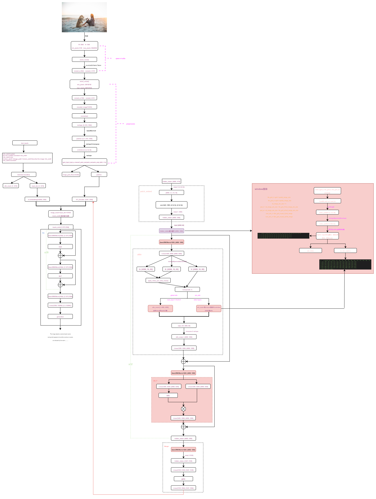
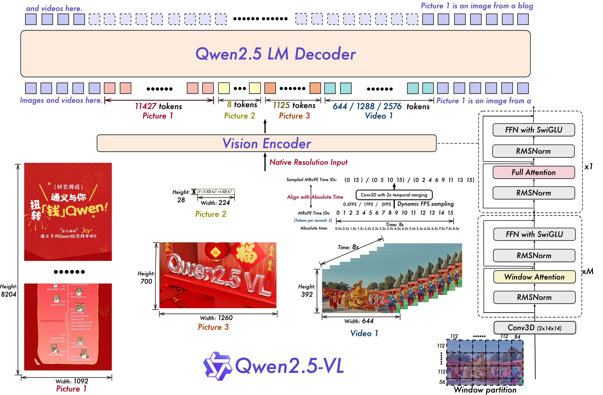

# Qwen2_5_VL

- [Qwen2-VL: Enhancing Vision-Language Model's Perception of the World at Any Resolution](https://arxiv.org/pdf/2409.12191)
- https://hf-mirror.com/Qwen/Qwen2.5-VL-7B-Instruct

## Model Arch

### pre-processing

#### text encoder
- text encoder的预处理仅需要经过tokenizer转为相应token序列(预插入了image占位符)

#### image encoder
- 传统预处理包括：to_rgb -> to_array -> resize -> rescale -> normalize
- 以及后续特殊预处理（经VDSP自定义算子实现）：tile -> reshape -> transpose -> reshape
- 最后由image patches经patch_embed后进入VIT输出image_embeds

### post-processing
- llm decoder

### backbone
- `Qwen2.5_VL`由`VIT Trained from scratch`和`Qwen2.5`构成，通过`MLP`将视觉模型和语言模型进行对齐
- 较Qwen2_VL，Visual部分，将LayerNorm改为RMSNorm方式，与和LLM部分对齐

### common

- 时间和图像尺寸的感知

    在空间维度上，Qwen2.5-VL 不仅能够动态地将不同尺寸的图像转换为不同长度的 token，还直接使用图像的实际尺寸来表示检测框和点等坐标，而不进行传统的坐标归一化。这使得模型能够直接学习图像的尺度。在时间维度上，引入了动态 FPS (每秒帧数)训练和绝对时间编码，将 mRoPE id 直接与时间流速对齐。这使得模型能够通过时间维度 id 的间隔来学习时间的节奏。
    在Qwen2-VL中，时间方向每帧之间固定间隔 1 ，没有考虑到视频的采样率，例如四秒的视频每秒采样两帧和一秒的视频每秒采样八帧，这样总的帧数都是8，在原来这种编码方式中时间维度的编码都是1->8没有任何区别。Qwen-2.5VL在时间维度上引入了动态 FPS (每秒帧数)训练和绝对时间编码，将 mRoPE id 直接与时间流速对齐。这使得模型能够通过时间维度 id 的间隔来学习时间的节奏。

- 更简洁高效的视觉编码器

    视觉编码器在多模态大模型中扮演着至关重要的角色。我们从头开始训练了一个原生动态分辨率的 ViT，包括 CLIP、视觉-语言模型对齐和端到端训练等阶段。为了解决多模态大模型在训练和测试阶段 ViT 负载不均衡的问题，我们引入了窗口注意力机制，有效减少了 ViT 端的计算负担。在我们的 ViT 设置中，只有四层是全注意力层，其余层使用窗口注意力。最大窗口大小为 8x8，小于 8x8 的区域不需要填充，而是保持原始尺度，确保模型保持原生分辨率。此外，为了简化整体网络结构，我们使 ViT 架构与 LLMs 更加一致，采用了 RMSNorm 和 SwiGLU 结构。

### train
- 在Qwen2-VL基础上，Qwen2.5-VL除了pretrain、SFT，还用了DPO
‒ 预训练数据：1.2万亿token ---> 4.1万亿token
‒ ViT没有设置初始权重，在私有数据从头开始训练，训练过程包含包括 CLIP 预训练、视觉-语言对齐和端到端微调
‒ video：20分钟--->1小时理解
‒ 全面的文字识别和理解，增强文字bounding boxes能力， QwenVL HTML 格式文档解析（layerout）
‒ 增强结构化输出能力

## Build_In Deploy
- [deploy.md](./source_code/deploy.md)
- [deploy_gptq_int4.md](./source_code/deploy_gptq_int4.md)