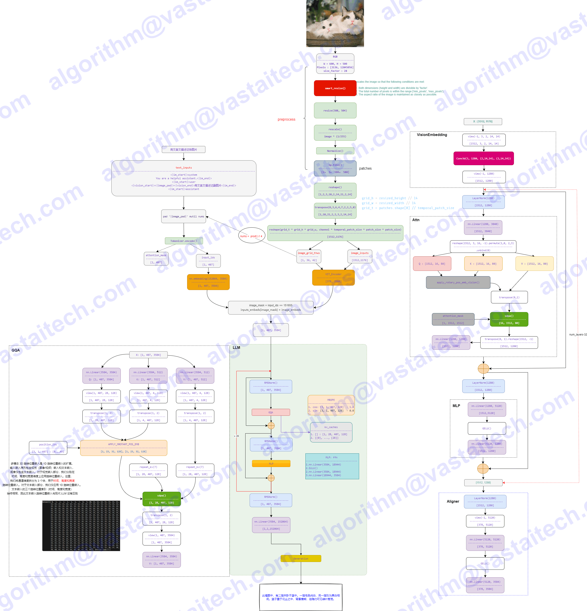
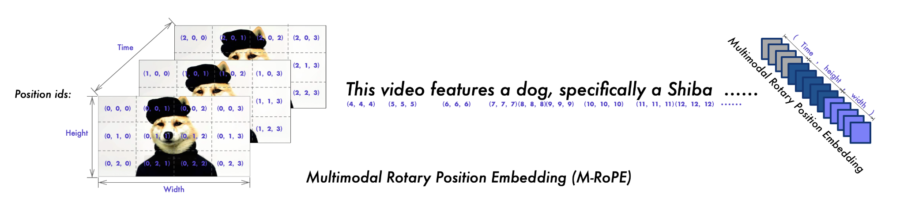

# Qwen2_VL

- [Qwen2-VL: Enhancing Vision-Language Model's Perception of the World at Any Resolution](https://arxiv.org/pdf/2409.12191)
- https://hf-mirror.com/Qwen/Qwen2-VL-7B-Instruct

## Model Arch



### pre-processing

#### text encoder
- text encoder的预处理仅需要经过tokenizer转为相应token序列(预插入了image占位符)

#### image encoder
- 传统预处理包括：to_rgb -> to_array -> resize -> rescale -> normalize
- 以及后续特殊预处理（经VDSP自定义算子实现）：tile -> reshape -> transpose -> reshape
- 最后由image patches经patch_embed后进入VIT输出image_embeds

### post-processing
- llm decoder

### backbone
- `Qwen2_VL_7B`由`ViT-600M`和`Qwen2-7B`构成，通过`MLP`将视觉模型和语言模型进行对齐


### common
- 朴素动态分辨率：通过如下方式获取最佳缩放尺寸

    ```python
    def smart_resize(
        height: int, width: int, factor: int = 28, min_pixels: int = 56 * 56, max_pixels: int = 14 * 14 * 4 * 1280
    ):
        """Rescales the image so that the following conditions are met:

        1. Both dimensions (height and width) are divisible by 'factor'.

        2. The total number of pixels is within the range ['min_pixels', 'max_pixels'].

        3. The aspect ratio of the image is maintained as closely as possible.

        """
        if height < factor or width < factor:
            raise ValueError(f"height:{height} or width:{width} must be larger than factor:{factor}")
        elif max(height, width) / min(height, width) > 200:
            raise ValueError(
                f"absolute aspect ratio must be smaller than 200, got {max(height, width) / min(height, width)}"
            )
        h_bar = round(height / factor) * factor
        w_bar = round(width / factor) * factor
        if h_bar * w_bar > max_pixels:
            beta = math.sqrt((height * width) / max_pixels)
            h_bar = math.floor(height / beta / factor) * factor
            w_bar = math.floor(width / beta / factor) * factor
        elif h_bar * w_bar < min_pixels:
            beta = math.sqrt(min_pixels / (height * width))
            h_bar = math.ceil(height * beta / factor) * factor
            w_bar = math.ceil(width * beta / factor) * factor
        return h_bar, w_bar
    ```

- 多模态旋转位置嵌入 (M-RoPE)
为了更有效地处理多模态输入（文本、图像和视频）中的位置信息，M-RoPE 基本原理是将传统的 RoPE 分解为时间、宽度和高度，同时捕捉不同模态的时空信息。
文本输入：三部分为相同的数字，与普通 RoPE 相同
图像输入：固定t，h和w根据 token 位置定义
视频输入：视频被视为帧序列，每一帧的t递增，h和w与图像输入相同
当模型输入包含多种模态时，每种模态的位置编号从前一个模态的最大位置 ID 加一开始。



- 统一的图像和视频理解
Qwen2-VL 采用了一种混合训练机制，结合了图像和视频数据，确保其在图像理解和视频理解方面熟练掌握。 为了尽可能完整地保留视频信息，我们以每秒2帧的速率对每个视频进行采样。 此外，集成了深度为2的3D卷积来处理视频输入，使模型能够处理 3D 管道而不是 2D 补丁，从而使其能够处理更多视频帧而不增加序列长度。


### train
- 延续Qwen-VL，Qwen2-VL也采用了3-stage的训练过程：ViT训练 -> 全参数训练 -> LLM指令微调
- 多样性的数据包括：图像文本对、OCR 数据、图像文本的文章、VQA 数据、视频对话以及图像知识。来源于网站、开源数据集以及人造数据
- Qwen2-VL的LLM组件使用来自Qwen2的参数进行初始化；而 Qwen2-VL的视觉编码器使用来自DFN的ViT进行初始化，原始ViT中的固定位置嵌入被替换为RoPE-2D

## TVM_VACC部署

### step.1 模型准备

1. 下载模型权重

    | source  | local weights | tips |
    | :---: | :--: | :--: |
    | [Qwen/Qwen2-VL-2B-Instruct](https://hf-mirror.com/Qwen/Qwen2-VL-2B-Instruct)  | [modeling_qwen2_vl_vacc.py](./build_in/source_code/modeling_qwen2_vl_vacc.py) |
    | [Qwen/Qwen2-VL-7B-Instruct](https://hf-mirror.com/Qwen/Qwen2-VL-7B-Instruct)  | [modeling_qwen2_vl_vacc.py](./build_in/source_code/modeling_qwen2_vl_vacc.py) |

2. 网络修改
    - 为了方便部署`Qwen2-VL`系列模型，在官方源码的基础上，需要对`modeling_qwen2_vl.py`进行适当修改
    - 修改后：[modeling_qwen2_vl_vacc.py](./build_in/source_code/modeling_qwen2_vl_vacc.py)

3. onnx导出
    - visual部分，模型不切分，vamc加载huggingface模型转换自动至onnx
        - 如需调试，可导出onnx，参考：[export_onnx.py](./build_in/source_code/export_onnx.py)，
    - llm部分，模型需切分，vamc加载huggingface模型转换自动至onnx


### step.2 获取数据集

- vlm模型基于`evalscope`工具进行精度测评，数据集参考：[supported_dataset](https://evalscope.readthedocs.io/zh-cn/latest/get_started/supported_dataset.html#vlmevalkit)

### step.3 模型转换
1. 根据具体模型修改配置文件：
    - [qwen2_vl_llm.yaml](./build_in/build/qwen2_vl_llm.yaml)
    - [qwen2_vl_visual.yaml](./build_in/build/qwen2_vl_visual.yaml)

    ```bash
    vamc compile ./build_in/build/qwen2_vl_llm.yaml
    vamc compile ./build_in/build/qwen2_vl_visual.yaml
    ```

### step.4 模型推理
1. 获取大模型部署推理工具：[vastgenx](../../docs/vastgenx/README.md)
2. 精度评估参考：[vastgenx-精度测试](../../docs/vastgenx/README.md#-精度测试)
3. 性能评估参考：[vastgenx-性能测试](../../docs/vastgenx/README.md#-性能测试)

### Tips
- VACC部署中，拆分为两个模型进行推理，Visual部分不切分，LLM部分可TP切分
- Visual部分
    - 计算最佳图像尺寸Smart_Resize操作在CPU上实现，其它缩放、均值方差、归一化在VDSP上实现
    - visual部分的旋转位置编码在VDSP自定义算子上实现，需要把sin/cos置前，通过参数传入
    - 模型输出`image_embeds`数据量太大([1024,3584])，由于硬件限制，compile会切成6份输出，前5份[1024,640]，最后一份[1024,384]
    - 模型编译耗时7小时，推理时加载需6分钟
    - 关于visual部分尺寸限制，以720P(720x1280)为例
        - 首先，宽高将缩放至最接近28倍数值上（728x1288）；
        - 在VIT计算时将转换为(728//14) x (1288//14) = 4784 patch
        - 在编译visual部分三件套时，设置稍大于4784的值（且需为16的倍数），如5120
        - 在visual部分转换为token时，有相邻patch-merge操作(2x2)，最终visual-token=5120//4=1280
        - 因此，在llm部分的prefill阶段seq-length需大于1280，如设置为2048
- LLM部分
    - 3D旋转位置编码MROPE的`get_rope_index`在CPU上实现
- Visual部分基于VSX推理，bs=1，每次只能处理一张图片；通过消息队列向基于vast_llm推理的LLM部分传递，最后输出文本回答
- 仅验证了Qwen2-VL-7B-Instruct，transformers版本需要较新(>=4.45)
- 精度测试可测试多个数据集：
    - MMBench_DEV_EN
    - MMBench_DEV_CN
    - MMMU_DEV_VAL
    - OCRBench
- Qwen2_VL依赖的transformers版本较新
    ```
    transformers==4.45.0
    huggingface-hub==0.23.2
    ```

- input_ids转为embedding部分，需要使用从预训练模型获取的embedding权重：[embed_tokens.bin](http://192.168.20.139:8888/vastml/modelzoo/vlm/Qwen/debug_file/embed_tokens.bin)
    ```python
    import torch
    import numpy as np
    from transformers import AutoTokenizer, AutoModelForCausalLM, AutoModel

    model_name = "./vlm/Qwen/Qwen2-VL-7B-Instruct"

    model = AutoModel.from_pretrained(
        model_name,
        trust_remote_code=True,
        torch_dtype=torch.float16,
        device_map="auto"
    )
    embed_tokens = model.embed_tokens.weight.data
    embed_tokens.cpu().numpy().tofile("embed_tokens.bin")
    print(f"embed_tokens shape: {embed_tokens.shape}")
    ```