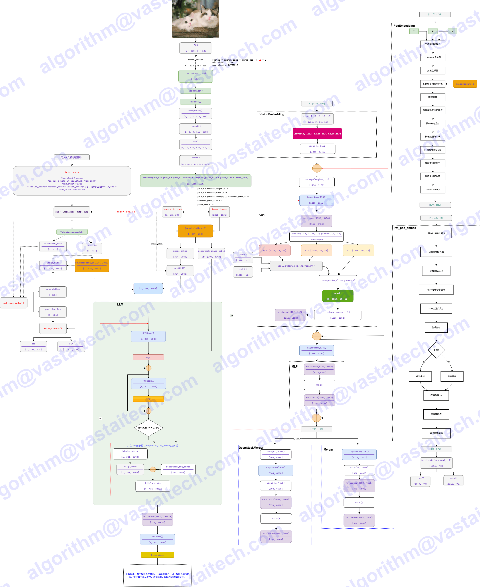

# Qwen3_VL

- blog: https://qwen.ai/blog?id=99f0335c4ad9ff6153e517418d48535ab6d8afef&from=research.latest-advancements-list
- report: https://arxiv.org/pdf/2511.21631
- code: https://github.com/QwenLM/Qwen3-VL
- huggingface: https://huggingface.co/collections/Qwen/qwen3-vl-68d2a7c1b8a8afce4ebd2dbe
- modelscope: https://modelscope.cn/collections/Qwen3-VL-5c7a94c8cb144b


## Model Arch



## 核心亮点

Qwen3-VL 的目标，是让模型不仅能“看到”图像或视频，更能**真正看懂世界、理解事件、做出行动**。为此，在多个关键能力维度上做了系统性升级，力求让视觉大模型从“感知”走向“认知”，从“识别”迈向“推理与执行”。

- **视觉智能体（Visual Agent）**：Qwen3-VL 能操作电脑和手机界面、识别 GUI 元素、理解按钮功能、调用工具、执行任务，在 OS World 等 benchmark 上达到世界顶尖水平，能通过调用工具有效提升在细粒度感知任务的表现。
- **纯文本能力媲美顶级语言模型**：Qwen3-VL 在预训练早期即混合文本与视觉模态协同训练，文本能力持续强化，最终在纯文本任务上表现与 Qwen3-235B-A22B-2507 纯文本旗舰模型不相上下 —— 是真正“文本根基扎实、多模态全能”的新一代视觉语言模型。
- **视觉 Coding 能力大幅提升**：实现图像生成代码以及视频生成代码，例如看到设计图，代码生成 Draw.io/HTML/CSS/JS 代码，真正实现“所见即所得”的视觉编程。
- **空间感知能力大幅提升**：2D grounding 从绝对坐标变为相对坐标，支持判断物体方位、视角变化、遮挡关系，能实现 3D grounding，为复杂场景下的空间推理和具身场景打下基础。
- **长上下文支持和长视频理解**：全系列模型原生支持 256K token 的上下文长度，并可扩展至 100 万 token。这意味着，无论是几百页的技术文档、整本教材，还是长达两小时的视频，都能完整输入、全程记忆、精准检索，支持视频精确定位到秒级别时刻。
- **多模态思考能力显著增强**：Thinking 模型重点优化了 STEM 与数学推理能力。面对专业学科问题，模型能捕捉细节、抽丝剥茧、分析因果、给出有逻辑、有依据的答案，在 MathVision、MMMU、MathVista 等权威评测中达到领先水平。
- **视觉感知与识别能力全面升级**：通过优化预训练数据的质量和广度，模型现在能识别更丰富的对象类别——从名人、动漫角色、商品、地标，到动植物等，覆盖日常生活与专业领域的“万物识别”需求。
- **OCR 支持更多语言及复杂场景**：支持的中英外的语言从 **10** 种扩展到 **32** 种，覆盖更多国家和地区；在复杂光线、模糊、倾斜等实拍挑战性场景下表现更稳定；对生僻字、古籍字、专业术语的识别准确率也显著提升；超长文档理解和精细结构还原能力进一步提升。
    

## 模型更新


- 模型架构
    - LLM: LLM 使用了 Qwen3 系列大语言模型，包括 2B, 4B, 8B, 32B 四个 dense model 以及 30B-A3B, 235B-A22B 两个 moe 模型
    - Vision Encoder: encoder 基于 SigLip-2 初始化，然后使用了 dynamic input resolutions 进行 continue training, 作者使用了 CoMP 提出的 2D-RoPE 以及 interpolate absolute position embedding, 最终包括 SigLip2-SO-400M 和 SigLip-Large (300M) 两个 size, 后者用于 2B 和 4B 两个 size
    - Patch Merger: 一个 2 层的 MLP, 将四个 visual token 压缩为 1 个
    - 作者将预训练阶段扩展至 256K token 上下文长度，并将后训练阶段分为“非思考型”（non-thinking）与“思考型”（thinking）两种变体，以满足不同应用场景需求

- 结构设计
    - 一是采用 **MRoPE-Interleave**，原始MRoPE将特征维度按照时间（t）、高度（h）和宽度（w）的顺序分块划分，使得时间信息全部分布在高频维度上。我们在 Qwen3-VL 中采取了 t,h,w 交错分布的形式，实现对时间，高度和宽度的全频率覆盖，这样更加鲁棒的位置编码能够保证模型在图片理解能力相当的情况下，提升对长视频的理解能力；

    - 二是引入 **DeepStack** 技术，融合 ViT 多层次特征，提升视觉细节捕捉能力和图文对齐精度；我们沿用 **DeepStack** 的核心思想，将以往多模态大模型（LMM）单层输入视觉tokens的范式，改为在大型语言模型 (LLM) 的多层中进行注入。这种**多层注入**方式旨在实现更精细化的视觉理解。  
    在此基础上，我们进一步优化了视觉特征 token 化的策略。具体而言，我们将来自 ViT 不同层的视觉特征进行 token 化，并以此作为视觉输入。这种设计能够有效保留从底层（low-level）到高层（high-level）的丰富视觉信息。实验结果表明，该方法在多种视觉理解任务上均展现出显著的性能提升。

    - 三是将原有的视频时序建模机制 T-RoPE 升级为 **文本时间戳对齐机制**。该机采用“时间戳-视频帧”交错的输入形式，实现帧级别的时间信息与视觉内容的细粒度对齐。同时，模型原生支持“秒数”与“时:分:秒”（HMS）两种时间输出格式。这一改进显著提升了模型对视频中动作、事件的语义感知与时间定位精度，使其在复杂时序推理任务——如事件定位、动作边界检测、跨模态时间问答等——中表现更稳健、响应更精准。

- Interleaved MRoPE
    Qwen2-VL引入了 MRoPE 来建模多模态输入的位置信息。在原始设计中，嵌入维度被划分为时间（t）、水平（h）和垂直（w）三个子空间，每个子空间分配了不同的旋转频率。这导致频率谱分布不均衡，后续研究已表明该问题会降低模型在长视频理解基准上的性能。为解决此问题，作者重新设计了频率分配策略，将  和 w 分量在嵌入维度上交错排列。该方法确保了每个时空轴在低频和高频带中均得到均匀表示。由此产生的平衡频谱有效缓解了原始的谱偏差问题，显著提升了视频中的长距离位置建模能力。

- DeepStack

    受 Deepstack 启发，作者从 vision encoder 的中间层（具体来说是第8，16，24层）提取对应的视觉特征，然后经过 MLP 与 LLM 对应 layer 的视觉 token 直接进行相加。

- Video Timestamp

    作者发现，Qwen2.5-VL 中使用的 MRoPE 存在如下问题：
    - 将 temporal position 与绝对时间绑定之后，对于长视频会产生非常大且稀疏的 temporal position ids
    - 需要使用不同的 FPS 进行采样来提高模型的泛化性

    为了解决这个问题，作者使用了一个 textual token-based time encoding strategy, 其中每个 video temporal patch 对应的 timestamp 表示为<3.0 seconds>, 这样视频会被处理为以下格式
    
    ```
    <0.0 seconds> <video token> <video token> ... <4.0 seconds> <video token> <video token>
    ```
    在训练时，作者还使用了 seconds 以及 HMS 两种格式来提高模型对于不同格式的泛化能力。作者认为，虽然这种表示会提高上下文长度，但是也能够提高模型 video grounding 或者 dense captioning 等时序信息敏感任务的表现

## Train
- Pre-training
    - Stage 0: 这一阶段的目的是对齐视觉特征和文本特征，只训练 Patch merger, 训练使用了 67B token, 覆盖 image-caption, knowledge, OCR 数据，上下文长度为 8192
    - Stage 1: 这一阶段所有参数都参加训练，训练使用了 1Ttoken, 作者在训练是加入了纯文本数据，最终数据包含 interleaved image-text, visual grounding, VQA, STEM, video 数据，上下文长度为 8192
    - Stage 2: 这一阶段的目的是扩展模型的上下文长度到 32K, 训练使用了 1T token, 数据包括长视频以及 agent-oriented instruction-following 数据
    - Stage 3: 这一阶段的目的是将模型的上下文长度进一步扩展到 262K, 训练使用了 100B token. 数据包括长视频以及长文本

- Post-training
    - SFT: 提高模型的指令跟随能力，SFT 又分为了两个小阶段，上下文长度分别为 32K 和 256K, 对于 instruct 和 reasoning 版本，作者设计了不同的数据格式，后者包含 CoT reasoning trace
    - Strong-to-Weak Distillation: 提高小模型的能力，这里应该是和 Qwen3 一样，将大模型的能力蒸馏到小模型里
    - RL: 提高模型的 reasoning 能力以及人类偏好对齐。这里包含了 Reasoning RL 以及 General RL 两个阶段，覆盖了 math, OCR, grounding, instruction following 等 domain

## vLLM部署

# 硬件要求

| 模型规格 |  最低硬件配置要求|
| --- | --- |
| Qwen3-VL-30B-A3B-xxx-FP8 | 单卡 VA16 (128G)/单卡 VA1L (64G) / 单卡 VA10L (128G)|


## 模型支持

  |model | huggingface  | modelscope | parameter | dtype| arch |
  | :--- | :--- | :-- | :-- | :-- | :-- |
  |Qwen3-VL-30B-A3B-Instruct-FP8 | [Qwen/Qwen3-VL-30B-A3B-Instruct-FP8](https://hf-mirror.com/Qwen/Qwen3-VL-30B-A3B-Instruct-FP8) | [Qwen/Qwen3-VL-30B-A3B-Instruct-FP8](https://modelscope.cn/models/Qwen/Qwen3-VL-30B-A3B-Instruct-FP8) | 30B-A3B | FP8 |VLM-MOE-GQA |
  |Qwen3-VL-30B-A3B-Thinking-FP8 | [Qwen/Qwen3-VL-30B-A3B-Thinking-FP8](https://hf-mirror.com/Qwen/Qwen3-VL-30B-A3B-Thinking-FP8) | [Qwen/Qwen3-VL-30B-A3B-Thinking-FP8](https://modelscope.cn/models/Qwen/Qwen3-VL-30B-A3B-Thinking-FP8) | 30B-A3B | FP8 |VLM-MOE-GQA |

> 截至2025/12/24，暂不支持视频输入，仅文本/图片输入


## 模型下载
1. 通过hf-mirror下载

- 参考[hf-mirror](https://hf-mirror.com/)下载权重
  ```shell
  wget https://hf-mirror.com/hfd/hfd.sh
  chmod a+x hfd.sh
  export HF_ENDPOINT=https://hf-mirror.com
  apt install aria2
  ./hfd.sh Qwen/Qwen3-VL-30B-A3B-Instruct-FP8 -x 10 --local-dir Qwen3-VL-30B-A3B-Instruct-FP8
  ```

2. 或通过modelscope下载

- 参考[modelscope](https://modelscope.cn/docs/models/download)下载权重
  ```shell
  pip install modelscope -i https://mirrors.ustc.edu.cn/pypi/web/simple
  export PATH=$PATH:~/.local/bin
  modelscope download --model Qwen/Qwen3-VL-30B-A3B-Instruct-FP8 --local_dir ./Qwen3-VL-30B-A3B-Instruct-FP8
  ```

## 注意事项

  | model | parallel | seq limit | mtp | tips|
  |:--- |:--- | :-- | :-- | :-- |
  | Qwen3-VL-30B-A3B-*-FP8 | tp4 | max-input-len 56k </br> max-model-len 128k | ❌ | max-concurrency 4|

> - max-input-len: 最大输入长度
> - max-model-len: 最大上下文长度
> - mtp: Multi-Token Prediction，多token预测模式
> - max-concurrency: 最大并发
> - 对于超过上下文长度的请求，内部会拦截不做处理，需要客户端自行处理


## 启动模型服务

1. 参考官方启动命令：[vllm](https://docs.vllm.ai/en/latest/cli/#bench)

  ```bash
  docker run \
      -e VACC_VISIBLE_DEVICES=0,1,2,3 \
      -e LLM_MAX_PREFILL_SEQ_LEN="102400" \
      --privileged=true --shm-size=256g \
      --name vllm_service \
      -v /path/to/model:/weights/ \
      -p 8000:8000 \
      --ipc=host \
      harbor.vastaitech.com/ai_deliver/vllm_vacc:VVI-25.12.SP1 \
      vllm serve /weights/Qwen3-VL-30B-A3B-Instruct-FP8 \
      --trust-remote-code \
      --tensor-parallel-size 4 \
      --max-model-len 131072 \
      --enforce-eager \
      --host 0.0.0.0 \
      --port 8000 \
      --served-model-name Qwen3-VL-30B-A3B-Instruct-FP8
  ```

- 参数说明如下
  - `LLM_MAX_PREFILL_SEQ_LEN="102400"`：最大prefill长度环境变量设置。

  - `--tensor-parallel-size`：张量并行数。

  - `--model`：原始模型权重所在路径。请根据实际情况替换。

  - `--port`：模型服务端口。

  - `--served-model-name`：模型名称。

  - `--max-model-len`：模型最大上下文长度。

  > - 在`vllm_vacc`中，`--enable-expert-parallel/--async-scheduling/--gpu-memory-utilization/--limit-mm-per-prompt.video`参数将无法使用


## 模型性能测试

> 模型性能包含吞吐和推理时延，可通过 vLLM 服务加载模型，并使用 vLLM 自带框架进行性能测试。

1. 参考vLLM文档测试模型性能：[benchmarking/cli](https://docs.vllm.ai/en/latest/benchmarking/cli/)

```shell
vllm bench serve \
    --host <IP> \
    --port <Port> \
    --model <model_path> \
    --dataset-name random-mm \
    --num-prompts <num> \
    --random-input-len <input_len> \
    --random-output-len <output_len> \
    --random-mm-base-items-per-request <items_pre_request> \
    --random-mm-limit-mm-per-prompt <mm_per_prompt> \
    --random-mm-bucket-config <bucket_config> \
    --request-rate inf \
    --ignore-eos \
    --max-concurrency <concurrency> \
    --served-model-name <model_name> \
    --server-num <server_num> \
    --save-result \
    --result-dir <result> \
    --result-filename <result_name>
```

- 其中，参数说明如下

  - `--host`：vLLM 推理服务所在 IP 地址。

  - `--port`：vLLM 推理服务端口。

  - `--model`：原始模型权重文件所在路径。和 vLLM 推理服务启动时设置的模型路径一致。

  - `--dataset-name`：数据集名称。

  - `--num-prompts`：测试时使用的输入数据数量。

  - `--random-input-len`：输入序列的长度。

  - `--random-mm-base-items-per-request`：random-mm数据集每个请求中的多模态输入基数。

  - `--random-mm-limit-mm-per-prompt`：每个请求所附项目的每个模态硬上限，例如`{"image": 3, "video": 0}`。每个请求的采样项目计数被限制为这些限制的总和。当一个模态达到其上限时，其桶被排除在外，概率被重新归一化。

  - `--random-mm-bucket-config`：bucket配置是一个字典，将多模态项目采样配置映射到概率。目前允许两种模式：图像和视频。bucket键是（height，width，num_frames）的元组，值是对特定项进行采样的概率。例如：`{(256, 256, 1): 0.5, (720, 1280, 1): 0.4, (720, 1280, 16): 0.10}`，第一项：分辨率为256x256 w.p. 0.5的图像，第二项：分辨率720x1280 w.p. 0.4的图像，第三项：分辨率为720x1280和16帧w.p. 0.1的视频。

  - `--request-rate`：每秒请求数。如果这是inf，则请求将在时间0发送；否则，我们使用泊松过程或伽玛分布来合成请求到达时间。

  - `--ignore-eos`：用于控制生成文本时是否忽略模型的 EOS（End-of-Sequence） Token，即结束标记，如 `<|endoftext|>` 或 `</s>`。

  - `--random-output-len`： 输出序列的长度。

  - `--max-concurrency`：最大请求并发数。

  - `--served-model-name`：API 中使用的模型名称。
    > 该参数设置应与模型服务启动脚本中`--served-model-name`参数一致。

  - `--save-result`：是否保存测试结果。如果设置该参数，则测试保存至`--result-dir` 和 `--result-filename` 指定的路径。

  - `--result-dir`：测试结果保存目录。如果不设置，则保存至当前路径。

  - `--result-filename`：测试结果文件名称。

  - `--server-num`: 服务数单服务填 1； 多服务则与 `--instance` 参数设置一致


2. 测试示例
- 启动vLLM服务
- 测试`Qwen3-VL-30B-A3B-Instruct-FP8`模型性能

  ```shell
  docker exec -it  vllm_service bash
  cd /test/benchmark
  mkdir benchmark_result
  export OPENAI_API_KEY="token-abc123"
  
  vllm bench serve \
    --backend openai-chat \
    --model /weights/Qwen3-VL-30B-A3B-Instruct-FP8 \
    --served-model-name Qwen3-VL-30B-A3B-Instruct-FP8 \
    --endpoint /v1/chat/completions \
    --port 9900 \
    --dataset-name random-mm \
    --num-prompts 5 \
    --max-concurrency 1  \
    --random-input-len 128 \
    --random-output-len 256  \
    --random-mm-base-items-per-request 1 \
    --random-mm-limit-mm-per-prompt '{"image": 1, "video": 0}' \
    --random-mm-bucket-config '{(720, 1280, 1): 1.0}' \
    --request-rate inf \
    --ignore-eos \
    --seed 42
  ```
  - 其中，`vllm_service`为 vLLM 服务容器名称，可通过`docker ps |grep vLLM`查询；`host`为本机ip地址。


## 性能结果指标说明

- Maximum request concurrency： 最大并发数。

- Benchmark duration (s)：请求测试耗时。

- Successful requests：请求总数。

- Total input tokens：输入Token数量。

- Total generated tokens：输出Token数量。

- Request throughput：每秒处理的请求数。

- Output token throughput：每秒输出Token数量。

- Total Token throughput：每秒生成Token数量。

- Mean TTFT ：从用户发送请求到模型生成第一个 Token 的平均时间。

- Mean TPOT：模型生成每个输出 Token 所需的平均时间。

- Mean ITL: token间延迟。


## 模型精度测试

1. 通过EvalScope进行模型精度测试，参考：[installation](https://evalscope.readthedocs.io/zh-cn/latest/get_started/installation.html)
2. 启动 vLLM 模型服务
3. 参考脚本：[precision_vlm_qwen3_vl.py](./vllm/precision_vlm_qwen3_vl.py)，配置测评数据集及采样参数等信息，执行脚本获取精度测评结果
    > 生成采样参数，参考Qwen3-VL官方：[Qwen3-VL](https://github.com/QwenLM/Qwen3-VL/blob/main/README.md#instruct-models)

  - 测评主要参数：
    - model：模型名称。
      - 该参数设置应与模型服务启动脚本中`--served-model-name`参数一致

    - api_url：vLLM 服务地址。

    - api_key：API 密钥。默认值：Empty。

    - datasets：数据集名称。支持输入多个数据集，数据集将自动从modelscope下载。

    - dataset_args：数据集参数

      - subset_list：评测数据子集列表，指定后将只使用子集数据。

    - eval_batch_size：评测批次大小。

    - generation_config：生成参数。

      - max_tokens：生成的最大Token数量。

      - temperature：生成温度。

      - top_p：生成top-p。

      - top_k：生成top-k。
      - repetition_penalty: 重复惩罚系数。

      - presence_penalty：新内容惩罚系数。

      - n： 生成序列数量。

    - judge_worker_num：并行评测模型任务的工作线程数。

    - judge_strategy： 结果测评策略。

    - judge_model_args：结果测评模型配置（注意和前面任务模型配置区别，此处用于对任务模型输出和标签进行匹配评价）

      - model_id：结果测评模型id。

      - api_url：结果测评模型API服务地址。

      - api_key：结果测评模型API密钥。默认值：Empty。

      - generation_config：测评模型生成参数。

        - temperature：生成温度。
        
        - top_p：生成top-p。

    - stream：是否使用流式输出，默认值：false。

    - timeout：请求超时时间。

    - limit：每个数据集最大评测数据量，不填写则默认为全部评测，可用于快速验证。支持int和float类型，int表示评测数据集的前N条数据，float表示评测数据集的前N%条数据。