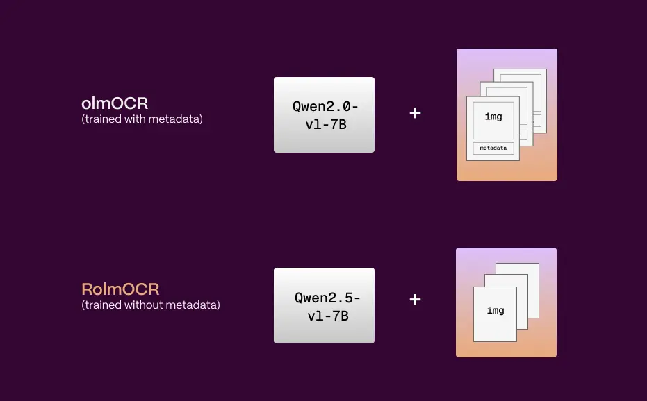
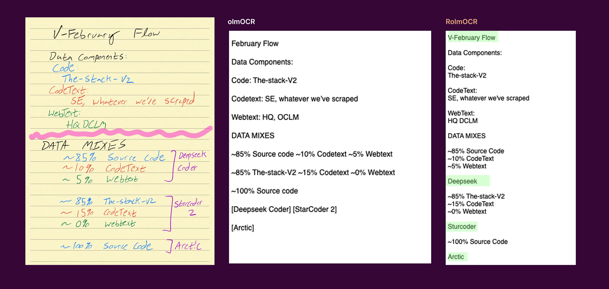

# RolmOCR

- [Introducing RolmOCR: A Faster, Lighter Open Source Document Model Built on olmOCR](https://reducto.ai/blog/introducing-rolmocr-open-source-ocr-model)
- https://hf-mirror.com/reducto/RolmOCR

## Model Arch

### pre-processing

#### text encoder
- text encoder的预处理仅需要经过tokenizer转为相应token序列(预插入了image占位符)

#### image encoder
- 传统预处理包括：to_rgb -> to_array -> resize -> rescale -> normalize
- 以及后续特殊预处理（经VDSP自定义算子实现）：tile -> reshape -> transpose -> reshape
- 最后由image patches经patch_embed后进入VIT输出image_embeds

### post-processing
- llm decoder

### backbone
- `RolmOCR`是基于`Qwen2.5-VL-7B-Instruct`在数据集`olmOCR-mix-0225`上fintune而来
- `Qwen2.5_VL`由`VIT Trained from scratch`和`Qwen2.5`构成，通过`MLP`将视觉模型和语言模型进行对齐

### common

- 新的基座模型

    RolmOCR相较于olmOCR替换了原先的基础模型，由`Qwen2-VL-7B`更换为`Qwen2.5-VL-7B-Instruct`。
    

    
    

- 无元数据输入

   与过往版本olmOCR不同，不再使用从PDF中提取的元数据。这显著缩短了提示长度，从而降低了处理时间和显存使用率，同时在大多数情况下，准确率并未受到影响。

- 训练数据的再处理

   为了增强对偏角文档的鲁棒性，对大约15%的训练数据进行了旋转。

- 文档识别效果

   RolmOCR相较于olmOCR对于文档的识别能力有所提升，可以参见下图识别效果展示：
   

   
   

   使用相同手写笔记示例，RolmOCR 能够生成更准确的结果。它能够正确捕获之前可能由于元数据损坏而误读的字符（例如，“OCLM”现在被正确识别为“DCLM”）。此外，它还能保留正确的读取顺序，例如将“Deepseek Coder”放置在相应的“Data Mixes”部分下。这些细节对下游的解析和理解至关重要。

## train
- 在Qwen2.5-VL-7B-Instruct基础上，进行finetune微调
- finetue数据：[allenai/olmOCR-mix-0225](https://huggingface.co/datasets/allenai/olmOCR-mix-0225)
- 对各种类型的文档OCR能力都表现良好

## Build_In Deploy
- [deploy.md](./source_code/deploy.md)