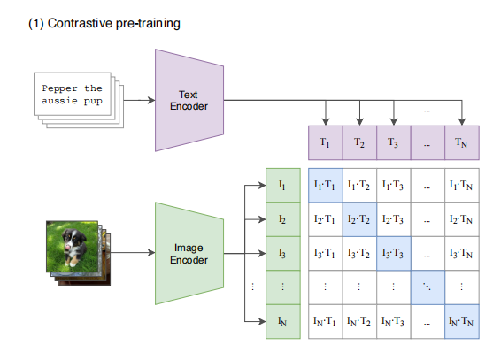
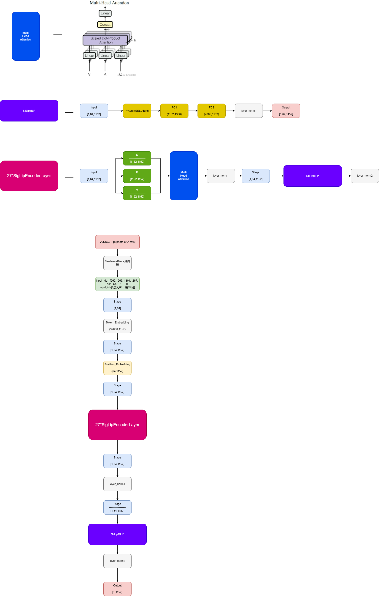
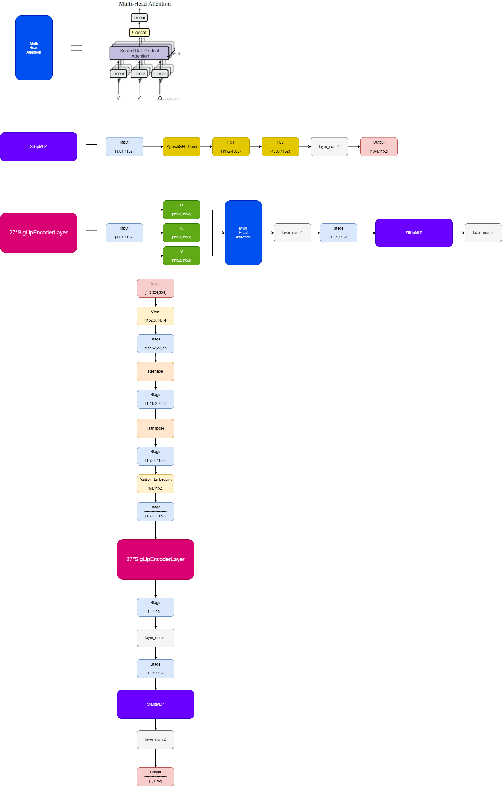

# SIGLIP

[Sigmoid Loss for Language Image Pre-Training](https://arxiv.org/abs/2303.15343)

## Model Arch



Siglip模型的结构可以简单理解为存在两个编码器用于提取特征，图像编码器负责对图像进行特征提取，文本编码器负责对文本进行特征提取，然后计算这两个特征的Cosin距离，得到文本是否与图像匹配的分数。


### pre-processing

#### text encoder
siglip模型的文本分词器为SentencePiece分词器，它负责将输入的文本分割为token。

#### image encoder
image encoder的预处理如下所示:

```json
{
    "image_mean": [0.5,0.5,0.5],
    "image_std": [0.5,0.5,0.5],
    "rescale_factor": 0.00392156862745098,
    "size": {
        "height": 384,
        "width": 384
    }
}
```

### post-processing
clip的后处理是将两个编码器得到的同维度图像嵌入和文本嵌入， 通过矩阵相乘映射到相同的向量空间， 计算图像-文本对的相似度代码如下

<details><summary>点击查看代码细节</summary>

```python
def forward(self, image, text):
    # encoder
    image_features = self.encode_image(image)
    text_features = self.encode_text(text)

    # normalized features
    # 使用 L2 归一化将特征向量转换为单位向量，直接相乘就是余弦相似度
    image_features = image_features / image_features.norm(dim=1, keepdim=True)
    text_features = text_features / text_features.norm(dim=1, keepdim=True)

    # cosine similarity as logits
    # logit_scale 用于调整相似度分数的范围
    logit_scale = self.logit_scale.exp()
    # @符号表示矩阵乘法
    logits_per_image = logit_scale * image_features @ text_features.t()
    logits_per_text = logits_per_image.t()

    # shape = [global_batch_size, global_batch_size]
    return logits_per_image, logits_per_text
```

</details>

### backbone

#### text-encoder


siglip中的文本编码器是一个标准的 Transformer编码器，它将输入文本转换为表示文本含义的Embedding向量（特征值）。需要注意的是它只会输出一个向量，而不是一个矩阵，它直接提取输入序列中最后一个标记的向量来表示整个输入的文本序列。

#### image-encoder


siglip的图像编码器为Vit，它将图像转换为表示图像含义的Embedding向量（特征值）。

### common
- Constastive Pretraining

## Build_In Deploy
- [siglip_deploy.md](./source_code/siglip_deploy.md)